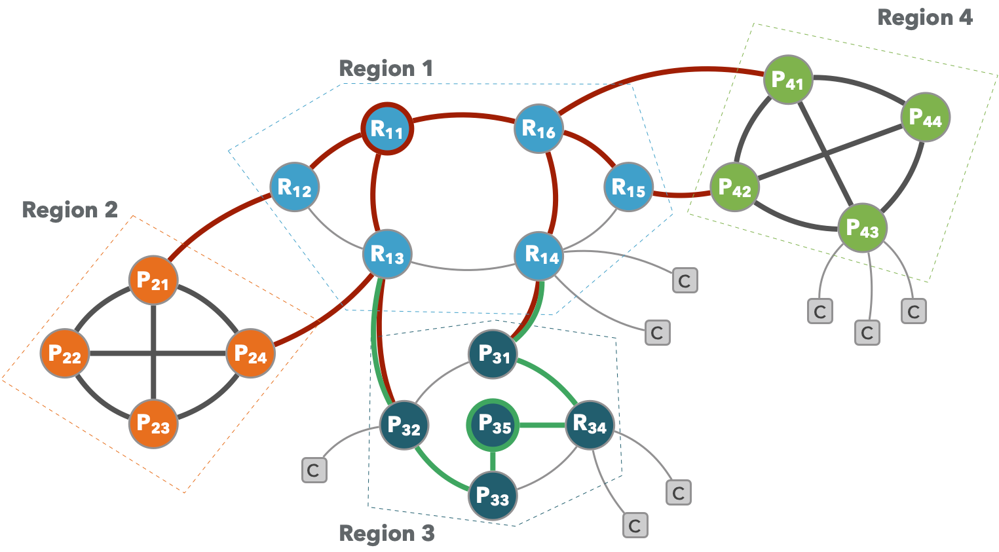

In our last blog we announced a rewrite of [**zenoh**](http://zenoh.io) in [Rust](http://rust-lang.org). We wrote the first version of zenoh in [OCaml](http://ocaml.org), a super-neat ML-derived functional programming language. [OCaml](http://ocaml.org) allowed us to experiment very quickly with good performance. Yet, one of the major bits of feedback we received from the community was that few people knew this programming language and this was limiting contributions. Besides, we had the desire to make zenoh even faster and smaller. One obvious choice would have been to write the new version in C/C++, yet something we did not want to loose were the safety properties we enjoyed with [OCaml](http://ocaml.org). Additionally, if we had to leave our beloved [OCaml](http://ocaml.org), we did not want to completely give away high level abstractions. We also wanted to avoid languages that had a heavy runtime and a garbage collector. We had already looked at [Rust](http://rust-lang.org) back in 2015, but at the point we did not feel it was the right choice for us. The improvements introduced in the programming language with the 2018 edition along with the introduction at a language level **async** make [Rust](http://rust-lang.org) a perfect choice for zenoh. 

## zenoh: a new era
As we were going for a rewrite, we took this opportunity to leverage the experience, user feedback and lessons learnt from the first version of zenoh. We did some improvements at the protocol level as well as some reorganisation. The resulting stack is represented in the diagram below.


As you can see from this diagram, now zenoh is organised as two layers: 

### zenoh-net
Implements a networking layer capable of running above a Data Link, Network or Transport Layer.  **zenoh-net** provides primitives for efficient pub/sub and distributed queries. It supports fragmentation and ordered reliable delivery and provides a pluggable scouting abstraction for discovery. **zenoh-net** defines and builds upon a session protocol that provides abstractions for ordered best effort and reliable channels with unlimited MTU that are independent of the underlying layer.

**zenoh-net** supports peer-to-peer and routed communication as well as push and pull pub/sub along.


### zenoh
The **zenoh** layer provides a high level API for pub/sub and distributed queries. It deals with data representation encoding and transcoding and provides an implementation of geo-distributed storage and distributed computed values. **zenoh** natively supports a series of data encoding, such as JSON, Properties, Relational, Raw, etc., along with transcoding across supported formats. It also defines a canonical query syntax based on URIs syntax.
The **zenoh** layer also provides a storage back-end plug-in API to ease the integration of third parties storage technologies. Currently supported storage back-ends are Memory, MySQL, MariaDB, PostgreSQL, SQLite and InfluxDB. By default, the Geo-Distributed Storages work under eventual consistency. Stronger consistency can be implemented by users leveraging Quorum Mechanism.

## Improvements and new features
The upcoming version of **zenoh** comes with improvements and some new features. Specifically, you will see:

**Major performance improvements**. These performance improvements are a consequence of both using Rust and of some changes on packet scheduling. 

**Protocols improvements**. We have reorganised the protocol to make it even simpler to port **zenoh** to different kinds of networks while exploiting network specific features. We have also added the ability to carry user provided attachments with both data and queries. These attachments can be used by zenoh applications to either extend the protocol, or for instance add user level security.  

**Generalised peer-to-peer and client communication**. In the upcoming version of **zenoh** an application can decide at runtime to behave like a peer or a client. Peers route information between themselves and can also route on behalf of clients -- in other terms peers can behave like routers. Peer-to-peer communication is supported for arbitrary connectivity graphs and supports cliques as a special case. 

**Closure-based discovery**. Discovery in **zenoh** is supported by the **scouting** protocol, in order to ease the deployment of a system that wants to leverage a clique connectivity, for cases in which multicast is not available, or desirable, we now support a closure-based discovery. Starting from a single peer, we can discover its closure, or in other terms, the peers can be reached directly or indirectly from this starting point.

**Region-based routing**
The new version of **zenoh** supports region-based routing. As depicted in the diagram below, this means two things, (1) routing information required to build and maintain our routing tables scales with the size of the region, and (2) each region can decide whether to route over an arbitrary connectivity graph or assume a clique. This approach to routing greatly improves scalability and performance by allowing to use the most appropriate routing technique within a region.


## Performance
The zenoh distribution includes simple tests to check the performance. To build and run these tests follow the instructions below:

```
$ git clone git@github.com:eclipse-zenoh/zenoh.git
$ cd zenoh 
$ git checkout rust-master
$ cargo build --release
$ cargo build --release --examples

# then run the throughput benchmark

# run the subscriber
$ ./target/release/examples/zn_sub_thr

# run the publisher with <payload size> (1024 below) and locator 
# the locator will become optional  once  the rust version will also support  zenoh scouting 

$ ./target/release/examples/zn_pub_thr 1024
```

When running these tests on a Linux laptop with an Intel Core i7 we get the results displayed below. As you can see from the graph the 1Gbps mark is already reached for messages with a payload of just 128 bytes. 


## Schedule
We have made good progress toward making the [Rust](http://rust-lang) of **zenoh** available. You can already start experimenting with the [rust-master branch](https://github.com/eclipse-zenoh/zenoh/tree/rust-master), but the good news is that by the end of July we should have the bulk of features in place. 
You can check-out the [roadmap](https://github.com/eclipse-zenoh/zenoh/wiki/Roadmap) to see our progress as well as comment on which features you'd like to see next. 

Finally, do not hesitate to reach us out on the [zenoh Gitter Channel](http://gitter.im/atolab/zenoh)


[**A+**](https://github.com/kydos/)
