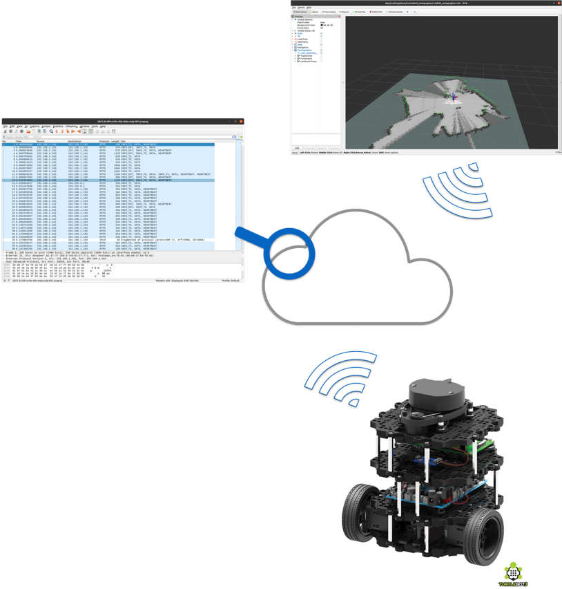
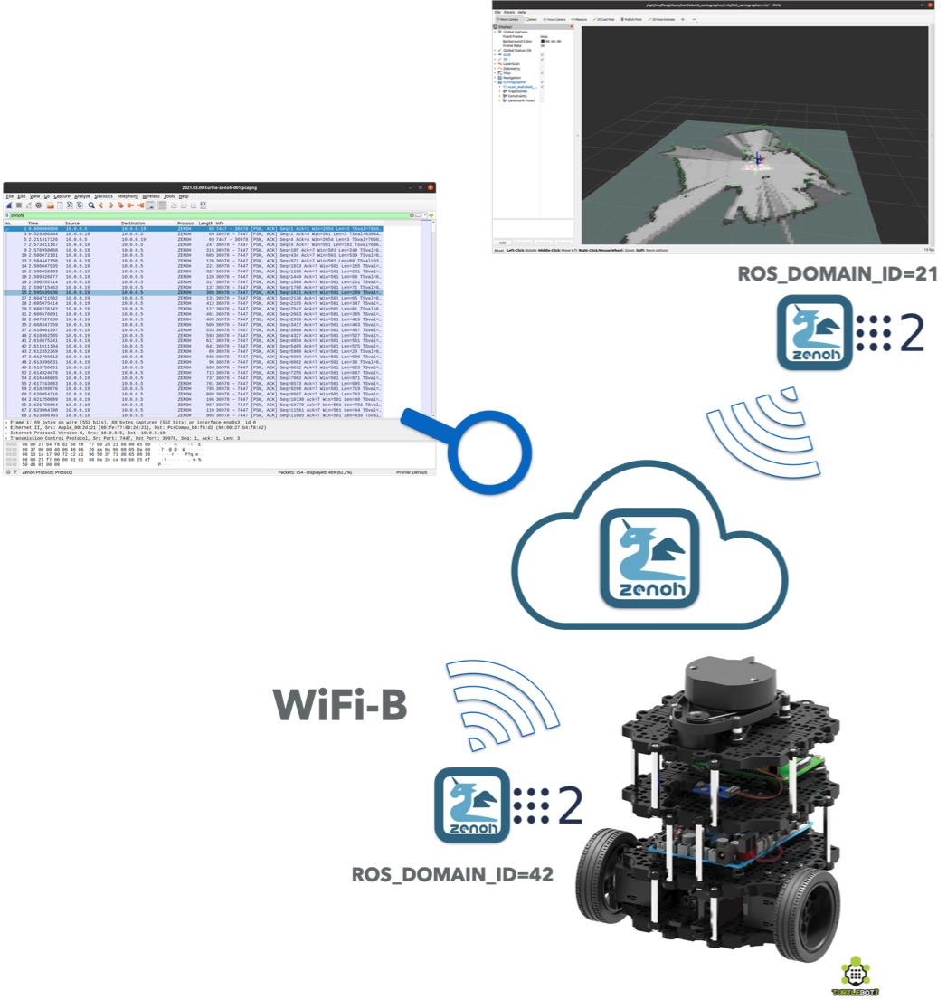

The amount of discovery traffic generated by ROS2 is a problem that has 
received an increasing attention in the community. The discovery overhead 
issue becomes extremely severe when running over wireless technologies,
such as WiFi, and in particular in combination with more complex robots, robot 
swarms and tele-operation. The [ROS2 Discovery Service](https://docs.ros.org/en/foxy/Tutorials/Discovery-Server/Discovery-Server.html) has been proposed 
as a way to alleviate the problem, not necessarily to solve it.


In the reminder of this post I'll explain the essence of problem, 
remind what was tried in the past and unveils a [**Zenoh**](https://github.com/eclipse-zenoh/zenoh) based solution that 
(1) drastically reduces DDS discovery overhead -- from 97% to 99,9% in tested scenarios,
(2) allows for peer-to-peer communication when useful,
(3) enables efficient Internet-scale routing when  necessary, and 
(3) does not require any changes to your existing ROS2 systems.

Ready, let's go!


# Understanding the Problem 
As many of you should know, ROS2 uses the [Data Distribution Service (DDS)](https://www.omg.org/omg-dds-portal/) as the mean to communicate and share data 
across ROS2 nodes. Thus, when people discuss about ROS2 discovery,
they really mean DDS discovery -- in any case,  this is what is used 
under-the-hood.

The problem of DDS discovery has been known for quite some time. The oldest
trace I can find of a  public reference to the issue goes back to this
[presentation](https://www.slideshare.net/Angelo.Corsaro/scaling-the-data-distribution-service-to-global-networks) I gave back in 2009.
As a team we did work hard to address this problem and already in 2012 we 
had products, such as [Vortex Cloud](https://www.slideshare.net/Angelo.Corsaro/building-and-scaling-internet-of-things-applications-with-vortex-cloud-37188676) (now Vortex Link), used by our customers to either scale DDS over a wired WAN or to reduce discovery traffic. One notable user of Vortex Cloud was
[NASA SMART NAS](https://www.adlinktech.com/en/News_18100302503788216.aspx). Thus I can humbly claim that, in a way, we've been there and we've done that long time back. The experience gathered during those years, was one of the main drivers for coming up with [**Zenoh**](https://github.com/eclipse-zenoh/zenoh). But before we get there, let me try to explain  what the DDS discovery problem is and why it is inevitably entangled with the very nature of DDS.

## DDS Discovery Fundamentals
DDS has two discovery protocols, one called the SPDP (Simple Participant Discovery Protocol) and one called SEDP (Simple Entity Discovery Protocol). 
The SPDP essentially takes care of finding out who is around, in DDS jargon 
it finds domain participants. Once discovered a new domain participant the 
SEPD kicks-in to mutually exchange the full list of data-readers, data-writers and optionally topics. As a consequence the amount of discovery data generated by real-world applications grows quadratically in the number of nodes. More precisely, assuming we have a system with  **n** domain participants each of which has
**r** readers and **w** writers, then the amount of discovery traffic scales with **n\*(n-1)\*(r+w)**. 

Additionally to the generated traffic, the DDS discovery model forces every domain participant to retain all discovery information. In other terms, every participant 
has  to keep track of every single reader and writer available on any other participant within the same domain -- all of this in spite of whether
that is of interest or not. 

As we did in [Vortex Cloud](https://www.slideshare.net/Angelo.Corsaro/building-and-scaling-internet-of-things-applications-with-vortex-cloud-37188676) some of this can be alleviated, yet the bulk of the problem is tied to design decisions that are at the very heart of DDS. Its end-points matching and reliability model is probably the main one, not to mention that DDS was designed with wired network in mind, networks in which bandwidth is plentiful and packet losses are relatively rare.

These are the reasons for the known challenges on WiFi and the hard truth about how far can we get with DDS because 
of its inherent model and assumptions.


As I mentioned above, our efforts trying to scale DDS made it evident that Discovery was one of the elephants in the room, 
but not the only one. This led us to look at things differently, it led us into designing [**Zenoh**](https://github.com/eclipse-zenoh/zenoh).

## Zenoh
When designing [**Zenoh**](https://github.com/eclipse-zenoh/zenoh), discovery overhead was one of the issues we wanted to
tackle along with the ability to support Internet-scale applications, constrained devices and networks.

Another problem we wanted to solve, that is interesting per-se but not relevant for this blog, was the unification of data
in motion an data at rest. This makes it much easier to support robot swarms, tele-operation and in general any kind of
applications in where you have to deal with data in motion as well geographically dispersed  data at rest.
Will provide some coverage on later instalment of this blog series,  for now let's get back to the protocol aspects.

Zenoh manages to drastically lower discovery traffic because (1) it only advertises resource interests, in other terms
does not need to advertise publishers, (2) resource interests can be generalized to "compress" discovery data,
(3) discovery messages are extremely wire efficient, and (4) the reliability protocol is between run-times as opposed 
to every couple of reader and writers as in DDS.


In this blog we will see how the design decisions summarized above significantly impact discovery traffic and more importantly how
you can leverage **zenoh** along with your favorite DDS -- which I hope is
 [**Eclipse Cyclone DDS**](http://github.com/eclipse-cyclonedds/cyclonedds) -- in order to massively reduce the discovery traffic,
and take advantage of the many super-cool features zenoh has to provide, including Internet-scale routing, geo-distributed storages, distributed queries, etc.


## Real World Use Case
Instead of crafting a synthetic benchmark, we decided to run a real-world **ROS2** application and measure the
discovery overhead induced by **DDS** and **zenoh** in the context of this application. As shown below, we  run
[RVIZ2](https://www.stereolabs.com/docs/ros2/rviz2/) in combination with the [turtlebot burger](https://emanual.robotis.com/docs/en/platform/turtlebot3/overview/#overview) 
[SLAM](https://emanual.robotis.com/docs/en/platform/turtlebot3/slam/) application and measured the discovery traffic generated
by each of the two technologies.


The [turtlebot burger](https://emanual.robotis.com/docs/en/platform/turtlebot3/overview/#overview) was running 
[ROS2 Foxy](https://docs.ros.org/en/foxy/Installation.html) and was connected to a WiFi network powered by a
[NetGear NightHawk](https://www.netgear.com/home/wifi/routers/r6020/) router. [RVIZ2](https://www.stereolabs.com/docs/ros2/rviz2/) for [ROS2 Foxy](https://docs.ros.org/en/foxy/Installation.html) was running on a [System76 Galago](https://system76.com/laptops/galago) Linux laptop.

## DDS Scenario
To measure the discovery traffic, we started the SLAM application on the turtlebot and awaited for it to be ready. Only then, we started, simultaneously, Wireshark and RVIZ2 on the laptop and captured DDS packets until RVIZ2 was showing the map created by the robot -- the setup is depicted in the diagram below.



The command used on the turtlebot was:

    $ ros2 launch turtlebot3_bringup robot.launch.py


The command used on the laptop to start RVIZ2 was:

    $ ros2 launch turtlebot3_cartographer cartographer.launch.py

## Zenoh Scenario
The first question you may have, is how can you use zenoh to transparently bridge ROS2/DDS communication?
The [Eclipse Zenoh Project](https://github.com/eclipse-zenoh) makes available the [zenoh-plugin-dds](https://github.com/eclipse-zenoh/zenoh-plugin-dds) to  transparently bridge DDS communication over zenoh and vice-versa. You can use this service to route DDS traffic over zenoh, for instance to tele-operate a robot over the internet,  or to interact with a DDS or a ROS2 application through the zenoh ecosystem -- will show how to do that on our next blog.


To measure the discovery overhead introduced by zenoh, we configured ROS on the robot and the laptop to use
different domains -- to ensure that they could not discover each other via DDS -- then we deployed an instance of [zenoh-plugin-dds](https://github.com/eclipse-zenoh/zenoh-plugin-dds) respectively on the robot and on the laptop. As a consequence all data flowing through the network was going over zenoh. Locally, to the robot and to the laptop, we had the [zenoh-plugin-dds](https://github.com/eclipse-zenoh/zenoh-plugin-dds) bridging from DDS to zenoh and zenoh to DDS.

To ensure that the scenario was as close as possible to that using DDS, we configured the [zenoh-plugin-dds](https://github.com/eclipse-zenoh/zenoh-plugin-dds)  to operate as a peer. Thus from a functional perspective it is important to understand the peer-to-peer communication model supported by ROS2 was maintained without any functional degradation. It is also important to say that the RVIZ2 application was running without no limitations or degradations.

The scenario used to measure zenoh discovery overhead is depicted below.



The application we ran on the robot were:

     $ cargo run --release -- dzd -m peer -d 21
     $ ROS_DOMAIN_ID=21 ros2 launch turtlebot3_bringup robot.launch.py


and on the laptop:

     $ cargo run --release -- dzd -m peer -d 42
     $ ROS_DOMAIN_ID=42 ros2 launch turtlebot3_cartographer cartographer.launch.py


### Zenoh's Discovery and Resource Generalisation
As de briefly mentioned earlier in this post, zenoh has a very different approach to discovery when compared to DDS. In a way we could say that
DDS is very detail oriented to the level of becoming pedantic. What do I mean with this?
DDS exchanges the tiny nitty gritty details of every single writers and readers available for a given topic (an optionally the topic info too), and by the way it exchanges it even if I do not care about the majority of it.

Zenoh operates very differently. This was a conscious choice, because when designing zenoh we wanted to
make sure that we could predict the resource used by an application in spite of the number of *"matching"* reader/writers.
In other terms, having a  writer  matching one or one million readers makes a huge difference in DDS in terms of discovery traffic generated, reliability protocol overhead, and discovery data to keep in memory.  When designing **zenoh** we did not want to have this undesirable side-effect.

This lead toward a design geared toward sharing only resource interests as opposed to sharing interest as well as those who are interested, *i.e.*, readers and writers. This is a big difference and one of the areas where zenoh has much better scalability. The other trick we play in  zenoh is that, our protocol may decide
to make generalizations -- to make a parallel with what I was mentioning above, it raises the level of abstraction and tries to detach itself from the details. What do I mean with that? This is best explained with an example, suppose that your robot publishes data for ```/mybot/sensor/lidar```,
```/mybot/sensor/camera```, ```/mybot/dynamics/odometry```, etc. Zenoh, when looking at these resources may decide that the only thing the rest of the world needs to know is that they have to come to this robot when looking for  anything that matches```/mybot/**```. This is in simple terms what we mean by resource generalization. This is an important mechanism  to compress discovery information and to ensure that the discovery information can withstand Internet scale applications. As a result,  in zenoh all routing and matching is performed using set-theoretic operations and set-coverage -- for instance to figure out the minimal set of storages that can answer a query.
The zenoh protocol performs resource generalization automatically whenever it makes sense but it also exposes an API for the user to give hints.

### Leveraging Resource Generalisation
To demonstrate the effectiveness of zenoh's resource generalization we ran an additional scenario whereby using an option
of our [zenoh-plugin-dds](https://github.com/eclipse-zenoh/zenoh-plugin-dds) we made the resource space for the robot
rooted by simply prefixing it with ```/bot```. Then we also gave hint to aggressively generalize resources matching this
prefix.

Thus to measure zenoh's discovery overhead when leveraging resource generalization, we ran the same scenario as above, with the following arguments:

    # On the Turtlebot

    $ cargo run --release -- dzd -m peer -d 21 -s /bot -r /bot/** -w /bot/**
    $ ROS_DOMAIN_ID=21 ros2 launch turtlebot3_bringup robot.launch.py


    # On the Laptop

    $ cargo run --release -- dzd -m peer -d 21 -s /bot -r /bot/** -w /bot/**
    $ ROS_DOMAIN_ID=42 ros2 launch turtlebot3_cartographer cartographer.launch.py

For your reference these are the options supported by our **dzd** bridge:

```rust
    $ dzd --help
    dzd zenoh router for DDS

    USAGE:
        dzd [OPTIONS]

    FLAGS:
        -h, --help       Prints help information
        -V, --version    Prints version information

    OPTIONS:
        -a, --allow <String>                The regular expression describing set of /partition/topic-name that should be
                                            bridged, everything is forwarded by default.'
        -c, --config <FILE>                 A configuration file.'
        -d, --domain <ID>                   The DDS Domain ID (if using with ROS this should be the same as ROS_DOMAIN_ID).'
        -w, --generalise-pub <String>...    A comma separated list of key expression to use for generalising pubblications.'
        -r, --generalise-sub <String>...    A comma separated list of key expression to use for generalising subscriptions.'
        -l, --listener <LOCATOR>...         Locators to listen on.'
        -m, --mode <MODE>                   The zenoh session mode.' [default: client]  [possible values: peer, client]
        -e, --peer <LOCATOR>...             Peer locator used to initiate the zenoh session.'
        -s, --scope <String>...             A string used as prefix to scope DDS traffic.'

```

### Cold and Warm Start
Another aspect that we need to consider when using zenoh in this configuration is whether we measure the discovery  traffic  assuming that nothing is running on the laptop, in other terms we start ```dzd``` after we start capturing zenoh packets, or else we assume that the zenoh infrastructure is already up and running and we only start ```RVIZ2```. We call **cold start** the case in which nothing is running on the laptop before we start measuring zenoh discovery data and **warm start** the case in which ```dzd``` is already running. On a real-world scenario you would have dzd running, but we prefer to measure the two cases to show the worst case scenario.

## Measuring Discovery Data
### DDS
To evaluate the traffic generated by DDS discovery data we take into account the SPDP (Single Participant Discovery Protocol) and SEDP (Simple Entity Discovery Protocol)  generated from the start of RVIZ2 to the last SEDP -- which is the last reader or writer declaration. After the last SEPD message nothing else is taken into account. We think this is a fair measure since it represents the amount of discovery data necessary to establish proper communication between the two DDS applications.

### Zenoh
To evaluate the traffic generated by zenoh we measure the overhead coming from the session opening and the link-state algorithm along with all the packets containing resource declarations. You may wonder why zenoh peers run a link-state algorithm, well they do it to be able to support communication on [arbitrary mesh topologies](http://zenoh.io/docs/getting-started/key-concepts/), we'll share more details on some later blog post.


## Experimental Results
The experiments described above were run five times each and for each run we measured discovery data. While for zenoh the measured data was stable across experiment, on DDS we saw a fluctuation of roughly 50Kbytes. To make the comparison even more compelling, we decided to take the best measure for DDS. Once again for zenoh we did not see variability across experiments.

The table below shows, for DDS, zenoh and for each of the scenarios described above, the number of discovery packets, their average size in bytes and more importantly the total number of bytes exchanged. The last column shows the percentage of discovery traffic reduction measured for zenoh.


|                | Packets   |  Avg Size (Bytes)   | Total Bytes  | Zenoh Discovery Reduction % |
|---------------:|:---------:|:------------:|:------------:|:--------------------------------:|
| DDS            |   686     |    366.73    |    251576    |                               |
| Zenoh         |    31     |    213.45    |      6617    |               97.37%               |
| Zenoh RG       |    13     |    136,54    |      1775    |              99.29%             |
| Zenoh WS       |    17     |    276,41    |      4699    |              98.13%              |
| Zenoh RGWS     |     1     |     82       |        82    |              99.97%              |


Where:
- **RG** stands for **R**esorce **G**eneralisation
- **WS** stands for ***W***arm ***S***tart

By looking at the table it is clear how much zenoh can drastically reduce the discovery overhead. In the measured scenarios,
zenoh is already able to reduce discovery by **97.37%** in the worst case. It gets to **99.29%** reduction in discovery traffic as soon as 
we add some structure to the turtlebot ROS2 topics by prefixing them with ```/bot``` and gets to the incredible **99.97%** reduction in discovery traffic when combining resource generalization with warm start.

We think these results are extremely encouraging and in a way explain why those who have moved to zenoh for Robot to Everything (R2X) communication have
experienced huge improvements over wireless networks and in particular WiFi. The other good news is that to leverage zenoh you do not have to change anything to your application.
Just drop-in the [zenoh-plugin-dds](https://github.com/eclipse-zenoh/zenoh-plugin-dds) and have fun!

But there is even more that you can do, such as writing  native zenoh applications  and have them seamlessly interact with ROS2. We'll cover these and other cool matters in upcoming posts.

Good Hacking!

[**A+**](https://github.com/kydos/)
