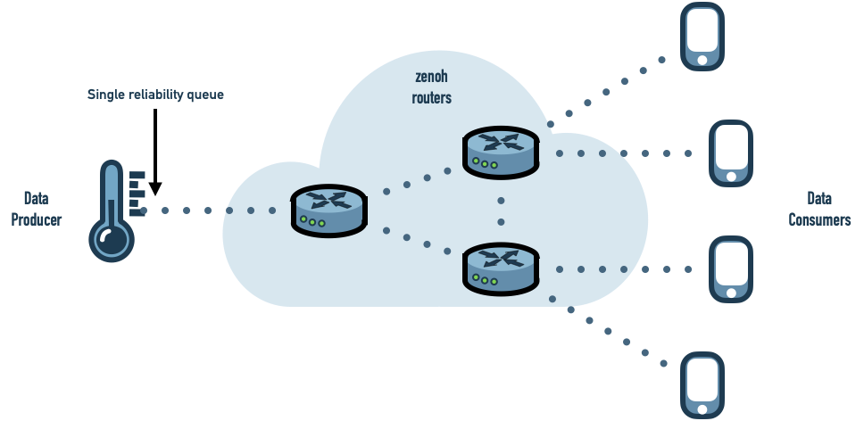
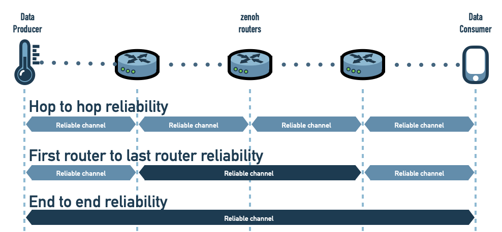
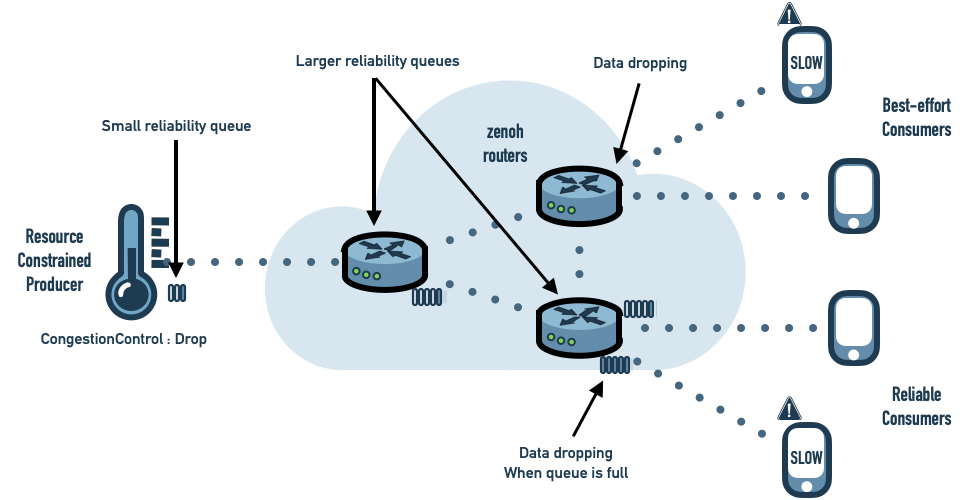

Providing many to many reliable communications  over a wide area network is challenging. This may even be an understatement, as theoretically,  even simple point to point reliable communication over asynchronous channels requires either infinite amount of memory or giving up progress… but guess what, many real systems can’t afford neither of those restrictions. Thus, trade-offs need to be made regarding reliability for the system to work, scale smoothly and have sufficiently strong guarantees. System's heterogeneity, with respect to network capabilities and nodes resources,  has important consequences and requires proper strategies to avoid a slow node to impact the entire system.

*zenoh* provides different mechanisms to deal with these challenges. It allows users to clearly define the reliability semantics they need without bringing extra complexity. 

-------
## Reliability and Scalability
### Hop to hop reliability
The *zenoh* protocol is composed of two layers: 
- *The session protocol* establishes a bidirectional 1 to 1 session between two *zenoh* runtimes ([client](../../docs/getting-started/key-concepts/#client), [peer](../../docs/getting-started/key-concepts/#peer) or [router](../../docs/getting-started/key-concepts/#router)). Each session comes by default with a best-effort channel and a reliable channel. The session protocol among other things, takes care of performing automatic batching for maximising network usage and fragmentation to give the illusion of an unlimited MTU. 
- *The routing protocol* leverages the session protocol to propagate interests and route data from many producers to many consumers.

Consequently the reliability state maintained by each application is independent of the number of data producers and data subscribers hosted by the application.

As *zenoh* offers routed communication, a single data producer connected to a *zenoh* router can reliably send data to as many data consumers as needed while maintaining a single reliability state.



This strategy is highly scalable and offers a good level of reliability. No data samples are lost while the infrastructure is stable. If a *zenoh* router fails, the *zenoh* infrastructure will automatically adapt to the new topology (details will be provided in a future post). During the failover, data samples may be lost. As soon as the infrastructure re-stabilized, data is distributed reliably again.

-------
## A Stronger Reliability
With the default hop to hop reliability strategy data samples can be lost during topology changes. This is the price to pay for a good scalability but can be problematic for some systems. *zenoh* is designed to offer two stronger reliability strategies which are very briefly described here.

### End to End Reliability
A reliability channel is established between each data producer/data consumer pair. This avoids sample loss even during topology changes but is less scalable and induces higher resource consumption on producers and consumers.

### First Router to Last Router Reliability
A reliability channel is established between the first *zenoh* router and the last *zenoh* router of each data route. This allows to relax pressure on producers and consumers by deporting this pressure to nearest infrastructure components.



-------
## Reliability and Flow Control
In a reliable system, there is a constant trade-off between reliability, progress and memory consumption. Indeed a slow or non-responsive data consumer will force matching data producers to either:
- Store more and more messages thus consuming more and more memory.
- Drop messages thus losing reliability.
- Block new writes thus losing progress.

It’s often the receiving application that can decide if messages losses are acceptable or not. When only parts of the subscribers need reliable communications it is more efficient to only propagate data reliably to those subscribers than to all of them. So it seems appropriate to let the receiving application decide if communication should be reliable or not. On the other hand, giving full control to subscribers has downsides. Receiving applications can force data producers to maintain a reliability state while those producers may be resource constrained and not willing to do so. And a single misbehaving receiver application may block or slow down the whole system.

A lot of technologies made opinionated choices to address this problem and applied predefined semantics on which users have very limited control. Those semantics may be good for some use cases and bad for others and you would often need a mix of different behaviors in the same system.

Part of the issue is a confusion between *reliability* and *congestion control*. *zenoh* clearly separates control over *message resending*, *memory usage* (buffering) and *message dropping*.
- Receivers control *reliability* by selecting a *resending strategy*. They declare if they need missing messages to be resent or not.
- Senders and intermediate infrastructure components (*zenoh* routers) individually decide how much *memory* they are willing to dedicate to reliability. This allows constrained devices to dedicate few resources to reliability while resourceful intermediate routers can dedicate more memory lowering the probabilities of congestion situations.
- Senders control *congestion* by selecting a *message dropping* strategy. For each sample they decide what should be done in case of congestion (the reliability queue is full) -- drop the sample or block the publication. The *congestion control* strategy is propagated from the sender to all involved infrastructure components and applied along the entire routing path.



-------
## Show me Some Code

Here are examples of how reliability and congestion control can be configured using the *zenoh* Python API.

### Configuring Reliability
zenoh reliability is configured on the subscriber side as shown below:

```python
session = zenoh.net.open({})

sub_info = SubInfo(
zenoh.net.Reliability.Reliable, 
zenoh.net.SubMode.Push)

sub = session.declare_subscriber(selector, sub_info, lambda sample: 
		print('received {}'.format(sample)))
```

### Configuring Congestion Control
zenoh  congestion control is configured per sample as shown below:

```python
session = zenoh.net.open({})

zenoh.write('/demo/hello', bytes('Hello world', encoding='utf8'),
	congestion_control=zenoh.net.CongestionControl.Drop())
```

-------
## Conclusion
*zenoh* provides different flavors of reliability and congestion control. It provides the level of control required 
to balance between application needs and system constraints, thus allowing the user to operate under the right trade-off between reliability, scalability, resource consumption and progress. Finally, each zenoh application and infrastructural node, i.e. zenoh routers, participates to the system with its own capacity and is well protected from structural or  temporary asymmetries. 

These are some of the key ingredients that make  *zenoh* work well at scale, in dynamic and heterogeneous networks,  while maintaining strong guarantees.

[**--OH**](https://github.com/OlivierHecart)