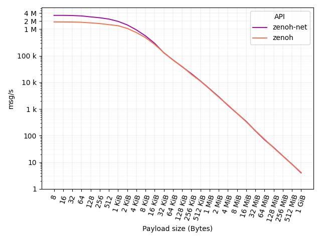
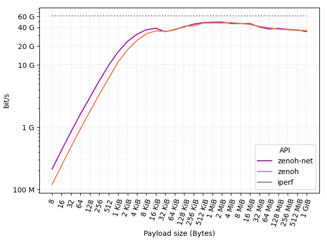
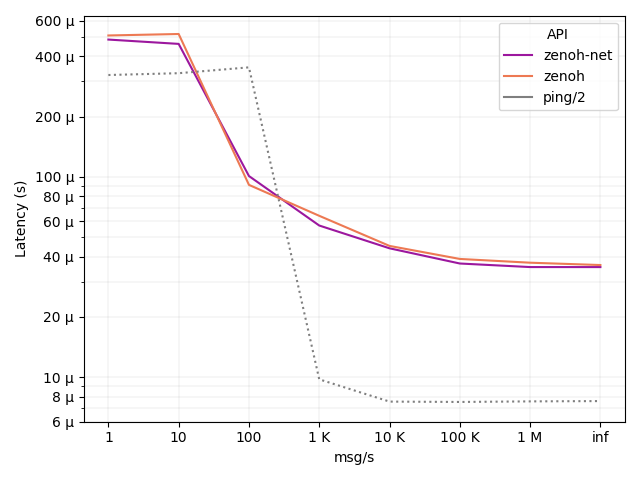
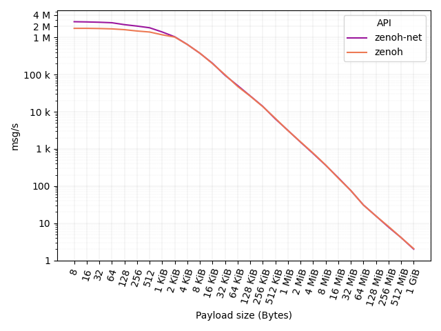
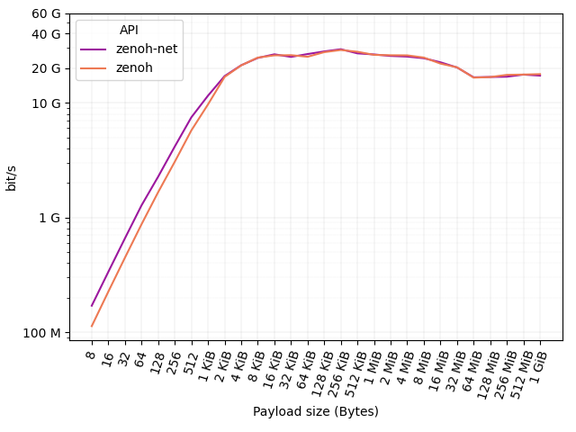
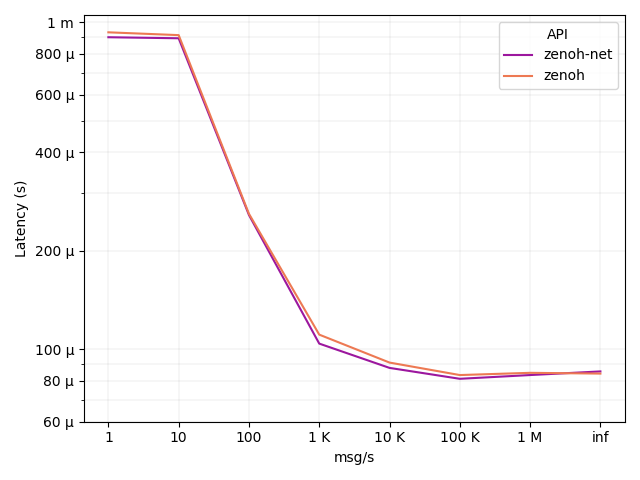

Since its very first public release, zenoh provided impressive and easily accessible performances (see **[here](https://zenoh.io/blog/2020-06-29-zenoh-tidings/)**). 
But instead of resting on laurels, the zenoh team has been relentlessly working on further improving them. 

As a result of this work, we are happy to announce that zenoh delivers at least twice the performances than before: 
- more than **3.5M msg/s** with 8 bytes payload, 
- more than **45 Gb/s** with 1 Megabyte payload, 
- a latency as little as **35 &#181;sec** in backlogged scenarios.

The reminder of this post will take you through the  journey of zenoh profiling along with the nuts and bolts of Rust async programming. 
If you are unfamiliar with Rust and you are just interested in the results, you can jump directly **[here](#looking-at-the-results)**.

----
## Getting ready

As we previously wrote in this **[blog post](https://zenoh.io/blog/2020-06-29-zenoh-tidings/)**, zenoh is purely written in **[Rust](https://www.rust-lang.org/)** and leverages the **[async](https://async.rs/)** features to achieve high performance and scalability. 

Even though initial zenoh performances were already quite good, we weren’t completely happy about them. Some numbers didn’t sum up as expected and we were very puzzled about it: we knew that zenoh could deliver more. We had only to discover what was preventing us from getting there. So, during the last few months we have been relentlessly profiling zenoh and looking into its most deep and intimate internals. 

The very first thing we did was to properly prepare our testing environment in such a way to get reproducible results. This is very important when profiling your code otherwise you risk to walk down the wrong path: there are plenty of external factors that may impact the performance of the code. If you are about to profile your code, we highly recommend you to follow this **[guide](https://easyperf.net/blog/2019/08/02/Perf-measurement-environment-on-Linux)** that summarizes very well how to properly setup a Linux environment and how to get consistent results out of it. 

The second thing was to have a thorough read of **[The Rust Performance Book](https://nnethercote.github.io/perf-book/title-page.html)**. If you are developing in Rust like us, we recommend you to go through it since we found it really insightful for what concerns performance tips and tricks along with profiling techniques in Rust. 
Another nice reference on how to write performant code in Rust can be found **[here](http://likebike.com/posts/How_To_Write_Fast_Rust_Code.html)**.


## Finding the hotspots

We started with identifying the hotspots in zenoh by generating flame-graphs with this **[tool](https://github.com/flamegraph-rs/flamegraph)**. We were confident that flame-graphs were a good way to visualize which part of the code takes most of the time in zenoh. We were wrong. 

We couldn’t see any function taking a substantial amount of time to justify the performance mismatch we were observing. In addition, async was making the flame-graph quite difficult to read because of the async scheduler and future executor appearing almost everywhere in the graph. So, we changed the profiling tool and we started using **[perf](https://perf.wiki.kernel.org/index.php/Main_Page)** which provided, at least for us, a more clear view on the hotspots: notably on serialization and deserialization. 

We improved our serializer and deserializer implementation and the synthetic benchmarks immediately improved by roughly 100%. However, that improvement didn’t reflect in the throughput tests. Nothing had changed. We were more puzzled than before.


## Heap or not to heap? Stack is the problem

Then we started looking into memory allocations. Since the beginning of zenoh, we have been very careful to avoid heap allocations in the critical path. We used **[Valgrind](https://www.valgrind.org/)** to double check if that was still the case and yes, it was: we didn’t observe unnecessary allocations nor suspicious high cache miss rates. 

So, if it’s not the heap, it might be the stack. But how to see how deep the stack is? Especially when operating with async? Luckily for us, there is a very useful Rust compilation flag (available only in Rust nightly) to verify how big a data structure is and its cache alignment. It is sufficient to build zenoh (or any Rust code) with:

```sh
$ RUSTFLAGS=-Zprint-type-sizes cargo build --release
```

In addition to the usual Cargo output, each data structure including async futures is printed out with the corresponding size and cache alignment. An examples of the generated output for the zenoh data message Rust struct is:

```sh
print-type-size type: `net::protocol::proto::msg::Data`: 304 bytes, alignment: 8 bytes
print-type-size     field `.key`: 40 bytes
print-type-size     field `.data_info`: 168 bytes
print-type-size     field `.payload`: 96 bytes
```

And here comes the bitter discovery. These async futures, once compiled, were taking a few tens of KBs on the stack. These futures are called every time a message needs to be sent over the network. Unsurprisingly at this stage, we realized that we were putting too much pressure on the memory due to a stack too deep and large. 
Async libraries and runtime were doing their job correctly, they were putting on the stack everything that was needed in order to have a proper asynchronous environment. The problem was that we used async code too extensively in zenoh, mainly driven by its great simplicity and superb ergonomics.

So, we started a deep dive into zenoh internals and did some introspection on how to tackle the problem. We like async, it provides great flexibility and scalability properties to zenoh and we didn’t want to let it go. The final solution was to isolate the async code in specific parts of the code, especially the one interacting with the network, and to move some other parts to the standard sync library. As a result, zenoh has now a very balanced mix of sync and async code that takes the best of both worlds. This allowed us to drastically reduce the stack size of some critical async futures which immediately reflected in a massive performance boost as described below.

----
## Looking at the results

Throughput and latency tests are provided as examples in the main zenoh distribution. So, you can check what we actually used to get our throughput and latency results and replicate it yourself! 

In the following we are going to show the throughput and latency results for both peer-to-peer and routed communications. To see the communication models supported by zenoh, please refer to the **[documentation](https://zenoh.io/docs/getting-started/key-concepts/)**. 

All the tests below are run on three of our workstations equipped with an AMD Ryzen 5800x, 32 GB of RAM, connected through a 100Gb Ethernet connection, and configured according to this **[guide](https://easyperf.net/blog/2019/08/02/Perf-measurement-environment-on-Linux)**.


### Peer-to-peer communication

In the peer-to-peer communication test, we consider two peers that directly communicate with each other, that is without passing through an intermediate node.


#### Throughput

To build and run the p2p throughput tests just follow the instruction below:

```sh
$ git clone https://github.com/eclipse-zenoh/zenoh.git
$ cd zenoh
$ cargo build --release --all-targets

# ---- zenoh-net test ----
# run the zenoh-net subscriber
$ ./target/release/examples/zn_sub_thr

# run the zenoh-net publisher with <payload size> (1024 below)
$ ./target/release/examples/zn_pub_thr 1024

# ---- zenoh test ----
# run the zenoh subscriber
$ ./target/release/examples/z_sub_thr

# run the zenoh publisher with <payload size> (1024 below)
$ ./target/release/examples/z_put_thr 1024
```

In this test, one workstation runs the publisher while a separate one runs the subscriber. 
The figure below shows (in log scale) the number of messages per second for different payloads: from **8 bytes** to **1 GiB**. 


As you can see, **zenoh-net API** delivers more than **3.5M msg/s** with a **8 bytes payload**. 
At the same time, **zenoh API** delivers **2M msg/s**.



The figure below shows (in log scale) the results in terms of throughput (bit/s) delivered at API level. We also report the throughput obtained with iperf on the same 100GbE connection as reference baseline: **60 Gb/s**.



As it can be noticed, a **100 Mb/s** connection is already saturated by zenoh-net and zenoh with a payload as little as **8 bytes**.
A **1 Gb/s** connection is then saturated with a payload of **32** and **64 bytes** for zenoh-net and zenoh, respectively. 
A payload of **512** and **1024 bytes** is then sufficient for zenoh-net and zenoh to saturate a **10 Gb/s** connection. 
Finally, payloads larger than **128 KB** suffice to saturate a **40 Gb/s** connection.

#### Latency

Throughput figures are very nice, but about latency? To run the p2p latency tests just follow the instructions below:

```sh
# ---- zenoh-net test ----
# run the zenoh-net pong
$ ./target/release/examples/zn_pong

# run the zenoh-net ping
$ ./target/release/examples/zn_ping

# ---- zenoh test ----
# run the zenoh pong
$ ./target/release/examples/z_pong

# run the zenoh ping
$ ./target/release/examples/z_ping
```

With latency is necessary to clarify one very important aspect: latency depends on the load of the system. As you can see from the figure below, as the number of messages per second increases, latency actually decreases. This is due to the fact that when messages are sent at a low rate, the processes are more likely to be descheduled by the operating system. This operation adds additional latency since the processes need to be rescheduled when messages are sent and received. This is true for both zenoh and the classical ping, which is reported as a reference baseline for latency.

The x axis of the figure below shows the number of messages that we configured to be sent in one second, from 1 to 1 million and beyond. 
The inf case represents the scenario where messages are sent back-to-back as fast as possible. 
In such a backlogged scenario, we can see that zenoh latency is as little as **35 &#181;sec** for both zenoh-net and zenoh APIs. The payload size is **64 bytes**, the same as standard ICMP.




### Routed communication

In the router communication test, we consider two clients that communicate with each other through an intermediate node: the zenoh router.


#### Throughput

To run the routed throughput tests just follow the instruction below:

```sh
# ---- zenoh-net test ----
# run the zenoh router
$ ./target/release/zenohd

# run the zenoh-net subscriber
$ ./target/release/examples/zn_sub_thr -m client

# run the zenoh-net publisher with <payload size> (1024 below)
$ ./target/release/examples/zn_pub_thr 1024 -m client

# ---- zenoh test ----
# run the zenoh router
$ ./target/release/zenohd

# run the zenoh subscriber
$ ./target/release/examples/z_sub_thr -m client

# run the zenoh publisher with <payload size> (1024 below)
$ ./target/release/examples/z_put_thr 1024 -m client
```

In this test, one workstation runs the publisher, one runs the router and a third one runs the subscriber. 
The figure below shows (in log scale) the number of messages per second for different payloads: from **8 bytes** to **1GiB**. 



As you can see, zenoh-net API delivers **3M msg/s** with a **8 bytes** payload. At the same time, zenoh API delivers **1.8M msg/s**.
The figure below shows (in log scale) the same results in terms of throughput (bit/s) delivered at API level. 



As it can be noticed, a **100 Mb/s** connection is still saturated by zenoh-net and zenoh with a payload as little as **8 bytes**.
A **1 Gb/s** connection is then saturated with a payload of **64 bytes** for zenoh-net and zenoh. 
A payload of **1024 bytes** is then sufficient for both zenoh-net and zenoh to saturate a **10 Gb/s** connection. 
Finally, larger payloads are forwarded at **20-30 Gb/s**.


#### Latency

To run the routed latency tests just follow the instructions below:

```sh
# ---- zenoh-net test ----
# run the zenoh router
$ ./target/release/zenohd

# run the zenoh-net subscriber
$ ./target/release/examples/zn_pong -m client

# run the zenoh-net publisher with <payload size> (1024 below)
$ ./target/release/examples/zn_ping -m client

# ---- zenoh test ----
# run the zenoh router
$ ./target/release/zenohd

# run the zenoh subscriber
$ ./target/release/examples/z_pong -m client

# run the zenoh publisher with <payload size> (1024 below)
$ ./target/release/examples/z_ping -m client
```

In the routed test, latency is double than the p2p test: **70 &#181;s**.
This is due to the fact that an additional network hop, i.e. the router, has been introduced between the two clients. 
Nevertheless, it can be noticed that the router does not add any noticeable latency to the overall communication, being the latency driven mainly by the number of hops. 
The payload size is still **64 bytes**.



----
## Conclusions

Summarizing, recent work makes zenoh capable to deliver over **3.5M msg/s** for small messages, over **45 Gb/s** for large messages, and a latency as little as **35 &#181;sec**. 

This has been possible thanks to the careful redesign of some core parts of zenoh that led to a more balanced mix of synchronous and asynchronous code.
Although the results are already very remarkable, rest assured, our journey towards better performance doesn’t end here!

This blog post is just a very important milestone for zenoh, not the finishing line.


[**--LC**](https://github.com/Mallets/)
