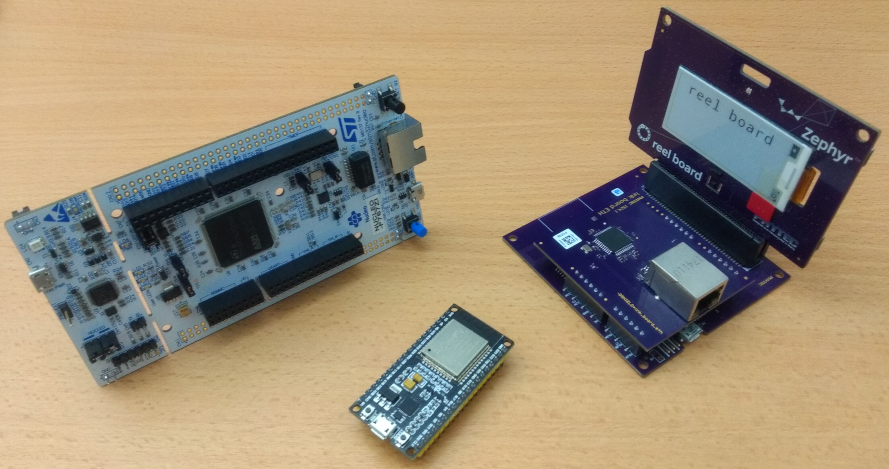
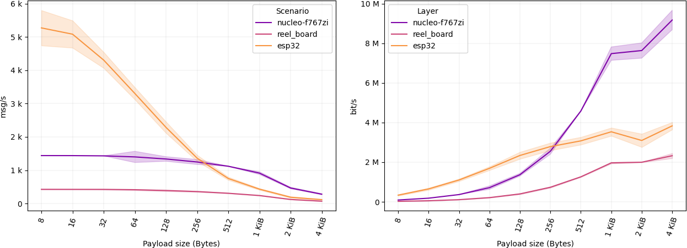

In this post, we will introduce [zenoh-pico](https://github.com/eclipse-zenoh/zenoh-pico), **a lightweight implementation of Zenoh APIs in C, fully compatible with its Rust counterpart**. 

As a result of this work, we are happy to announce that we successfully deployed and tested Zenoh in [Zephyr](https://www.zephyrproject.org) (reel_board and nucleo-f767zi) and [Arduino](https://www.arduino.cc) (ESP32) compatible boards, with initial results showcasing a quite remarkable performance within the microcontrollers landscape:
 - Memory footprint of only ~2.8% (nucleo-f767zi), ~9.2% (reel_board), and ~0.9% (ESP32).
 - Deliver more than 5.2k msg/s with a 8 bytes payload in ESP32.
 - Application-level throughput of ~9.2 Mbps (thus, saturating a 10 Mbps Ethernet link) with nucleo-f767zi.

The reminder of this post will get you started with the environment setup, library installation, and project creation for your microcontrollers.

----
# A bit of context for zenoh-pico
[Zenoh](https://zenoh.io) has been natively designed to introduce minimal wire overhead (check our [previous blog post](https://zenoh.io/blog/2021-07-05-zenoh-overhead/)) and run across extremely constrained transports such as LPWAN and LowPAN, or directly over OSI Layer 2 (Data Link Layer) as well as to accommodate the resource constraints of embedded systems. However, since its very first public release, Zenoh Rust-based implementations have been focusing on providing high performance in widely used operating systems and platforms (check our [previous blog post](https://zenoh.io/blog/2021-07-13-zenoh-performance-async/)). As a side note, Arduino was supported in the [very first proof-of-concept for Zenoh](https://github.com/atolab/zhe). But what about other constraints devices and microcontrollers?

Fear not more because [zenoh-pico](https://github.com/eclipse-zenoh/zenoh-pico) has come a long way to provide such support. **Zenoh-pico is a lightweight implementation of Zenoh APIs in C, fully compatible with its Rust counterpart.**

Internet of Things (IoT), home automation, and robotic systems appear among a set of use cases where Zenoh capabilities and features are a clear fit, paving the way for several benefits: support for push and pull communication models, geo distributed storage, and minimal wire overhead. However, most of these use cases rely on a variety of heterogeneous, low-powered, and resource constrained devices, making it a challenging environment to be supported. Just as an example, many IoT and smart home appliances being available in the market today (like smart plugs, motion sensors, door sensors, among others) are embedded with a ESP8266/ESP32 devices: the ESP32 is a dual-core 160MHz to 240MHz CPU with 320 KiB SRAM and 4MiB of built-in flash, whereas the ESP8266 is a single-core processor that runs at 80MHz with 80 KiB SRAM and 1 MiB of built-in flash. Similarly, many robotic systems are integrated with microcontrollers to control specific parts of the hardware as a complement to a more powerful device (e.g., Raspberry Pi) where all the logic is running.

1. **But is the Rust-based implementation of Zenoh supported by microcontrollers?**
Not yet, but **zenoh-pico comes to rescue**. Zenoh-pico is a lightweight implementation of the Zenoh protocol in C, fully compatible with its Rust counterpart. Its goal is three-fold: (i) provide a library implementation optimized for microcontrollers; (ii) provide a native C-based implementation (around 80% of embedded systems use C programming language); and (iii) keep the Rust-based implementation abstracted from the constraints imposed by microcontrollers.

2. **Being a lightweight implementation, what is it missing?**
Currently, zenoh-pico does offer all the functionalities for you to implement a Zenoh [client mode](../../docs/getting-started/key-concepts/#client-application) in microcontrollers. The support for peer-to-peer communication is still under planning and it does not feature the same level of message scheduling of the Rust stack.

3. **Which frameworks, platforms, or boards are currently supported?**
So far, we have successfully tested zenoh-pico in [Zephyr](https://www.zephyrproject.org) ([reel_board](https://docs.zephyrproject.org/latest/boards/arm/reel_board/doc/index.html) and [nucleo-f767zi](https://docs.zephyrproject.org/2.6.0/boards/arm/nucleo_f767zi/doc/index.html) boards) and [Arduino](https://www.arduino.cc) ([ESP32](https://www.espressif.com/en/products/socs/esp32)). No changes have been made in the core of zenoh-pico, requiring only the implementation of the system calls for your specific framework / platform.



Well...enough talk, let's see how to do it!!

----
# Step by step guide
In the following, we provide a step by step guide to build a Zenoh publisher.

## Prepare your environment
In order to manage and ease the process of building and deploying into a variety of microcontrollers, we suggest that PlatformIO is used as a supporting platform. Among other things, [PlatformIO](https://platformio.org) provides a multi-platform and multi-architecture build system, supporting ~48 different platforms, ~26 frameworks, and ~1035 boards, without any external dependencies to the operating system.

You can check the super-quick installation instructions (as they call it) [here](https://docs.platformio.org/en/latest//core/installation.html).

## Setup your project folder
Different platforms, frameworks, and boards require different project structures. But do not worry because you do not need to do it manually yourself. PlatformIO will give you a hand with that.

A typical PlatformIO project for must have the following structure:

### Zephyr
```
project_dir
├── include
├── src
│    └── main.c
├── zephyr
│    ├── prj.conf
│    └── CMakeLists.txt
└── platformio.ini
```

### Arduino
```
project_dir
├── include
├── src
│    └── main.ino
└── platformio.ini
```

To setup this project structure, execute the following commands:
```sh
$ cd /path/to/project_dir
$ platformio init -b <board_name>  #check board id by running platformio boards
$ platformio run
``` 

For the Zephyr framework, additional configurations must be provided. These are included in both prj.conf and CMakeLists.txt files. Example files for reel_board and nucleo_f767zi boards are provided in the documentation files of zenoh-pico. We will be keeping this list updated as we test zenoh-pico support on other boards.

```sh
$ cp /path/to/zenoh_pico/docs/zephyr/<board>/CMakelists.txt /path/to/project_dir/zephyr/
$ cp /path/to/zenoh_pico/docs/zephyr/<board>/prj.conf /path/to/project_dir/zephyr/
```

## Set zenoh-pico as an external library in your project
This is as simple as doing a symlink. Easy right?

```sh
$ ln -s /path/to/zenoh_pico/ /path/to/project_dir/lib/zenoh-pico
```

## Implement your logic using zenoh-pico libraries
Your code goes inside /path/to/project_dir/src/ folder. Note that some platforms/frameworks/boards do not follow the usual int main() for the programs’ entry point (e.g., ESP32). 

Below you can find examples on how to implement a Zenoh publisher, publishing a message every 5 seconds.

### Zephyr
Examples provided with zenoh-pico work out of the box with Zephyr. However, note that in some boards, the board is still setting up the network when it starts running your program. In the following example, we solve this problem by sleeping for a couple of seconds.

```c
#include <stdio.h>
#include <unistd.h>
#include <string.h>
#include <zenoh-pico.h>

int main(int argc, char **argv)
{
    sleep(5);
    zn_properties_t *config = zn_config_default();
    zn_properties_insert(config, ZN_CONFIG_PEER_KEY, z_string_make("tcp/10.0.0.1:7447"));

    zn_session_t *s = zn_open(config);
    if (s == 0)
    {
        printf("Unable to open session!\n");
        exit(-1);
    }

    // Start the read session session lease loops
    znp_start_read_task(s);
    znp_start_lease_task(s);

    char *data = "Publishing from Zephyr";

    zn_reskey_t reskey = zn_rid(zn_declare_resource(s, zn_rname("/demo/example/zenoh-pico-zephyr")));
    zn_publisher_t *pub = zn_declare_publisher(s, reskey);
    if (pub == 0)
    {
        printf("Unable to declare publisher.\n");
        exit(-1);
    }

    while (1)
    {
        zn_write_ext(s, reskey, (const uint8_t *)data, strlen(data), Z_ENCODING_DEFAULT, Z_DATA_KIND_DEFAULT, zn_congestion_control_t_BLOCK);
        sleep(5);
    }

    return 0;
}
```

### Arduino
```c
#include <Arduino.h>
#include <WiFi.h>

extern "C" {
    #include "zenoh-pico.h"
}

#define SSID "SSID"
#define PASS "PASSWORD"

// Zenoh-specific parameters
#define MODE "client"
#define PEER "tcp/10.0.0.1:7447"
#define URI "/demo/example/zenoh-pico-esp32"

zn_session_t *s = NULL;
zn_reskey_t *reskey = NULL;

void setup()
{
    // Set WiFi in STA mode and trigger attachment
    WiFi.mode(WIFI_STA);
    WiFi.begin(SSID, PASS);

    // Keep trying until connected
    while (WiFi.status() != WL_CONNECTED)
    { }
    delay(1000);

    zn_properties_t *config = zn_config_default();
    zn_properties_insert(config, ZN_CONFIG_MODE_KEY, z_string_make(MODE));
    zn_properties_insert(config, ZN_CONFIG_PEER_KEY, z_string_make(PEER));

    s = zn_open(config);
    if (s == NULL)
    {
        return;
    }

    znp_start_read_task(s);
    znp_start_lease_task(s);

    unsigned long rid = zn_declare_resource(s, zn_rname(URI));
    reskey = (zn_reskey_t*)malloc(sizeof(zn_reskey_t));
    *reskey = zn_rid(rid);

    zn_publisher_t *pub = zn_declare_publisher(s, *reskey);
    if (pub == NULL) {
        return;
    }
}

void loop()
{
    delay(5000);
    if (s == NULL)
        return;

    if (reskey == NULL)
        return;

    char *buf = "Publishing data from ESP-32";
    zn_write(s, *reskey, (const uint8_t *)buf, strlen(buf));
}
```

## Build and upload
To build and upload the code into the board, run the following command:
```sh
platformio run
platformio run -t upload
```

# First look on memory footprint and performance results
The scarce memory and flash resources in microcontrollers stresses out the importance of the memory footprint of zenoh-pico. In the following table, you will find that zenoh-pico is introducing a memory footprint of only ~2.8% (nucleo-f767zi), ~9.2% (reel_board), and ~0.9% (ESP32).

|                                |   |   | **reel_board (Zephyr)** |   |   | **nucleo-f767zi (Zephyr)** |   |   | **ESP32-D0WDQ6 (Arduino)** |
|--------------------------------|---|---|:-----------------------:|---|---|:--------------------------:|---|---|:--------------------------:|
|       **Build-in Flash**       |   |   |           1MiB          |   |   |            2MiB            |   |   |            4MiB            |
| **Empty Binary (Zephyr-only)** |   |   |       68166 bytes       |   |   |        127344 bytes        |   |   |        385859 bytes        |
|          **Zenoh Publisher**   |   |   |       164654 bytes      |   |   |        186942 bytes        |   |   |        423161 bytes        |

In terms of application-level throughput (i.e., goodput), ESP32 board was able to deliver more than 5.2k msg/s with a 8 bytes payload, while for a payload of 4096 bytes nucleo-f767zi board the link gets up to 9.2 Mbps (thus, saturating the 10 Mbps Ethernet link).



<sub><sup>*Note: reel_board and nucleo-f767zi are using Ethernet while ESP32 WiFi.</sub></sup> 

----
# Conclusion
As developers, we know how important it is to keep things efficient and optimized, especially when it comes to microcontrollers, while providing as transparent support as possible (no one likes to be setting up or significantly changing their projects).

Summarizing:
 - zenoh-pico provides a lightweight implementation of Zenoh, allowing you to integrate Zenoh client functionalities in your embedded systems natively in C.
 - We have successfully tested it in [Zephyr](https://www.zephyrproject.org) (reel_board and nucleo-f767zi) and [Arduino](https://www.arduino.cc) (ESP32) compatible boards
 - Initial performance tests hints for a quite remarkable performance within the microcontrollers landscape.
 -- Memory footprint of only ~2.8% (nucleo-f767zi), ~9.2% (reel_board), and ~0.9% (ESP32).
 -- Deliver more than 5.2k msg/s with a 8 bytes payload in ESP32.
 --Application-level throughput of ~9.2 Mbps (in an 10 Mbps Ethernet link) with nucleo-f767zi.

Help us increase the number of supported platforms, frameworks, and boards. We will provide all the support you need either in [GitHub](https://github.com/eclipse-zenoh) or [Gitter](https://gitter.im/atolab/zenoh).


[**--CG**](https://github.com/cguimaraes/)
