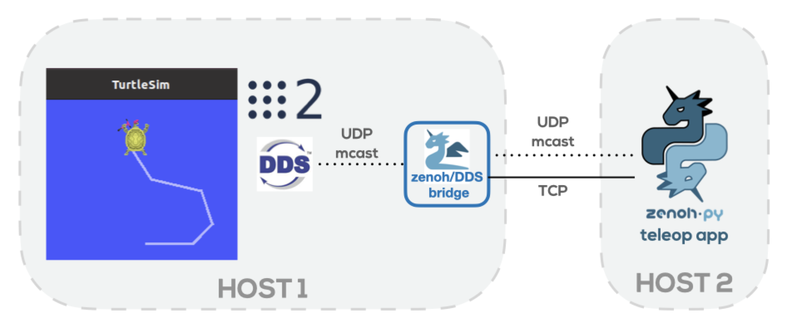
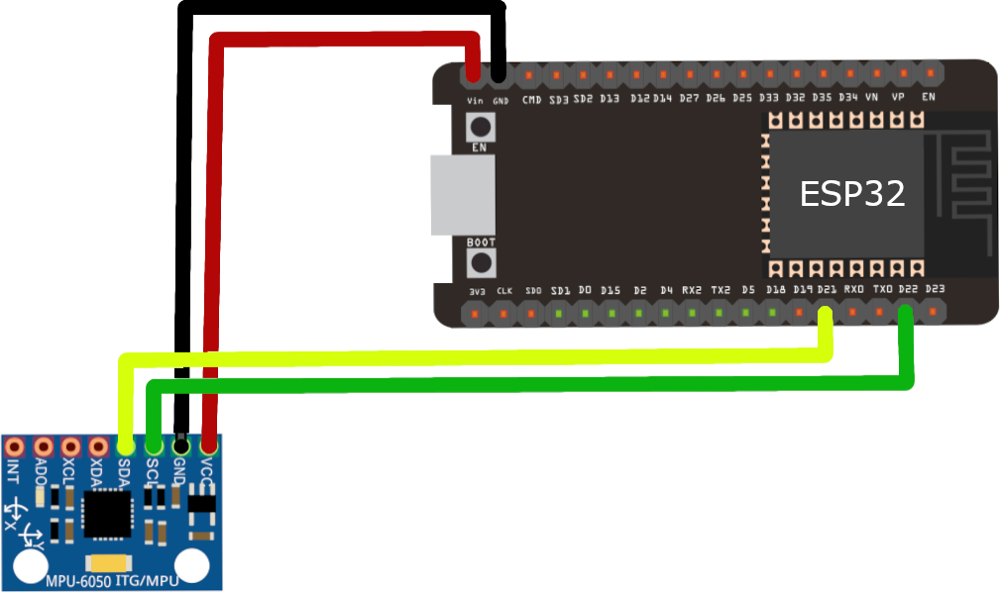
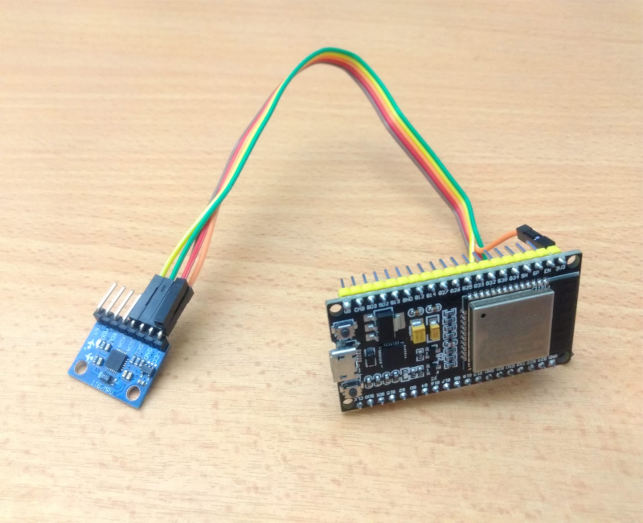

In a [previous blog](https://zenoh.io/blog/2021-04-28-ros2-integration/), we showed how you can easily write native Zenoh applications and seamlessly interact with ROS 2 applications. This was exemplified by developing a native Zenoh teleoperation application to control a ROS 2 powered robot, namely a [turtlebot](https://www.robot-advance.com/EN/actualite-turtlebot3-burger-by-robotis-149.htm) or its simulation counterpart [turtlesim](http://wiki.ros.org/turtlesim), from anywhere in the world. In this blog, we will go one step further by trying to make it cool and fun -- together with a bit of nostalgia.

As a result of this work, we are unveiling the capabilities of Zenoh to bridge the gap between ROS 2 and microcontroller environments by providing a lightweight and unified data-centric protocol coupled with its own implementation Zenoh middleware solution and DDS bridge. In other words, ROS 2 users can extend their application towards microcontrollers via Zenoh.

The reminder of this blog will recap the main concepts of our previous blog and guide you towards its extension to use [Zenoh-pico](https://github.com/eclipse-zenoh/zenoh-pico) and microcontrollers.

----
# Rewinding time
In the scenario described below, the Zenoh teleoperation application discovers the Zenoh/DDS bridge via its scouting protocol that leverages UDP multicast - when available. Once discovered, a TCP connection is established between the app and the bridge. But the Zenoh application can also be configured to directly establish a TCP connection with a known host, without relying on scouting protocol. Thus it can connect directly to the bridge (if reachable) or to 1 or more Zenoh routers that will route the Zenoh communications between the application and the bridge.



At this stage, the user can make use of its keyboard to control the robot (just like in a game).

# It seems like the 80s...can we fast forward in time?

Remember that it is a proof-of-concept demo to show the capabilities of Zenoh. Still, we have to agree that the turtlesim and teleoperation via keyboard is too much 80s.
So, how to forward this demo in time...
 - in the 90s, we had an explosion of game controllers
 - in the 00s, we had an explosion of pads, joysticks, racing wheels, and other gaming interfaces.
 - in the 10s, we had an explosion of motion controller
 - in the 20s, we are having an explosion of immersive experiences.

At this point, you might have guessed already that we are going for an immersive experience.

## Zenoh-powered Immersive Controller

As announced in a [previous blog](https://zenoh.io/blog/2021-10-04-zenoh-pico-guide/), Zenoh-pico is available as a lightweight implementation of Zenoh APIs in C, fully compatible with its Rust counterpart. It mainly targets embedded systems and, in particular, microcontrollers.

Thanks to the combination of Zenoh-pico, microcontrollers and a couple of sensors, we extended our initial teleoperation controller and embedded it anywhere. In doing so, we are going to show you how to control a turtlebot and its simulation counterpart turtlesim by means of hand gestures. For example, the small size of the microcontroller and sensors make them almost imperceptible to the eye and touch, and can be easily embedded in a regular glove for a truly immersive experience.

Wouldn’t it be cool and fun to have the power in your hand? How many of you have ever tried to use the force as a Jedi or telekinetic powers as an X-Men?

Here is a short video of our Zenoh-powered Immersive Controller prototype being used to control the turtlebot.


---
# Show me how to do it myself
All you need is an [ESP32](https://www.espressif.com/en/products/socs/esp32), a MPU-6050 accelerometer and gyroscope module and, of course, [zenoh-pico](https://github.com/eclipse-zenoh/zenoh-pico). Note that, even if you decide to use other microcontrollers or sensors, all Zenoh-related code and components remain unchanged.

By providing a set of abstractions for pub/sub, geo distributed storage, query, and evals, Zenoh really simplifies the development of distributed applications. In other words, Zenoh internally handles all the inherent complexities of a distributed system and data distribution, keeping your life as a developer much simpler.


## 1. Pinout and Connections

The first step is to wire the ESP32 with the MPU-6050 sensor. Here are some guidelines:

| **MPU-6050** |   |   | **ESP32** |
|:------------:|---|---|:---------:|
|      VCC     |   |   |    3V3    |
|      GND     |   |   |    GND    |
|      SCL     |   |   |   GPIO22  |
|      SDA     |   |   |   GPIO21  |

|                                                               |   |   |                                                            |
|:-------------------------------------------------------------:|---|---|:----------------------------------------------------------:|
|  |   |   |  |

## 2. Code

You can find the steps on how to set up your project in our [previous blog](https://zenoh.io/blog/2021-10-04-zenoh-pico-guide/). Then, you just need this little snippet of code to make it work. Note that, Zenoh-related code is only around 12 lines, while the remaining code is related to reading the values of the sensor, pre-processing them, and creating the Twist message.

```c
#include <Arduino.h>
#include <WiFi.h>
#include <Wire.h>
#include <MPU6050_tockn.h>

extern "C" {
    #include "zenoh-pico.h"
}

// WiFi-specific parameters
#define SSID "SSID"
#define PASS "PASSWORD"

// Zenoh-specific parameters
#define MODE "client"
#define URI "/rt/cmd_vel"

// Measurement specific parameters
#define X_SCALING_FACTOR 100.0
#define X_MAX_VALUE 0.20
#define X_MIN_VALUE -0.20

#define Y_SCALING_FACTOR 10.0
#define Y_MAX_VALUE 2.80
#define Y_MIN_VALUE -2.80

MPU6050 mpu(Wire);
double offset_x = 0.0;
double offset_y = 0.0;

zn_session_t *s = NULL;
zn_reskey_t *reskey = NULL;

void setup(void)
{
    // Set WiFi in STA mode and trigger attachment
    WiFi.mode(WIFI_STA);
    WiFi.begin(SSID, PASS);
    while (WiFi.status() != WL_CONNECTED)
        delay(1000);

    // Initialize MPU6050
    Wire.begin();
    mpu.begin();
    mpu.calcGyroOffsets(true);
    mpu.update();
    offset_x = mpu.getAccAngleX();
    offset_y = mpu.getAccAngleY();

    // Initialize Zenoh Session and other parameters
    zn_properties_t *config = zn_config_default();
    zn_properties_insert(config, ZN_CONFIG_MODE_KEY, z_string_make(MODE));

    s = zn_open(config);
    if (s == NULL)
        return;

    znp_start_read_task(s);
    znp_start_lease_task(s);

    unsigned long rid = zn_declare_resource(s, zn_rname(URI));
    reskey = (zn_reskey_t*)malloc(sizeof(zn_reskey_t));
    *reskey = zn_rid(rid);

    delay(1000);
}

void loop()
{
    delay(20);
    mpu.update();

    double linear_x = (mpu.getAccAngleX() - offset_x) / X_SCALING_FACTOR;
    linear_x = min(max(linear_x, X_MIN_VALUE), X_MAX_VALUE);
    if (linear_x < 0.10 && linear_x > -0.10)
            linear_x = 0;

    double linear_y = (mpu.getAccAngleY() - offset_y) / Y_SCALING_FACTOR;
    linear_y = min(max(linear_y, Y_MIN_VALUE), Y_MAX_VALUE);
    if (linear_y < 0.5 && linear_y > -0.5)
            linear_y = 0;

    Twist measure;
    measure.linear.x = linear_x;
    measure.linear.y = 0.0;
    measure.linear.z = 0.0;
    measure.angular.x = 0.0;
    measure.angular.y = 0.0;
    measure.angular.z = linear_y;

    uint8_t twist_serialized_size = 4 + sizeof(double) * 6;
    char buf[twist_serialized_size];
    serialize_twist(&measure, buf);

    if (s == NULL || reskey == NULL)
        return;

    zn_write(s, *reskey, (const uint8_t *)buf, twist_serialized_size);
}
```
**Note:** auxiliary structs and serialization functions are missing in the previous snippet. For the full code, including the adaptations for the turtlesim, please check the code under https://github.com/eclipse-zenoh/zenoh-demos/tree/master/ROS2/zenoh-pico-teleop-gyro

## 3. Setting up the infrastructure and the turtlebot / turtlesim
In order to set up the infrastructure and the turtlebot / turtle in different configurations, follow the steps described in our [previous blog](https://zenoh.io/blog/2021-04-28-ros2-integration/). However, note that Zenoh-pico currently supports client mode only (a lightweight peer mode is coming soon). As such, you might need to deploy at least one Zenoh router to which your microcontroller application will need to connect to. The minimum steps are shown below:

 1. Start the turtlesim or turtlebot3 burger:
    - ros2 run turtlesim turtlesim_node               # turtlesim
    - ros2 launch turtlebot3_bringup robot.launch.py  # turtlebot3 burger
 2. Start the Zenoh router:
    - zenohd
 3. Start the Zenoh/DDS bridge if not included as a plugin in Zenoh router
    - zenoh-bridge-dds
 4. Build, Upload and Start Ros2Teleop in your microcontroller
    - platformio run -t upload
 5. Move the sensor to drive the robot

## 4. Demonstration

If everything goes well, you might be able to control the robot just like in the video below.

|                         Turtlebot3 Burger                          |   |   |                              Turtlesim                             |
|--------------------------------------------------------------------|---|---|:------------------------------------------------------------------:|
|  |   |   |  |

Really cool, isn’t it?!

---
# Conclusion

Although it seems a very simple demonstration, it is supported by several state-of-the-art technologies and protocols that are running under the hood. For you as a developer, being abstracted from all of them means that you can focus on the core business of your application.

Moreover, Zenoh and Zenoh-pico are bridging the gap between ROS 2 and microcontroller environments, allowing ROS 2 users to make use of all its capabilities within their applications. Summarizing some key points:
 - [Zenoh](https://github.com/eclipse-zenoh/zenoh) is hatching as a powerful and yet low overhead data-centric solution, extremely flexible to accommodate a wide range of distinct applications and use cases.
 - [Zenoh-pico](https://github.com/eclipse-zenoh/zenoh-pico) allows you to integrate Zenoh functionalities in your embedded systems and microcontrollers natively in C.
 - [Zenoh bridge for DDS](https://github.com/eclipse-zenoh/zenoh-plugin-dds) allows to (1) bridge DDS communications through Zenoh, and (2) reduce by up to 99.97% the discovery traffic between the nodes.

Tell us about your ideas on how to unlock the power of microcontrollers. We will provide all the support you need either in [GitHub](https://github.com/eclipse-zenoh) or [Discord](https://discord.gg/cY4nVjUd).


[**--CG**](https://github.com/cguimaraes/)
[**--GB**](https://github.com/gabrik/)
[**--JE**](https://github.com/JEnoch/)

