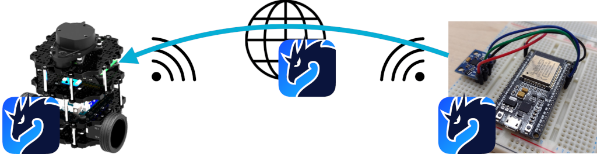
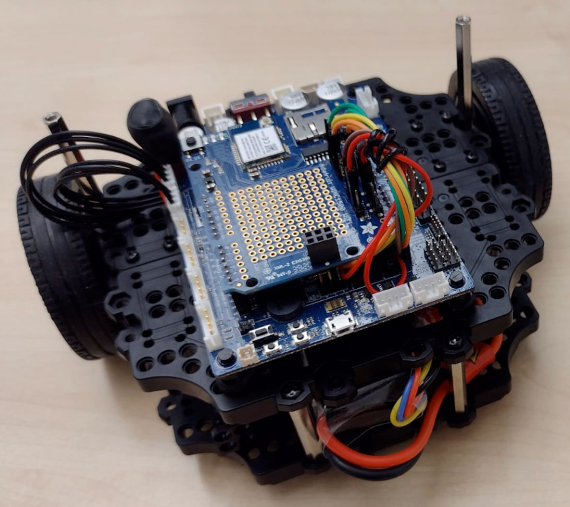
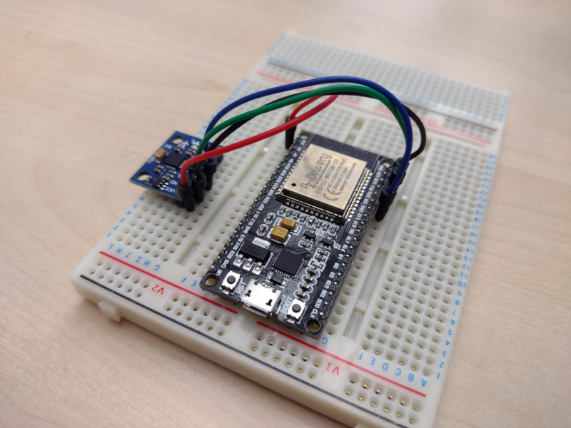

In previous blogs [(1)](https://zenoh.io/blog/2021-04-28-ros2-integration/)[(2)](https://zenoh.io/blog/2021-11-09-ros2-zenoh-pico/), we showed how you can easily develop native Zenoh applications and seamlessly integrate them with ROS2 applications by using Zenoh bridge for DDS. In particular, this was successfully exemplified by using a TurtleBot, a well-known, low-cost, personal robot kit with open-source software and hardware.

In this blog, we go one step further to show how you can bring Zenoh down to the TurtleBot’s microcontroller and control it from a different geographic location via a Zenoh infrastructure. By following a native Zenoh approach, you can rely on better decentralization concepts where no translation semantics are required.

Such approach allows the same technology to be used across all components from your application, from the microcontrollers to the cloud robotic platform, as well as bringing peer-to-peer capabilities to the microcontroller. To showcase it, we started working on the first demonstration of a TurtleBot look-a-like, fully Zenoh-powered personal robot that we will call from now on **DragonBotOne**.



Note that, although ROS2 is not used in this example, we still rely on ROS2 data type definitions as a way to leverage robot abstractions and to ease any migration towards Zenoh. As a consequence, leveraging the Zenoh-to-ROS2 connectivity any ROS2 application, anywhere on the Zenoh network, could interact with the robot.

Check out the final result!!!


The remainder of this blog will take you through the journey towards the hatching of our DragonBotOne egg.

----
# Checking behind the scenes
DragonBotOne is brought to life under the wings of Zenoh. Namely, both Zenoh and Zenoh-Pico implementation are on its genesis:
 - [Zenoh](https://github.com/eclipse-zenoh/zenoh) as a powerful and yet low overhead data-centric solution to deal with data in motion, data at rest and computations across the cloud-to-things continuum.
 - [Zenoh-Pico](https://github.com/eclipse-zenoh/zenoh-pico) as the enabler to integrate Zenoh functionalities in embedded systems and microcontrollers natively in C.

## DragonBotOne: OpenCR with WiFi connectivity

OpenCR consists of an open-source control module developed for ROS embedded systems. Given its completely open-source hardware and software and the fact it is widely used in several robotic applications, it quickly becomes our preferred choice for the development of DragonBotOne.

Still, we had to move some rocks along the way:

 1. **No networking interfaces:** OpenCR is able to work with both versions of ROS. With ROS1, OpenCR relies on ROS Serial over one of its serial ports as a protocol for wrapping standard ROS serialized messages and multiplexing multiple topics and services. With ROS2, it runs the DynamixelSDK protocol between a full fledged ROS2 subscriber and the board itself by leveraging one of its serial ports. As such, it is usually coupled with a RaspberryPi that acts as a proxy for all the network-based communications. However, DragonBotOne is designed to comprise a single microcontroller that interfaces with the different sensors and actuators. As such, OpenCR was enhanced with a WiFi module.
 2. **We added support into Zenoh-Pico:** Although Zenoh-Pico was already supporting the Arduino framework, every platform and board have their own specificities that might require additional porting of the system and network syscalls. Such a fact becomes a bit tricker due to the lack of a network interface, thus no native support for the networking aspects.
 3. **Single thread:** Despite single-thread applications are a baseline requirement for Zenoh-Pico, it has mostly targeted multi-thread applications, where the main, read, and lease tasks run in separate threads. DragonBotOne paved the way to show the world how Zenoh-Pico can also fit single-thread applications. No modifications were made to the core code of Zenoh-Pico showing how it was already ready for such a paradigm.



Finally, DragonBotOne made it all the way to hatch.

All source-code and step-by-step guides can be found in our [GitHub repositories](https://github.com/eclipse-zenoh/zenoh-demos/tree/master/zenoh-dragonbot).


## Remote Controller: ESP32 with a MPU-6050 accelerometer and gyroscope module
Born in a time where immersive experiences are becoming the mainstream, it is only natural if the controlling interfaces of DragonBotOne also follow such a paradigm. Thus, you can not only control DragonBotOne with a keyboard or a joypad but also by means of hand gestures.

For the development of this remote controller, we used an ESP32 with a MPU-6050 accelerometer and gyroscope module. By tilting the controller, you can make DragonBotOne to move forward and backward as well as to turn left and right. Moreover, you can control the velocity according to the inclination of the remote controller.



For additional implementation details, check our previous [blog](https://zenoh.io/blog/2021-11-09-ros2-zenoh-pico/).

# Conclusion

The simplicity and efficiency of Zenoh allied to the lightweightness of Zenoh-Pico is paving the way for a complete ecosystem in the whole cloud-to-things continuum, without impacting its high-performance or set of features and capabilities.

Summarizing the main takeaways:

 1. It enhances the set of capabilities and features supported on extremely constrained devices, such as microcontrollers.
 2. It expands communication in such devices towards low-powered link technologies that can be used as backup links, traffic separation, etc.
 3. It expands the  landscape for how robotic systems and their applications are designed:
    - powerful nodes that centralize the communication between the network and the microcontroller can be stripped from the robots, paving the way to cheaper DIY robots.
    - each component can be completely independent and act on its own in a fully decentralized design.
    - fine-grained control over the data and how it is distributed and consumed within the system.

Nevertheless, Zenoh is completely interoperable with already existing solutions that rely on ROS2+DDS. It is up to you to decide how high will our dragon fly or how deep will it swim.

We will provide all the support you need either in [GitHub](https://github.com/eclipse-zenoh) or [Gitter](https://gitter.im/atolab/zenoh).


[**--CG**](https://github.com/cguimaraes/)
[**--GB**](https://github.com/gabrik/)

----
# Additional Notes:

PlatformIO is a great tool when it comes to working with embedded development. Since OpenCR was not listed as one of the supported boards in PlatformIO, we decided to do it ourselves and share it with the community.

1. https://github.com/cguimaraes/platform-ststm32/tree/opencr-support
   - Apply the changes in this branch as a patch in your ```$PLATFORMIO_DIR/platforms/ststm32``` directory.
   - If you do not have this directory then you can opt by cloning the full repository instead.
     - Since you are manually installing the packages, you need to manually create the PlatformIO package manager files. To do so, create the following file ```.piopm``` in ```$PLATFORMIO_DIR/platforms/ststm32``` directory with the following content:
```
{"type": "platform", "name": "ststm32", "version": "15.2.0", "spec": {"owner": "platformio", "id": 8020, "name": "ststm32", "requirements": null, "url": null}}
```

2. https://github.com/cguimaraes/framework-arduinoststm32-opencr
   - Clone the following repo as ```$PLATFORMIO_DIR/packages/framework-arduinoststm32-opencr```
   - Since you are manually installing the packages, you need to manually create the PlatformIO package manager files. To do so, create the following file ```.piopm``` in ```$PLATFORMIO_DIR/packages/framework-arduinoststm32-opencr``` directory with the following content:
```
{"type": "tool", "name": "framework-arduinoststm32-opencr", "version": "1.4.18", "spec": {"owner": "platformio", "id": 8080, "name": "framework-arduinoststm32-opencr", "requirements": null, "url": null}}
```

3. You are now ready to create your OpenCR project using ```platformio init -b opencr```

Now you can easily build and upload your own applications into OpenCR boards, but we would love them to be Zenoh-powered 😜
