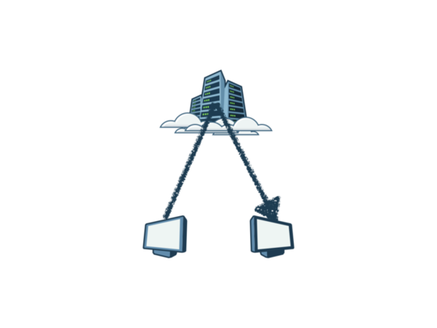
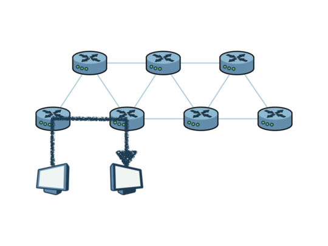
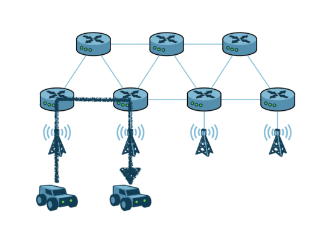
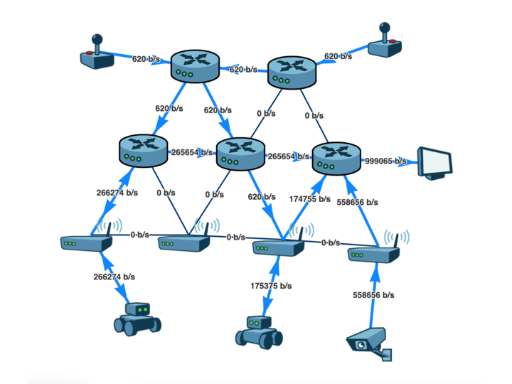

 
Connected cars, smart factories, swarms of robots… More and more applications need device mobility and require low latency for local device to device communications. With the increases in energy costs and its constrained  availability, there is an increasing necessity to optimize data paths and to avoid unnecessary data transmissions – as just for clarity, communications takes the lion share in  energy consumption when compared to computation.

Cloud centric architectures are energetically greedy  and offer poor latency. Decentralization becomes an increasingly pressing necessity. In this blog post we will see why mobility raises complex challenges in decentralized deployments and how zenoh, with its efficient discovery and dynamic routing, can offer seamless session migration and overcome those obstacles.

## Cloud Architectures

Cloud architectures promote centralisation toward a cloud hosted instance of a service, such as storage, compute or messaging. If we consider cloud messaging, then devices connect to an instance deployed on a cloud data center that acts as a broker to provide connectivity to all other devices – as shown in the figure below. This approach is convenient in several aspects, since there is a single instance of the service sitting on the cloud. Yet it leads to a centralized, hub-and-spoke architecture that introduces several challenges with respect to latency, connectivity requirements, energy consumption, security, mobility and the ability to exploit locality.



## Decentralization with Zenoh

Zenoh has been designed to support decentralized architectures. As such, it supports different communication topologies, including peer-to-peer, routed and brokered, over which it provides high performance publish/subscribe and queries for geo-distributed storages. In peer-to-peer deployments, all devices communicate directly with each other without any infrastructure components involved.  When direct communication is not possible, Zenoh routers  act as mediation points for devices to get connectivity with the rest of the system and across the Internet. Thanks to its data-centric paradigm, zenoh can transparently allow devices to connect to the nearest zenoh router to get optimal routing paths to other points in the system and optimal latency for local communications, thus avoiding many of the issues faced by host-centric and End-to-End solutions.



## Decentralization and mobility

When mobility gets into the party, things get more complicated. As a device is moving and the handover occurs in the physical layer (5G roaming, WiFi handover, …), if the device remains connected to the same zenoh router,  the data path becomes less and less optimal as the distance between them grows. This is a well-known issue in traditional mobility solutions as anchor points lead to suboptimal and longer data paths.


## zenoh session migration

As shown in this [previous experiment](https://zenoh.io/blog/2021-03-23-discovery/), the zenoh wire protocol is very lightweight and its discovery very efficient. The zenoh infrastructure and its several routing algorithms support high dynamicity. This allows zenoh devices to migrate their sessions from one zenoh router to another in a smooth and seamless manner. Devices can then connect to the nearest router after the mobility occurs and maintain optimal latency by migrating from zenoh router to zenoh router while moving.



## Demo

The following demo demonstrates zenoh session migration in a WiFi environment.



Hardware deployment:
- 4 WiFi hotspots deployed in a LAN (RaspberryPi 3).
- 1 camera attached to one of the WiFi access points.
- 2 turtlebot3 robots with 1 camera each (RaspberryPi 3).

Software deployment:
- A zenoh router deployed on each WiFi access point.
- Additional zenoh routers deployed on different hosts in the LAN.
- Two control applications: zenoh clients publishing move commands to the robots.
    - Rust: https://github.com/eclipse-zenoh/zenoh-demos/tree/apis-merge/ROS2/zenoh-rust-teleop
    - Python: https://github.com/eclipse-zenoh/zenoh-demos/tree/apis-merge/ROS2/zenoh-python-teleop
- Two robot applications: zenoh clients deployed on the robots which subscribe to move commands and drive the motors accordingly and publish video frames from the camera.
    - Rust: https://github.com/eclipse-zenoh/zenoh-demos/tree/apis-merge/turtlebot3/zturtle-rust
    - Python: https://github.com/eclipse-zenoh/zenoh-demos/tree/apis-merge/turtlebot3/zturtle-python
- A display application: zenoh client subscribing to video streams and displaying them.
    - Rust: https://github.com/eclipse-zenoh/zenoh-demos/tree/apis-merge/computer-vision/zcam/zcam-rust
    - Python: https://github.com/eclipse-zenoh/zenoh-demos/tree/apis-merge/computer-vision/zcam/zcam-python
- The zenoh administration tool.

The application deployed in the robots constantly monitors the currently associated WiFi access point. Each time the WiFi access point changes, the robot application reconnects to the closest zenoh router (details discussed below).


<video controls width="720">
    <source src="../../img/blog-zenoh-mobility/zenoh_mobility_trim_1080p_low_x2.mp4"
            type="video/mp4">

    <a href="../../img/blog-zenoh-mobility/zenoh_mobility_trim_1080p_low_x2.mp4">zenoh_mobility_trim_1080p_low_x2.mp4</a>
</video>


&nbsp;

To perform such zenoh session migrations it is needed that the device:
1. **Detects that it moved.** More precisely, detect that handover occurred and that a closer router may be available. Such detection is highly dependent on the kind of wireless communication involved (5G, WiFi, …) and it would be detected by the zenoh scouting sub-protocol. In this demo, the detection is performed by periodically looking at the BSSID of the currently associated WiFi access point. 
1. **Finds the new closest zenoh router.** Again, this is dependent on the underlying infrastructure and would leverage an implementation of Zenoh’s scouting that is specific to the network. For instance, a DNS-based scouting implementation would probably be the most portable, or a DHCP-based scouting implementation might allow zenoh router discovery during IP bootstrap. For this particular demo, the robots are configured with a json file containing a WiFi BSSID to zenoh endpoints mapping.

    Example : 
    ```json
    {
        "default": "[\"tcp/10.10.10.10:7447\"]",
        "00:00:00:00:00:00": "[\"tcp/10.10.10.11:7447\"]",
        "11:11:11:11:11:11": "[\"tcp/10.10.10.12:7447\"]"
    }
    ```
    For this experiment, the mapping is deployed as a json file in each robot. But in a more advanced version, the mapping could be stored in several zenoh storages deployed at strategic places in the system. It could even be served by one or several zenoh queryables and computed on demand according to some algorithms.

## Conclusion

Mobility in decentralized environments is a notorious challenge. Zenoh provides  a very efficient wire protocol, a light discovery and adaptive routing algorithms that demonstrates to be highly responsive in dynamic environments and topology changes and provides seamless session migration. This ensures optimal latency and resource consumption to devices in decentralized systems in spite of mobility.

[**--OH**](https://github.com/OlivierHecart)

*Special thanks to:*
- *[**--SN**](https://github.com/sreeja) for her driving skills.*
- *[**--CG**](https://github.com/cguimaraes/) for his WiFi expertise.*
- *[**A+**](https://github.com/kydos/) for peer review.*
