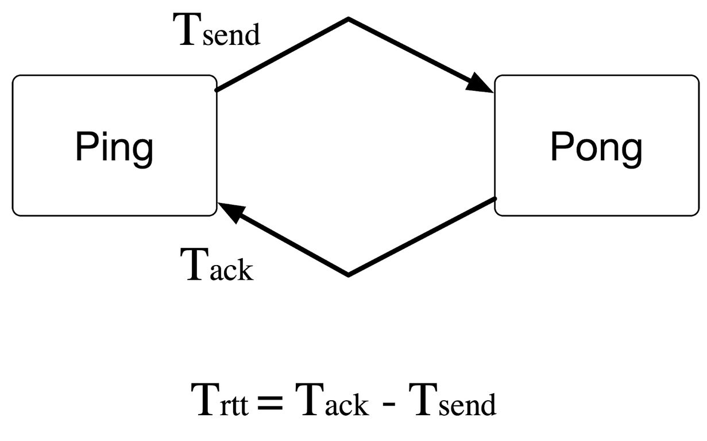
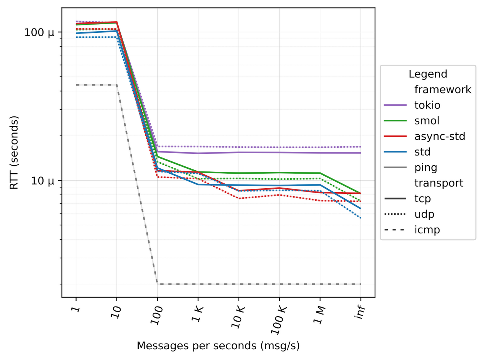
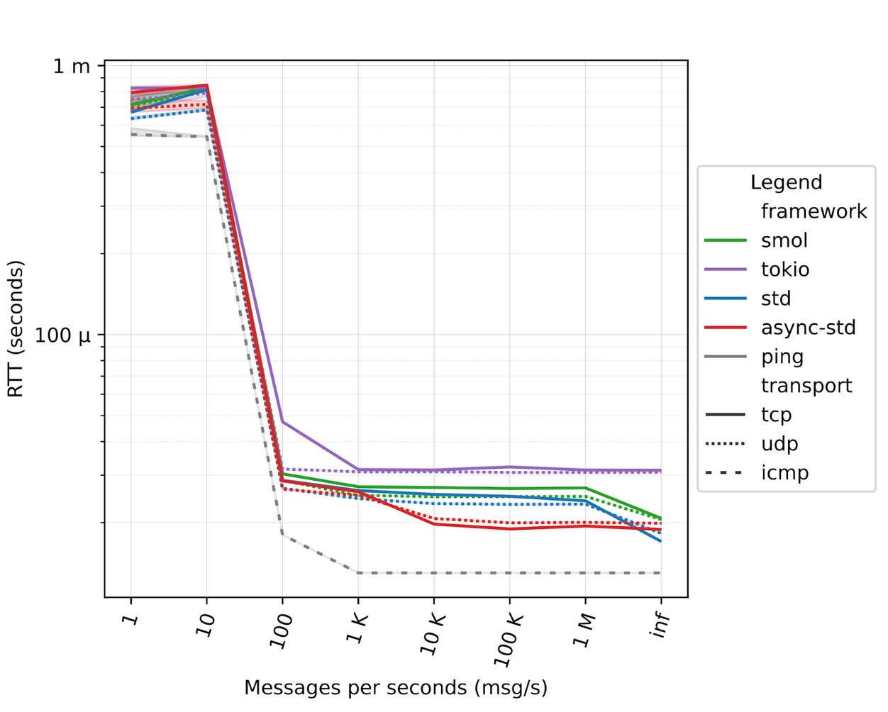
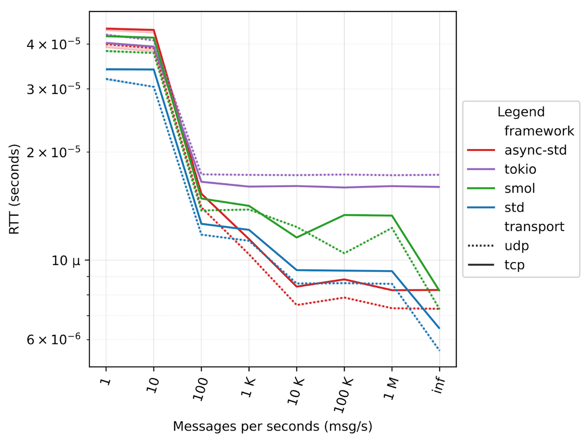
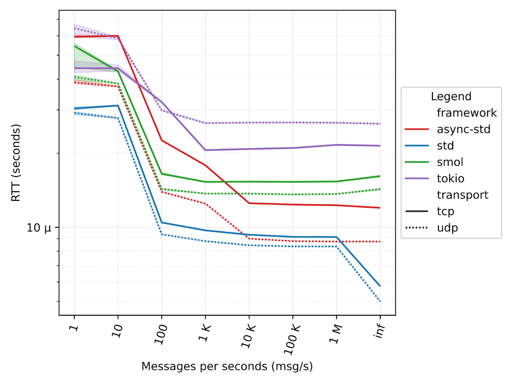
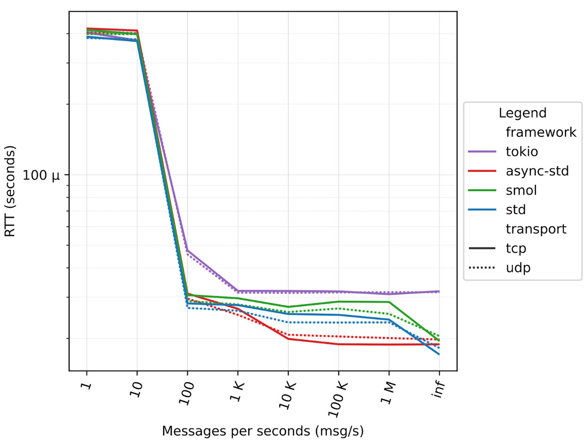
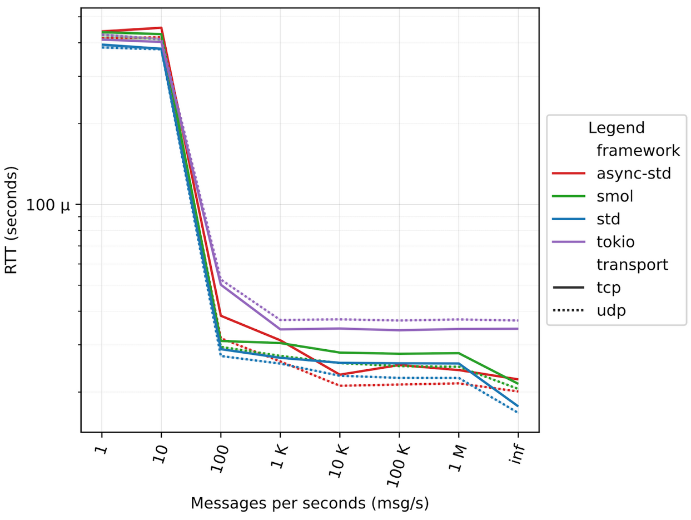
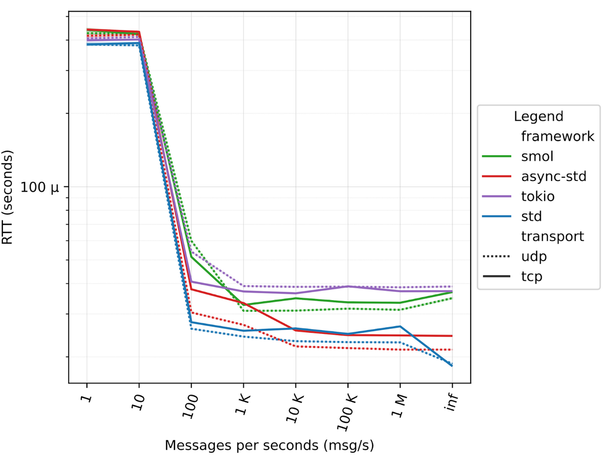

As we previously mentioned in [this blog post](https://zenoh.io/blog/2021-07-13-zenoh-performance-async/), Zenoh is written in **Rust** and leverages the **async** features to achieve high performance and scalability. At the present stage, we rely on the [async_std](https://async.rs/) framework – a decision that we took after a careful performance evaluation of the frameworks available in late 2019. This framework has proven to be quite effective, allowing Zenoh to reach more than **4M** msg/s with 8 bytes payload and over **45Gb/s** with 1MiB payload while keeping latency of **~30µsS**.

However, **async_std** development seems to be stalling and the community appears to be moving towards other async frameworks, such as **Tokio**. As such, we decided to re-evaluate the major Rust async frameworks in order to assess the possibility to move to another framework without compromising our performances.

In this post, we will go through the evaluation of three asynchronous frameworks with respect to how they perform on asynchronous networking. Each of them will be evaluated and compared with the baseline performances provided by the equivalent synchronous primitives provided by the Rust standard library. Namely, we are targeting the following frameworks:

- [async_std](https://async.rs/)
- [Tokio](https://tokio.rs/)
- [smol](https://github.com/smol-rs)

## Preparation of the testing environment

The first step toward reproducible results and fair evaluation is a stable and dedicated environment. In other terms, in any benchmarking effort, it is essential to reduce the number of factors that may influence the results of our performance evaluation. [This guide](https://easyperf.net/blog/2019/08/02/Perf-measurement-environment-on-Linux) effectively summarizes how to properly setup a Linux environment and how to get consistent results. The second recommendation is to have a thorough read of *“[The Rust Performance Book](https://nnethercote.github.io/perf-book/title-page.html)”* If you, like us, are developing in Rust, we recommend you to go through it since we found it really insightful for what concerns performance tips and tricks along with profiling techniques in Rust. Another nice reference on how to write performant code in Rust is [this one](http://likebike.com/posts/How_To_Write_Fast_Rust_Code.html]).

All the tests below are run on two of our workstations equipped with an AMD Ryzen 5800X @ 4.0GHz, 32 GB of RAM, running Ubuntu 20.04.3 LTS with Kernel 5.4.0-96-generic, connected through a 100Gb Ethernet connection (Mellaxon ConnectX-6 Dx).


## Experiment Description

For such evaluation, we concentrate on Round Trip Time (RTT) by building a ping-pong application for each framework. This synthetic benchmark is essential for us as it gives a lower bound on the achievable latency as well as its behavior under “async contention”. The **Round Trip Time (RTT)** is the amount of time it takes for a message to be sent plus the amount of time it takes for the acknowledgment of that message being received.

The picture below illustrates the ping-pong application, and how the RTT is computed.



Our RTT tests are provided [here](https://github.com/ZettaScaleLabs/rust-async-net-eval). So, you can check what we actually used to get the RTT results and replicate it yourself!


## Looking at the results

In the following, we are presenting the RTT results for all the frameworks under two different scenarios: over localhost and over the network.

### Localhost

In our first series of tests, the ping-pong application is executed on a single machine, leveraging only localhost communication.

#### RTT

To replicate these experiments, you can build and run the RTT test by following these instructions:

```sh
$ git clone https://github.com/ZettaScaleLabs/rust-async-net-eval.git
$ cd rust-async-net-eval.git
$ make

# ---- RTT in localhost ----
# run all the tests in localhost
$ ./run-localhost.sh -asStP

# parse the results
$ python3 parse.py -d latency-logs -k rtt -o localhost-latency.pdf -l 0

```

One very important aspect to mention is that RTT depends on the load of the system. As you can see from the figure below, as the number of messages per second increases, RTT decreases. This is due to the fact that when messages are sent at a low rate, the processes are more likely to be de-scheduled by the operating system. This operation adds additional latency since the processes need to be rescheduled when messages are sent and received. This is true for both the Rust code and the classical ping, which is reported as a reference baseline for RTT.

The x-axis of the figure below shows the number of messages that we configured to be sent in one second, from a single message to 1 million and beyond. The *inf* case represents the scenario where messages are sent back-to-back as fast as possible. In such a backlogged scenario, we can see that Rust latency is as little as 5 µs for the standard library. The payload size of each message is 64 bytes, the same as standard ICMP.



### Over the network

It is also interesting to see the behavior over a real physical network, as the asynchronous frameworks should take advantage of real blocking I/O operations, such as sending messages over the network. In this case, we used two workstations, one running the ping and the other one running the pong.



### Adding CPU bounded computing

But Zenoh does not only send data, but it also has a set of CPU-bound tasks, like looking up a forwarding table, de/serializing messages, and so on. To this extent, it is interesting to validate how such frameworks perform when interleaving the I/O tasks with come computing-intensive tasks.

A Zenoh peer runs two separate tasks for each session with other Zenoh peers, so we modified the ping-pong applications to spawn a number of tasks that mimics those compute-intensive tasks.
In our tests we range from 10 to 1000 tasks, mimicking from 5 to 500 “zenoh sessions”, figures below illustrate the different results.

#### Localhost

##### 10 tasks



##### 1000 tasks



#### Over a 100GbE network

In this series of tests the ping and the pong applications are running on two different machines, leveraging the 100GbE network connectivity, varying the number of computing tasks.

##### 10 tasks



##### 100 tasks



##### 1000 tasks




## Conclusions

Our evaluation shows **async_std** and **smol** are quite close to the standard library and  outperform it on some workloads. On the other hand, **Tokio** seems to reach very soon its limit ~18µs with 100 msg/s and it shows no differences between TCP and UDP. Additionally, Tokio seems to be adversely impacted by the CPU-bound (Rust) asynchronous tasks.
Based on these results, we believe that we have no choice but remain on **async-std**. That said, it would be interesting to understand why **Tokio** exposes such behavior under contention and also to improve its raw performance to close the gap with **async_std**. As it stands, **Tokio** introduces 8µs additional latency in localhost and 10µs over the network.

Ideally, we would like to see one async framework becoming the “standard”, but to do so we can’t ignore raw performance. We look forward to engaging and working with the rest of the community to help make this happen.
