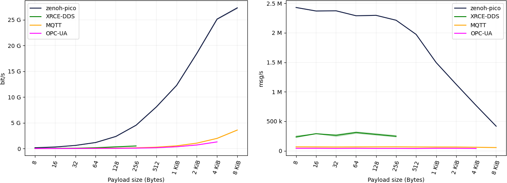
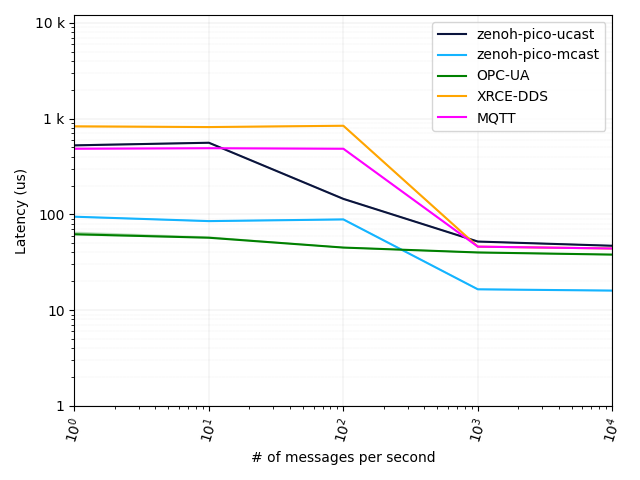
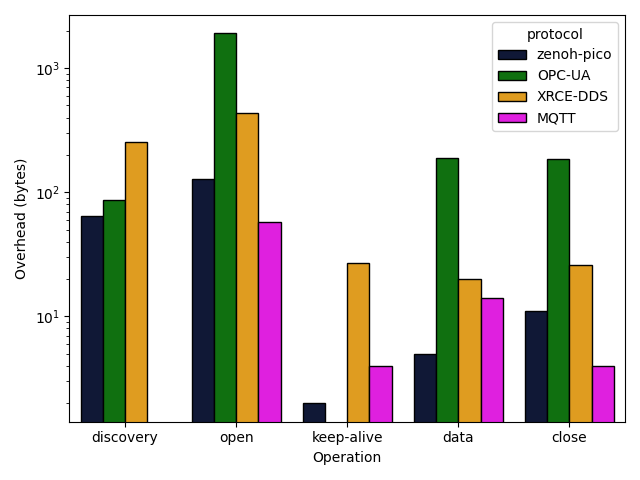

In a [previous blog post](https://zenoh.io/blog/2021-10-04-zenoh-pico-guide/), we introduced Zenoh-Pico, an implementation of Zenoh for microcontrollers and embedded devices, along with a preliminary performance results and its integration on off-the-shelf robots (by bridging both legacy ROS2+DDS and Zenoh systems or by making it a full-fledged Zenoh system).

In this post, we will dive deeper on Zenoh-Pico,  show, how Zenoh-Pico is capable of:
 - exchanging close to **2.5M msg/s** for small payloads, and over **25 Gbps** for larger messages,
 - achieving end-to-end latency (i.e., one way delay) as small as **45 µsec** and **15 µsec** for unicast and multicast transports, respectively,
 - minimizing the overhead in the wire down to **5 bytes** per data transmission,
 - fitting all its capabilities in less than **50KB** footprint, which can be quickly reduced to **~15KB** in tailored compilation setups, and
 - provides **simple** to use and yet **powerful APIs**.

The remainder of this post will compare Zenoh-Pico against  technologies currently used in embedded devices, and more specifically with DDS-XRCE, MQTT, and OPC-UA. We will depart from higher layers analyzing the ergonomics and  simplicity of the APIs, we will then look into performances and  compare throughput, latency, wire overhead, and flash memory footprint.

----
# Why constrained devices?

With digitalization spreading across industries and the growing adoption of Cyber Physical Systems (CPS)  new applications, services, and use cases are emerging that require scalable, and extremely performant,i.e. , high throughput and low latency, data-management technologies. Connected cars, smart factories, swarms of robots are some examples that impose such requirements over device-to-device and/or device-to-Edge-to-Cloud communications.

This means that your applications can operate beyond standalone systems limited to onboard capabilities, and start exploiting the ubiquitous computing, storage, and networking capabilities available anywhere in the network and at any time. Data distribution and storage became paramount in such vision, thus data exchange protocols face new needs with respect to vertical and horizontal scalability, support for constrained networks and devices with low duty cycle – in other terms devices that are disconnected/sleeping most of the time as well as ability to deal with both data in motion and data at rest. 

Protocols used today to build these systems, such as MQTT, DDS, CoAP and even HTTP were not designed with these needs in mind nor considering the whole Cloud-to-Things continuum. As a result, architects and developers are forced into patchwork design in which multiple protocols are stitched together to provide some meaningful end-to-end semantics.

**Zenoh** provides a stack that unifies data in motion data at rest and computations, by carefully blending traditional pub/sub with geo-distributed storages, queries and computations while retaining a level of time and space efficiency that is well beyond any of the mainstream stacks. And beyond all that, your entire system can leverage on Zenoh as the single solution, no matter if your applications are running on a microcontroller and/or in a powerful resource in the Cloud.

# Zenoh API for constrained devices

APIs should provide a minimal set of well defined and composable primitives. That's easily said but takes a deep understanding of the problem space and the patience necessary to refine the solution. In Zenoh, we went through a careful thought process in order to understand the abstractions and primitives that must or must not be provided to the users, hiding irrelevant details while not reducing its expressiveness. As a result, Zenoh-Pico provides exactly the same set of primitives as provided by the Zenoh Rust-implementation and its binding, making in fact 99% of Zenoh-C source-code copyable into Zenoh-Pico code.

> “(Software design is) a craft...and it has a lot to do with valuing simplicity over complexity. Many people do have a tendency to make things more complicated than they need to be.”

— Barbara Liskov

But let’s look at some code!! In the following, we compare the minimal source code required to implement a publisher of data in constrained devices, whenever done with Zenoh or with other widely used solutions for robotics (i.e., DDS-XRCE), industrial environments (i.e., OPC-UA), and IoT (i.e., MQTT).

## Zenoh API
```C
int main(int argc, char ****argv)
{
   z_owned_config_t config = z_config_default();
   z_owned_session_t s = z_open(z_move(config));
   if (!z_check(s))
       exit(EXIT_FAILURE);
 
   zp_start_read_task(z_loan(s));    // Zenoh-Pico specific code
   zp_start_lease_task(z_loan(s));   // Zenoh-Pico specific code
 
   z_keyexpr_t keyexpr = z_declare_expr(z_loan(s), z_expr(/demo/example/topic));
   z_put(z_loan(s), keyexpr, (const uint8_t **)buf, buflen);
 
   z_undeclare_expr(z_loan(s), keyexpr);
   z_close(z_move(s));
 
   zp_stop_read_task(z_loan(s));     // Zenoh-Pico specific code
   zp_stop_lease_task(z_loan(s));    // Zenoh-Pico specific code
 
   return 0;
}
```

## XRCE-DDS API
```C
typedef struct
{
   char **buf;
} MyDataType;
 
bool MyDataType_serialize_topic(ucdrBuffer** writer, const MyDataType** data)
{
   ucdr_serialize_array_uint8_t(writer, data->buf, msg_size + 1);
   return !writer->error;
}
 
uint32_t MyDataType_size_of_topic(const MyDataType** data, uint32_t size)
{
   uint32_t previousSize = size;
   size += (uint32_t)(ucdr_alignment(size, 4) + 4 + strlen(data->buf) + 1);
   return size - previousSize;
}
 
int main(int argc, char**** argv)
{
   uxrUDPTransport transport;
   if (!uxr_init_udp_transport(&transport, UXR_IPv4, DDS_IP, DDS_PORT))
       exit(EXIT_FAILURE);
 
   uxrSession session;
   uxr_init_session(&session, &transport.comm, 0x11111111);
   if (!uxr_create_session(&session))
       exit(EXIT_FAILURE);
 
   uint8_t output_reliable_stream_buffer[BUFFER_SIZE];
   uxrStreamId reliable_out = uxr_create_output_reliable_stream(&session, output_reliable_stream_buffer, BUFFER_SIZE, STREAM_HISTORY);
 
   uint8_t input_reliable_stream_buffer[BUFFER_SIZE];
   uxr_create_input_reliable_stream(&session, input_reliable_stream_buffer, BUFFER_SIZE, STREAM_HISTORY);
 
   uint8_t output_besteffort_stream_buffer[BUFFER_SIZE];
   uxrStreamId besteffort_out = uxr_create_output_best_effort_stream(&session, output_besteffort_stream_buffer, BUFFER_SIZE);
 
   uxrObjectId participant_id = uxr_object_id(0x01, UXR_PARTICIPANT_ID);
   const char** participant_xml = "<dds><participant><rtps><name>default_xrce_participant</name></rtps></participant></dds>";
   uint16_t participant_req = uxr_buffer_create_participant_xml(&session, reliable_out, participant_id, 0, participant_xml, UXR_REPLACE);
 
   uxrObjectId topic_id = uxr_object_id(0x01, UXR_TOPIC_ID);
   const char** topic_xml = "<dds><topic><name>HelloWorldTopic</name><dataType>MyDataType</dataType></topic></dds>";
   uint16_t topic_req = uxr_buffer_create_topic_xml(&session, reliable_out, topic_id, participant_id, topic_xml, UXR_REPLACE);
 
   uxrObjectId publisher_id = uxr_object_id(0x01, UXR_PUBLISHER_ID);
   const char** publisher_xml = "";
   uint16_t publisher_req = uxr_buffer_create_publisher_xml(&session, reliable_out, publisher_id, participant_id, publisher_xml, UXR_REPLACE);
 
   uxrObjectId datawriter_id = uxr_object_id(0x01, UXR_DATAWRITER_ID);
   const char** datawriter_xml = "<dds><data_writer><topic><kind>NO_KEY</kind><name>HelloWorldTopic</name><dataType>MyDataType</dataType></topic></data_writer></dds>";
   uint16_t datawriter_req = uxr_buffer_create_datawriter_xml(&session, reliable_out, datawriter_id, publisher_id, datawriter_xml, UXR_REPLACE);
 
   uint8_t status[4];
   uint16_t requests[4] = { participant_req, topic_req, publisher_req, datawriter_req};
   if (!uxr_run_session_until_all_status(&session, 1000, requests, status, 4))
       exit(EXIT_FAILURE);
 
   ucdrBuffer ub;
   MyDataType topic = { buf };
   uint32_t topic_size = MyDataType_size_of_topic(&topic, 0);
   uxr_prepare_output_stream(&session, besteffort_out, datawriter_id, &ub, topic_size);
   MyDataType_serialize_topic(&ub, &topic);
 
   connected = uxr_run_session_time(&session, 1000);
 
   uxr_delete_session(&session);
   uxr_close_udp_transport(&transport);
 
   return 0;
}
```

## MQTT API
```C
void on_connect_failure(void** context, MQTTAsync_failureData5** response)
{
   printf("Connect failed, rc %d\n", response->code);
   exit(EXIT_FAILURE);
}
 
void on_connect(void** context, MQTTAsync_successData5** response)
{
   ready = 1;
}
 
int main(int argc, char**** argv)
{
   MQTTAsync client;
   MQTTAsync_createOptions create_opts = MQTTAsync_createOptions_initializer;
   create_opts.MQTTVersion = MQTTVERSION_5;
   int rc = MQTTAsync_createWithOptions(&client, MQTT_BROKER, MQTT_CLIENTID, MQTTCLIENT_PERSISTENCE_NONE, NULL, &create_opts);
   if (rc != MQTTASYNC_SUCCESS)
       exit(EXIT_FAILURE);
 
   MQTTAsync_connectOptions conn_opts = MQTTAsync_connectOptions_initializer5;
   conn_opts.keepAliveInterval = 3;
   conn_opts.onSuccess5 = on_connect;
   conn_opts.onFailure5 = on_connect_failure;
   conn_opts.context = client;
   conn_opts.MQTTVersion = MQTTVERSION_5;
   conn_opts.cleanstart = 1;
   rc = MQTTAsync_connect(client, &conn_opts);
   if (rc != MQTTASYNC_SUCCESS)
   {
       MQTTAsync_destroy(&client);
       exit(EXIT_FAILURE);
   }
 
   while (!ready);
 
   while (1)
   {
       MQTTAsync_message pubmsg = MQTTAsync_message_initializer;
       pubmsg.payload = buf;
       pubmsg.payloadlen = buflen;
       pubmsg.qos = MQTT_QOS;
       pubmsg.retained = 0;
       MQTTAsync_sendMessage(client, MQTT_TOPIC, &pubmsg, NULL);
   }
 
   MQTTAsync_disconnectOptions disc_opts = MQTTAsync_disconnectOptions_initializer;
   rc = MQTTAsync_disconnect(client, &disc_opts);
   MQTTAsync_destroy(&client);
 
   exit(EXIT_SUCCESS);
}
```

# OPC-UA API
```C
int main(int argc, char ****argv)
{
   UA_Client **client = UA_Client_new();
   UA_ClientConfig_setDefault(UA_Client_getConfig(client));
   UA_StatusCode status = UA_Client_connect(client, "opc.tcp://localhost:4840");
   if(status != UA_STATUSCODE_GOOD)
   {
       UA_Client_delete(client);
       return status;
   }
 
   while (1)
   {
       struct timeval start;
       gettimeofday(&start, 0);
 
       buf[msg_size] = '\0';
       memcpy(&buf[0], &start.tv_sec, sizeof(size_t));
       memcpy(&buf[sizeof(size_t)], &start.tv_usec, sizeof(size_t));
 
       UA_String val = UA_STRING(buf);
       UA_Variant value;
       UA_Variant_init(&value);
       UA_Variant_setScalarCopy(&value, &val, &UA_TYPES[UA_TYPES_STRING]);
 
       status = UA_Client_writeValueAttribute(client, UA_NODEID_STRING(1, "/test/lat"), &value);
 
       UA_Variant_clear(&value);
       usleep(1000000 / msgs_per_second);
   }
 
   UA_Client_delete(client);
   return status;
}
```

All the previous examples are doing exactly the same –  publish a string of data under a given topic. That is the basic primitive that the developer should care about, circumscribing all the complexity only to the required, without ‘nice to have’ features that are not relevant from the user point of view. But be aware, that just because you do not see these ‘nice to have’ features does not mean that the user cannot exploit them.

# Performance comparison on Linux environment

Although Zenoh APIs are simple to understand and use, it still gives the user the proper handles to extract the best performance from Zenoh. Below you can check a set of tests comparing different solutions and performed under the same set of conditions, as explained in a [previous blog post](https://zenoh.io/blog/2022-04-14-rust-async-eval/).

Note that, for the sake of fairness, Zenoh is evaluated under a brokered model since it is the same model provided by all the other solutions. In such a model, Zenoh clients connect the nearest Zenoh node in the infrastructure node to exchange communications. Still, Zenoh allows peer-to-peer models to be in-place peers that allows Zenoh nodes to directly communicate with one another, without passing through an intermediate node.


All the tests below are run on two of our workstations equipped with an AMD Ryzen 5800X @ 4.0GHz, 32 GB of RAM, running Ubuntu 20.04.3 LTS with Kernel 5.4.0-96-generic, connected through a 100Gb Ethernet connection (Mellaxon ConnectX-6 Dx).

Let’s check the numbers!!

## Throughput



As you can see, Zenoh-Pico operating over a unicast transport is able to exchange data messages at a rate of **~2.5M msg/s** with a 8 bytes payload. As it can be noticed, a 100 Mb/s connection is already saturated by Zenoh-Pico with a payload as little as 8 bytes. For payloads of 8 bytes, 64 bytes and 1024 bytes, Zenoh-Pico is already saturating, respectively, a 100Mbps, 1Gbps and 10Gbps connection. Payloads larger than 8 KB are sufficient to achieve **>25Gbps** of application throughput.

In turn, when operating over a multicast transport, although both pub and sub are directly exchanging multicast messages without the need for a broker, Zenoh-Pico has a lower performance when compared to the unicast scenario. The reason lies solely in the fact that data messages are not being batched.

When comparing against the remaining solutions, Zenoh-Pico is able to achieve significantly better throughput performance, almost **10x better than XRCE-DDS, 40x better than MQTT and 55x better than OPC-UA**.

Finally, Zenoh-Pico and MQTT were the only solutions that were able to send payloads up to 8192 bytes, while XRCE-DDS was not able to send payloads bigger than 256 bytes and OPC-UA bigger than 4096 bytes.

## Latency

Throughput figures are looking nice, but about latency?

With latency is necessary to clarify one very important aspect: latency depends on the load of the system. As you can see from the figure below, as the number of messages per second increases, latency actually decreases. This is due to the fact that when messages are sent at a low rate, the processes are more likely to be descheduled by the operating system. This operation adds additional latency since the processes need to be rescheduled when messages are sent and received.



The x axis of the figure below shows the number of messages (payload size of 16 bytes) that are sent in one second. In such a backlogged scenario, we can see that Zenoh-Pico latency (one way delay) is as little as **45 µsec** for the unicast transport, being on par with the remaining solutions. Note that OPC-UA already achieves such a latency for lower message loads because it follows a polling approach, thus its processes are less likely to be descheduled by the operating system.

In addition, if we consider that Zenoh-Pico is in peer mode and making use of the multicast transport, its latency can be as small as **15 µsec**.

## Overhead

One might think that having high throughput and low latency is all that matters right? Not quite true. It might be that you need to optimize your power consumption and the link budget as is the case of [Low Throughput Networks](https://www.etsi.org/deliver/etsi_gs/ltn/001_099/002/01.01.01_60/gs_ltn002v010101p.pdf), where you would be allowed to send as low as 200 bytes per day (5KB maximum), payloads as low as 12 bytes (255 bytes maximum) and throughput as low as 10 bps (1kbps maximum).

Where do you think Zenoh stands? Let me give you a hint: Zenoh has been designed to run across extremely constrained networks, including on OSI Layer 2, and it has a **minimal wire overhead of 5 bytes.**

Let’s look at the numbers!



Except for the session opening and closing, Zenoh offers the lowest overhead in the wire for the remaining operations. However, data is the recurrent operation for publishing data, making the others a one-time operation for the whole lifetime of a session. Even though, Zenoh only sends 71 bytes more in the wire, during the opening and closing operations, when compared to the less expensive solution.

Still, the most important operation is publishing data, and **Zenoh overhead in the wire is 98%, 75% and 64% smaller when compared to OPC-UA, XRCE-DDS and MQTT**. In doing so, Zenoh is considerably less expensive if we consider long-lived sessions that periodically publish information (e.g., IoT sensoring systems making use of Low Throughput Networks). 

As for the keep-alives, in Zenoh they are not sent if any message is transmitted between the session peers in the corresponding lease window, making its overhead non-existent for periodic publishers.

## Flash Memory Overhead
Flash memory might be an extremely restrictive element in constrained devices like IoT devices, not comprising more than 1MB of flash memory. This means that all the compiled software (including the user code and libraries), firmware and any other data the device can download needs to fit in such a small amount of space.

It becomes quite important that Zenoh footprint is as small as possible. Check in the following table, the footprint of Zenoh w.r.t. different RTOSs and different networking configurations.

---
|                                           | **Arduino**                        | **Zephyr**                         | **MBedOS**       |
|-------------------------------------------|----------------------------------|----------------------------------|----------------|
| **Empty App (wo/ Zenoh-Pico)**              | 17796 bytes                    | 160400 bytes                     | 49552 bytes    |
| **Zenoh-Pico core (wo/ networking stacks)** | 62844 bytes                      | 202980 bytes                     | 99568 bytes    |
| **Zenoh-Pico w/ UDP stack**                 | 98176 bytes                      | 209410 bytes                     | 158008 bytes   |
| **Zenoh-Pico w/ TCP stack**                 | 104140 bytes                     | 209434 bytes                     | 158144 bytes   |
| **Zenoh-Pico w/ UDP and TCP stacks**        | 104916 bytes                     | 211988 bytes                     | 160008 bytes   |
| **Zenoh-Pico w/ Serial Stack**              | Not supported yet | Not supported yet | 122472 bytes   |
---

Note that, most of the additional footprint required to include a networking stack does not come from Zenoh-Pico itself but from the RTOS (Arduino / Zephyr / MBedOS) implementations.

Out of the box, Zenoh-Pico allows you to incorporate all capabilities provided by Zenoh in less than **~50KB** within your microcontroller applications. Still, the set of supported features can be stripped down at compilation time. This provides you the flexibility to define the set of Zenoh features that you require at your application, allowing you to reduce Zenoh-Pico footprint to the minimum w.r.t. your application.

Taking the example of a Zenoh publisher, Zenoh-Pico core can be reduced to only **~15KB** of footprint in the flash memory, enabling Zenoh capabilities to be included in applications running on Atmel-based 8-bits MCUs with 32KB of flash memory like Arduino Uno or similar.

# Conclusion
Zenoh-Pico is a lightweight implementation of Zenoh targeted for microcontroller and embedded systems. This blog has shown how it delivers better performance than alternative technologies and has less overhead.

In summary, Zenoh-Pico capable of:
 - exchanging close to **2.5M msg/s** for small payloads, and over **25 Gbps** for larger messages,
 - achieving end-to-end latency (i.e., one way delay) as small as **45 µsec** and **15 µsec** for unicast and multicast transports, respectively,
 - minimizing the overhead in the wire down to **5 bytes** per data transmission,
 - fitting all its capabilities in less than **50KB** footprint, which can be quickly reduced to **~15KB** in tailored compilation setups, and
 - providing **simple** to use and yet **powerful APIs**.

This blog post is just a very important milestone for Zenoh-Pico, but we will not rest here. We aim to use it as the baseline comparison for all developments in the future, making sure that our compass is calibrated towards the right direction. As short-term evaluations, we will target a performance assessment on different **RTOS already supported by Zenoh-Pico**, namely **Arduino**, **Zephyr**, **MBedOS** and **ESP-IDF**.

And remember…while most of us demand more and more powerful computers, the future of our technological world will greatly depend on the smallest things.

[**--CG**](https://github.com/cguimaraes/)

