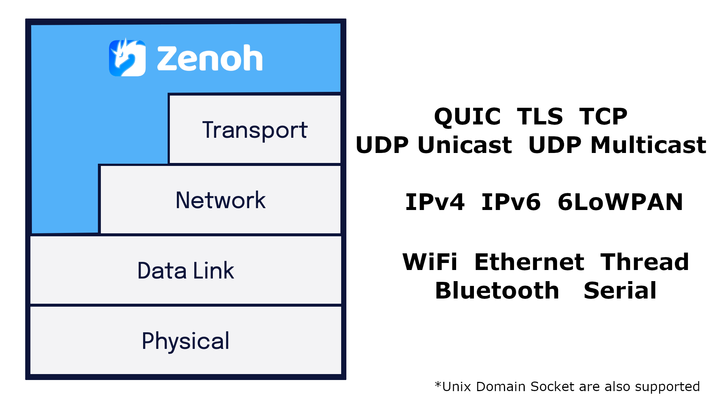
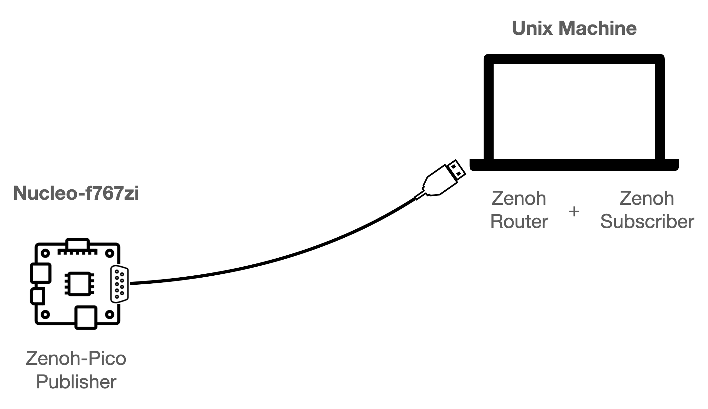

Since the early 2000s the transition towards All-IP networks had been pushed as a natural evolutionary path. Today, IP is the dominant stack for packet-based integrated networks deployed worldwide. However, there is land beyond the ocean…in other words, **there is an entire and growing non-IP universe that cannot be ignored**. This universe expands at the outskirts of ordinary IP networks, where other protocols shine brighter because of more stringent requirements on **overhead, energy-efficienciency, latency / real-time, and cost**.

In this post, we will show how **Zenoh can simultaneously operate over multiple layers of the OSI model**, accommodating IP and non-IP networks. By the end of this post, you will be able to use **Zenoh over Serial** for some of your applications and have them transparently communicate with applications running over IP networks.

----
# Zenoh runs where you need it

Simply put, **Zenoh is capable of running above a Data Link, Network, or Transport Layer**. 
Such capability is available by protocol design, which defines and builds upon a Zenoh Session Protocol that provides abstractions for ordered best effort and reliable channels, different priorities and unlimited MTU.

Zenoh has minimal overhead, introducing only 4-6 bytes of overhead per data exchange. This is once again the result of careful design and protocol behavior as demonstrated in our previous blog post \[1\](https://zenoh.io/blog/2021-07-13-zenoh-performance-async/) \[2\](https://zenoh.io/blog/2022-06-09-zenoh-pico-above-and-beyond/).

Below, you can find the protocols currently supported by Zenoh. The modularity of our implementations allow us to easily add new underlying protocols. Check-out our [roadmap](https://github.com/eclipse-zenoh/roadmap) to see what is planned, and let us know if you have any transport you would like to see supported.



# Zenoh over Serial

Our latest addition to **Zenoh is the Serial Transport**. As you can imagine, by supporting serial we are unleashing the potential of Zenoh into a new set of devices that lack any other kind of networking interfaces (e.g., WiFi, Bluetooth, Ethernet). This is a common scenario, especially in robotics, vehicles, bus, and maritime/agricultural/industrial devices, where conventional computer network technologies are rarely used.

In the following, we present a quick how-to on Zenoh over Serial, where Serial-only devices are able to exchange data with other devices in the IP domain.

## Zenoh over Serial

For this how-to, you will need: a unix-based machine, a MbedOS device with serial capabilities, and a serial cable.



### Unix-based machine

1. Run the following commands to compile Zenoh with Serial capabilities:

```bash
$ git clone -b api-changes https://github.com/eclipse-zenoh/zenoh
$ cd zenoh
$ cargo build --bin zenohd --example z_sub --no-default-features --features transport_tcp --features transport_serial
```

2. Run `zenohd` on one terminal:
```bash
$ RUST_LOG=debug ./target/debug/zenohd --no-multicast-scouting -l "serial//dev/tty.usbserial-0001#baudrate=115200" -l “tcp/127.0.0.1:7447”
```

 - Be sure you replace `/dev/tty.usbserial-0001` with your serial device.
 - You might also want to change the baud rate.

3. Attach a `Zenoh Subscriber` in the IP domain, on a second terminal:
```bash
$ ./target/debug/examples/z_sub -m client -e "tcp/127.0.0.1:7447"

```

### MbedOS device (nucleo-f767zi)
```bash
$ platformio init -b nucleo_f767zi --project-option "framework=mbed" --project-option "lib_deps=https://github.com/eclipse-zenoh/zenoh-pico#api-changes"
```

Include the following code as your `src/main.cpp`:

```C
#include <mbed.h>
#include <EthernetInterface.h>
#include <randLIB.h>

extern "C" {
    #include <zenoh-pico.h>
}

#define MODE "client"
#define PEER "serial/110.105#baudrate=115200"

#define KEYEXPR "demo/example/zenoh-pico-pub"
#define VALUE "[MBedOS]{nucleo-F767ZI} Pub from Zenoh-Pico via Serial!"

int main(int argc, char **argv)
{
    randLIB_seed_random();

    // Initialize Zenoh Session and other parameters
    z_owned_config_t config = zp_config_default();
    zp_config_insert(z_config_loan(&config), Z_CONFIG_MODE_KEY, z_string_make(MODE));
zp_config_insert(z_config_loan(&config), Z_CONFIG_PEER_KEY, z_string_make(PEER));

    // Open Zenoh session
    printf("Open session!\n");
    z_owned_session_t s = z_open(z_config_move(&config));
    if (!z_session_check(&s)) {
        printf("Unable to open session!\n");
        while(1);
    }
    printf("OK\n");

    // Start the receive and the session lease loop for zenoh-pico
    zp_start_read_task(z_session_loan(&s));
    zp_start_lease_task(z_session_loan(&s));

    printf("Declaring publisher for '%s'...", KEYEXPR);
    z_owned_publisher_t pub = z_declare_publisher(z_session_loan(&s), z_keyexpr(KEYEXPR), NULL);
    if (!z_publisher_check(&pub)) {
        printf("Unable to declare publisher for key expression!\n");
        exit(-1);
    }
    printf("OK\n");

    char buf[6];
    for (int idx = 0; idx < 5; ++idx) {
        z_sleep_s(1);
        sprintf(buf, "[%4d]", idx);
        printf("Putting Data ('%s': '%s')...\n", KEYEXPR, buf);
        z_publisher_put_options_t options = z_publisher_put_options_default();
        options.encoding.prefix = Z_ENCODING_PREFIX_TEXT_PLAIN;
        z_publisher_put(z_publisher_loan(&pub), (const uint8_t *)buf, strlen(buf), &options);
    }

    printf("\nPreparing to send burst of 1000 messages. Start in 2 seconds...\n");
    z_sleep_s(2);

    for (int idx = 0; idx < 1000; ++idx) {
        sprintf(buf, "[%4d]", idx);
        printf(".");
        fflush(stdout);
        z_publisher_put_options_t options = z_publisher_put_options_default();
        options.encoding.prefix = Z_ENCODING_PREFIX_TEXT_PLAIN;
        z_publisher_put(z_publisher_loan(&pub), (const uint8_t *)buf, strlen(buf), &options);
    }
    printf("\n");

    printf("Closing Zenoh Session...");
    z_undeclare_publisher(z_publisher_move(&pub));

    // Stop the receive and the session lease loop for zenoh-pico
    zp_stop_read_task(z_session_loan(&s));
    zp_stop_lease_task(z_session_loan(&s));

    z_close(z_session_move(&s));
    printf("OK!\n");

    return 0;
}
```

Build and upload your application to the board. Remember to set `Z_LINK_SERIAL=1` in `zenoh-pico/config.h`

```bash
$ platformio run -t upload
```

Connect your serial cable to the board: `TX` and `RX` as pins `D1 (110)` and `D0 (105)`, respectively.
If you prefer to use a different pair of pins or to change the baud rate, you can do it by changing the Zenoh locator: `serial/110.105#baudrate=115200`

### Demo

If everything goes well, you should have a similar output to the one below.


# Conclusion
**Zenoh is the most flexible stack available for decentralized data management** capable of supporting not only serial but able to run across several layers of the OSI model.

In summary, Zenoh paves the way for:
 - decentralizing data distribution/management across IP and non-IP networks.
 - empowering Serial-only devices to expand their communication reach.
 - significantly reducing the wire overhead on data exchanges.

The support for Serial communication in Zenoh is an important milestone, as yet another and concrete proof of how Zenoh can operate across several layers of the OSI model. Thus, Zenoh meets the expectations of today’s applications and systems w.r.t. Robotic, embedded, and vehicular applications, where alternative buses are used instead of conventional computer network technologies.

In conclusion, this is yet another example of how **Zenoh makes available a holistic data management solution** for the whole Cloud-to-Things continuum.

[**--CG**](https://github.com/cguimaraes/)
[**--GB**](https://github.com/gabrik/)
