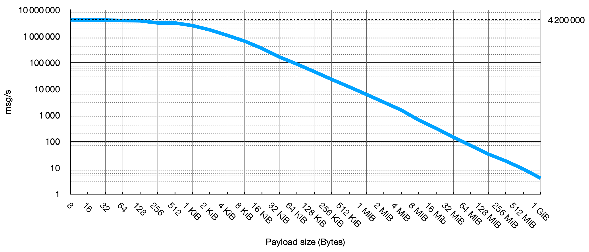
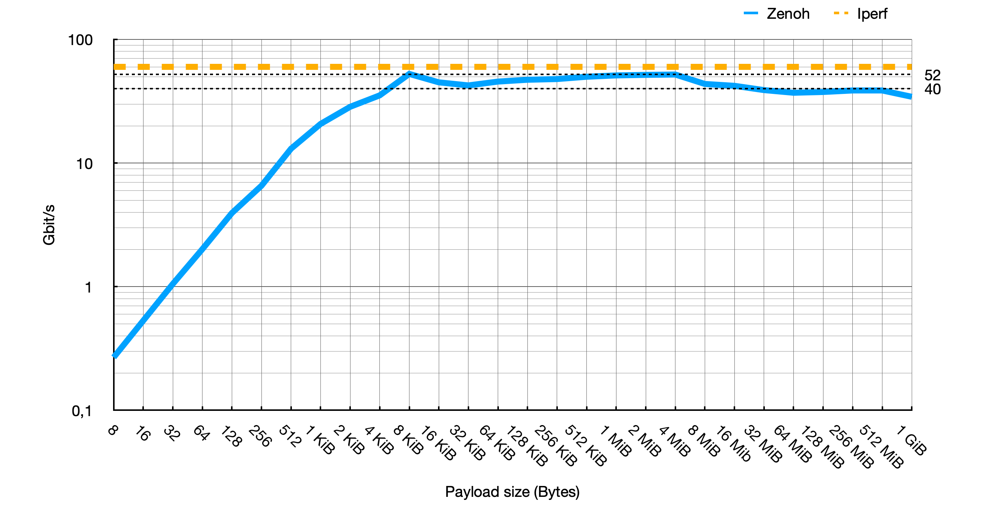
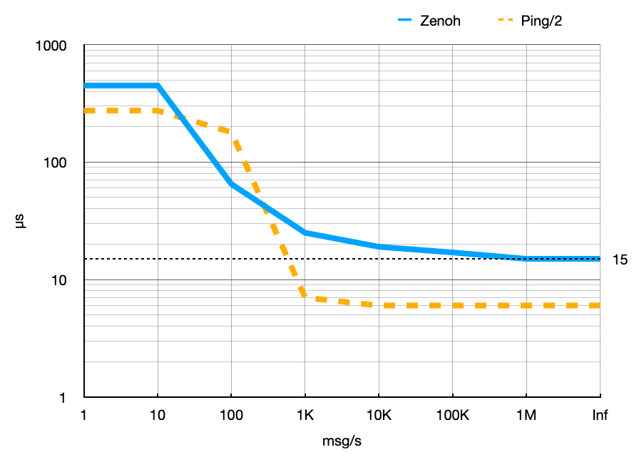

The little Zenoh dragon has vigorously grown up in the last year and now craves to take higher flight towards the highest peaks in marvellous lands. 


The new 0.6.0 release of Zenoh is code-named Bahamut: the king of the good dragons. This reflects the major efforts the development team and the community have put in Zenoh to make it grow healthy, strong, wise, and resolute. Bahamut comes with a supercharged list of new features and improvements, including:
- an improved and streamlined API for Rust, C, and Python
- a formalized syntax and semantic for key expressions
- a brand-new configuration file supporting json5 and yaml encodings
- better performance delivering more than 51 Gb/s and 15us latency 
- support for more network transports: websocket, bluetooth, and serial
- support for replicated storage alignment
- support for more platforms and multicast transport in zenoh-pico
- many bug fixes

The full change list for Bahamut can be found [here](https://github.com/eclipse-zenoh/zenoh/releases/tag/untagged-63446f2b3928df8dc470). But let’s find out together what the main news is and what’s next.


----
# An improved API

A brand new API has just landed. And this is without a shadow of a doubt the biggest change brought by Zenoh Bahamut. Some of you may say “oh no, this is a breaking change” and some others may say “oh yes, tons of cool new features”! But worry not! Even if this is a breaking change, moving to the new API is quite trivial (see the [migration guide](https://zenoh.io/docs/migration/migrationguide-v0.5.x-v0.6.x/)! 

So, let’s have a look at why we did it.

[Zenoh](https://github.com/eclipse-zenoh/zenoh) is written in Rust and targets a large spectrum of hardware ranging from enterprise grade to embedded. Zenoh is also paired up with [Zenoh-Pico](https://github.com/eclipse-zenoh/zenoh-pico), which is written in C, to expand our reach to the tiniest microcontrollers. Moreover, on top of the Rust implementation, [C](https://github.com/eclipse-zenoh/zenoh-c) and [Python](https://github.com/eclipse-zenoh/zenoh-python) bindings are provided, and many more are to come. Therefore, a new API was necessary to bring the required expressiveness, flexibility, and stability across different programming languages while having a similar look and feel. 

The second reason lies in the need of having an API surface as minimal as possible so as to not overload tiny microcontrollers with a bulky and complex interface. Moreover, a minimal API surface also helps in creating and maintaining a more language-specific implementation for the bindings. 

Last but not least, future extensibility was the third objective for the new API. Depending on the programming language, future extensibility is provided by three paradigms: builder pattern (e.g. in Rust), kwargs with default values (e.g. in Python), and option struct (e.g. in C). This allows Zenoh API to accommodate the addition of any new capability in the future whilst being backward compatible. 

If you are curious about the philosophy of the new API, you can find the full discussion [here](https://github.com/eclipse-zenoh/roadmap/discussions/23).

## Rust
*Subscriber* -- Full working example available [here](https://github.com/eclipse-zenoh/zenoh/blob/master/examples/examples/z_sub.rs).

```Rust
let session = zenoh::open(config).res().await.unwrap();
let subscriber = session.declare_subscriber("test").reliable().res().await.unwrap();
while let Ok(sample) = subscriber.recv_async().await {
    println!("'{}': '{}'", sample.key_expr.as_str(), sample.value);
}
```

*Publisher* -- Full working example available [here](https://github.com/eclipse-zenoh/zenoh/blob/master/examples/examples/z_pub.rs).

```Rust
let session = zenoh::open(config).res().await.unwrap();
let publisher = session.declare_publisher("test").res().await.unwrap();
loop {
    async_std::task::sleep(Duration::from_secs(1)).await;
    publisher.put("data").res().await.unwrap();
}
```

## Python
*Subscriber* -- Full working example available [here](https://github.com/eclipse-zenoh/zenoh-python/blob/master/examples/z_sub.py).

```Python
def listener(sample: Sample):
    print(f"'{sample.key_expr}': '{sample.payload.decode('utf-8')}'")

session = zenoh.open(conf)
sub = session.declare_subscriber("test", listener, reliability=Reliability.Reliable)
while True:
    time.sleep(1.0)
```

*Publisher* -- Full working example available [here](https://github.com/eclipse-zenoh/zenoh-python/blob/master/examples/z_pub.py).

```Python
session = zenoh.open(conf)
pub = session.declare_publisher("test")
while True:
    time.sleep(1.0)
    pub.put("data")
```

## C
*Subscriber* -- Full working example available [here](https://github.com/eclipse-zenoh/zenoh-c/blob/master/examples/z_sub.c).

```C
void data_handler(const z_sample_t *sample, const void *arg) {
    char *keystr = z_keyexpr_to_string(sample->keyexpr);
    printf("'%s': '%.*s'\n", keystr, (int)sample->payload.len, sample->payload.start);
    free(keystr);
}

int main(int argc, char **argv) {
    z_owned_session_t s = z_open(z_move(z_config_default()));
    if (!z_check(s)) {
        exit(-1);
    }


    z_subscriber_options_t opts = z_subscriber_options_default();
    opts.reliability = Z_RELIABILITY_RELIABLE;
    z_owned_closure_sample_t callback = z_closure(data_handler);
    z_owned_subscriber_t sub = z_declare_subscriber(z_loan(s), z_keyexpr(expr), z_move(callback), &opts);
    if (!z_check(sub)) {
        exit(-1);
    }

    while (1) { sleep(1); }
}
```

*Publisher* -- Full working example available [here](https://github.com/eclipse-zenoh/zenoh-c/blob/master/examples/z_pub.c).

```C
int main(int argc, char **argv) {
    z_owned_config_t config = z_config_default();
    z_owned_session_t s = z_open(z_move(config));
    if (!z_check(s)) {
        exit(-1);
    }

    z_owned_publisher_t pub = z_declare_publisher(z_loan(s), z_keyexpr(keyexpr), NULL);
    if (!z_check(pub)) {
        exit(-1);
    }

    char buf[] = “data”;
    z_publisher_put_options_t options = z_publisher_put_options_default();
    options.encoding = z_encoding(Z_ENCODING_PREFIX_TEXT_PLAIN, NULL);
    for (int idx = 0; 1; ++idx) {
        sleep(1);
        z_publisher_put(z_loan(pub), (const uint8_t *)buf, strlen(buf), &options);
    }
}
```

Additionally, in C we have defined an ownership model to help developers to safely handle data when using Zenoh. You can refer to this [RFC](https://github.com/eclipse-zenoh/roadmap/blob/main/rfcs/ALL/Ownership%20in%20C.md) for a more detailed explanation of the ownership model.


----
# Formalized key expressions

Zenoh is governed by content-centric concepts, thus it uses key expressions to address data. 
A thoughtful definition and formalization of what a key expression is and looks like has been done in Zenoh Bahamut.
This effort has been undertaken for three main reasons: 
1. To avoid ambiguity in key expression definition and matching, which before could lead to undefined behaviour.
2. To improve the key expression matcher for better performance.
3. To allow future extensibility to be introduced for more complex matching and behaviours. 

Briefly, we can summarize the main changes here below:
- A key expression is as `/`-separated list of chunks, where each chunk is a non-empty (UTF-8) string
- Leading and trailing `/` are not valid. This was necessary to avoid ambiguity.
- `$` indicates a DSL for key expression matching. The first DSL defined is `$*`, which allows sub-chunk matching.
- Key expressions can be reduced to a non-ambiguous canonical form that is uniquely defined.

The single wild `*` expresses *exactly one chunk of any value*, and is equivalent to the `[^/]+` regular expression. 
For example, `a/*/b`:
- Includes `a/c/b`, `a/hi/b`
- Intersects `*/a/b`, `*/*/*`
- Does not intersect `a/*/c`, `b/*/a`

The double wild `**` expresses *any amount (including 0) of chunks of any values*. 
For example, `a/**/b`:
- Includes `a/b`, `a/**/b/b`, `a/*/b`, `a/*/*/b`, `a/*/**/b`, `a/**/c/**/b`
- Intersects `**/b`, `a/**`
- Does not intersect `a/**/b/c`

For a more in-depth reading on key expressions, please refer to this [RFC](https://github.com/eclipse-zenoh/roadmap/blob/main/rfcs/ALL/Key%20Expressions.md). 

----
# A new configuration file format

A new json5/yaml-based configuration file has been added. This allows configuring various aspects of Zenoh via a simple yet comprehensive file that can be extended as needed in the future. A snippet of the configuration file can be found below while the full configuration file can be found [here](https://github.com/eclipse-zenoh/zenoh/blob/master/DEFAULT_CONFIG.json5).

```Json
{
  "mode": "peer",
  // Connect to a specific router at startup time
  "connect": {
    "endpoints": [
      "tcp/myzenohrouter.com:7447"
    ],
  },
  // Accept any connections from other peers
  "listen": {
    "endpoints": [
      "tcp/192.168.1.10:7447"
    ],
  },
  // Enable multicast scouting to discover neighboring peers
  "scouting": {
    "multicast": {
      "enabled": true,
      "listen": true,
    },
}
```
Please note that the configuration via a json5/yaml file is available only for the [Zenoh](https://github.com/eclipse-zenoh/zenoh) implementation written in Rust and any bindings based on it. [Zenoh-Pico](https://github.com/eclipse-zenoh/zenoh-pico) does not support such a way of configuring since it will be simply too heavy for microcontrollers. 

----
# Improved routing

The **peer** mode now supports 2 different routing strategies for local subsystems: 
- **linkstate**: This is the only strategy that was supported in the previous release. It supports any topology like mesh networks for example. 
- **peer_to_peer**: With this strategy, all peers in the subsystem need to directly connect to each other. It offers a much greater scalability compared to the linkstate mode (approximately 10 times more nodes per subsystem in a similar environment) and overall better performances (smaller network overhead, smaller memory footprint, lower CPU consumption and faster alignment). This is the new default.

----
# Improved performance

In this [blog post](https://zenoh.io/blog/2021-07-13-zenoh-performance-async/) we reported that Zenoh Aithusa delivered more than `3.5 million msg/s` with `8 bytes` payload, more than `45 Gb/s` with `1 Megabyte` payload, and a latency as little as `35 µs` in backlogged scenarios. On the exactly same machine and 100Gb Ethernet connection, Zenoh Bahamut now brings significant performance gains by delivering:
- more than `4.2 million msg/s` with `8 bytes` payload,
- more than `51 Gb/s` with `1 Megabyte` payload,
- a latency as little as `15 µs` in backlogged scenarios.

The figure below shows (in log scale) the number of messages per second for different payloads: from `8 bytes` to `1 GiB`.



The figure below shows (in log scale) the results in terms of throughput (bit/s) delivered at API level. We also report the throughput obtained with iperf on the same 100GbE connection as reference baseline: `60 Gb/s`.



The figure below shows (in log scale) the one-hop latency for different message rates. The inf case represents the scenario where messages are sent back-to-back as fast as possible. In such a backlogged scenario, we can see that zenoh latency is as little as 15 µsec, less than half of before. The payload size is 64 bytes, the same as standard ICMP. A more in-depth explanation on why latency decreases when the message rate increases is available [here](https://zenoh.io/blog/2021-07-13-zenoh-performance-async/#latency).



----
# Replicated Storages

Zenoh Bahamut brings in a new experimental feature to support replicated storage alignment. Zenoh now ensures eventual consistency for storages that subscribe to the same key expression, even in the presence of network partitions and system faults. The storage alignment protocol that takes care of this convergence property is called anti-entropy protocol; as the name suggests, it keeps the entropy in the system low. Further details on the protocol and the usage are coming soon!

----
# Zenoh-Pico

Zenoh also evolved its lightweight implementation targeting microcontrollers. In addition to the above features, Zenoh-Pico introduces other improvements, not only in terms of supporting platforms but also in terms of better suitability for such constrained devices.


The [list of supported platforms](https://github.com/eclipse-zenoh/zenoh-pico) has been extended with:
- More RTOSs, including well-known platforms like [MbedOS](https://os.mbed.com/) and [ESP-IDF](https://docs.espressif.com/projects/esp-idf/en/latest/esp32/).
- BSD in the family of Unix systems.
- [OpenCR](https://emanual.robotis.com/docs/en/parts/controller/opencr10/) boards, allowing a native port of a Turtlebot3 to be [Zenoh-powered only](https://zenoh.io/blog/2022-02-08-dragonbot/).
- Constrained and/or low power networks, including [Serial](https://zenoh.io/blog/2022-08-12-zenoh-serial/), [Bluetooth](https://www.bluetooth.com/learn-about-bluetooth/tech-overview/) and [Thread](https://openthread.io/) protocols.

Moreover, we have improved the design of Zenoh-Pico to better fit the requirements of the embedded systems and microcontrollers, including:
- Allow configuration of features (including their enable/disable) at compilation time in order to reduce its footprint, including support for single or multiple thread mode.
- Improve memory alignment per supported platform.
- Improve randomness of number generators (RNG), using hardware-based RGN when available.

Finally, as experimental support, Zenoh-Pico now supports **peer** mode for **multicast** transports.

----
# What’s next?
Are you ready to keep rocking with Zenoh?


These are the cool features you can expect for the months to come:
- A [MQTT plugin](https://github.com/eclipse-zenoh/roadmap/issues/29)
- A [Amazon S3](https://github.com/eclipse-zenoh/roadmap/issues/54) storage backend
- More [DDS features](https://github.com/eclipse-zenoh/roadmap/issues/35) in the Zenoh plugin for DDS
- New features such as Key Formatters

And many other cool things...

And don’t forget to stay in touch with the Zenoh team on [Discord](https://discord.gg/vSDSpqnbkm) and to propose new features on the [roadmap](https://github.com/eclipse-zenoh/roadmap/discussions).

[**--The Zenoh Team**](https://github.com/orgs/eclipse-zenoh/people)
