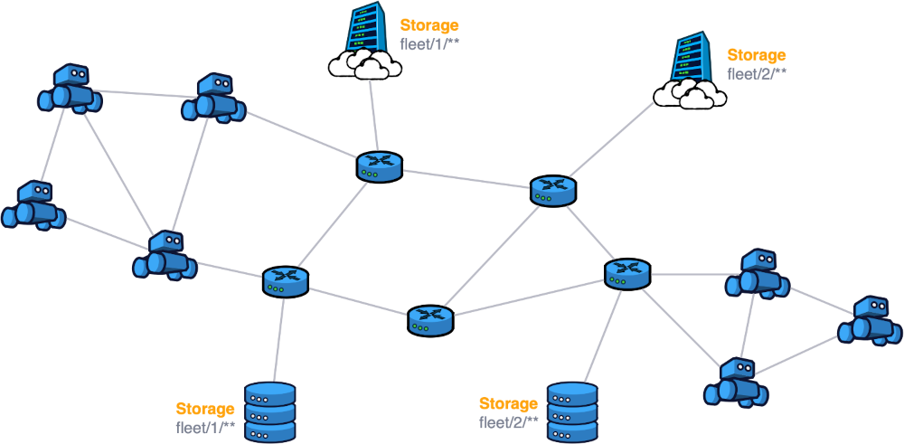
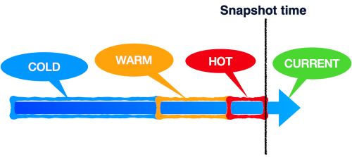
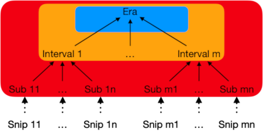
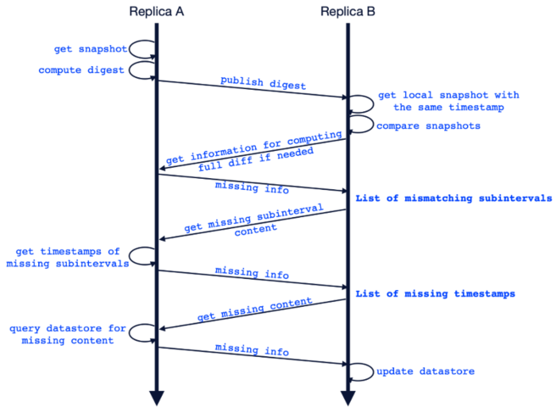

[Zenoh Bahamut](https://zenoh.io/blog/2022-09-30-zenoh-bahamut/#replicated-storages) introduced a new experimental feature to support replicated storage alignment. With this feature, Zenoh ensures eventual consistency for storages that subscribe to the same key expression, even in the presence of network partitions and system faults. As promised, today we dig into some details about the storage alignment protocol. We will also give insights on how to efficiently configure a replicated storage in Zenoh.

---
# Replicated Storages in Zenoh

As we already know, Zenoh allows a user to configure storages on a given key expression. For critical data, users can decide to have several copies (called replicas) at multiple locations. Moreover, users can transparently use different storage technologies at different locations to replicate their data!

In a stable network, all Zenoh storages subscribed to the same key expression will have the same data. Unfortunately, due to packet loss or network partition, an update might not reach a given storage. In this case, the replicated storages might reach a diverged state.

Let us consider a warehouse with two fleets of robots. The warehouse can store the data for the two fleets by creating storages on their corresponding key expressions. They can also store an additional copy in the cloud. The deployment looks as follows:



Due to the location of the warehouse, the network connectivity with the cloud storage might be occasionally interrupted. This leads to the storages diverging permanently.

There are two approaches in dealing with these types of misalignments - **read-repair** and **anti-entropy**. In the read-repair approach, when a particular data item is read, the system detects that a replicated storage has older data and it “repairs” the storage for that data. From the explanation itself it is clear that only the keys that are read will be repaired. Anti-entropy on the other hand is a background process  that maintains convergence independently from any external event, which means our repair action does not depend on detecting reads or partitions/failures. In order to ensure convergence independent of any external events, we choose to go with the second approach named anti-entropy protocol.

---
# Zenoh’s anti-entropy protocol

As an analogy to thermodynamics, the divergence of the replicas (or in other words its entropy) will increase if no effort is made to reduce it. Hence, the protocol that maintains convergence in distributed databases is named anti-entropy protocol. In general, an anti-entropy protocol ensures that the replicated storages subscribing to the same key expression will attain [eventual consistency](https://dl.acm.org/doi/pdf/10.1145/1435417.1435432). 

Due to the decentralized nature of Zenoh, no replicated storage will have the knowledge of any other replicated storage in the network at a given point in time. Due to this restriction, Zenoh needs a mechanism to reach related storages. A replicated storage periodically publishes a fingerprint of its data through the network, and at the same time subscribes to fingerprints from other storages. When it receives the fingerprint from another replica, it compares the fingerprint with its own and identifies the missing data. A point to be noted here is that Zenoh’s protocol aligns the replicated storages that subscribe to the same key expression. The figure below shows a glimpse of the anti-entropy protocol in action.


In line with our goal to minimize the overhead of Zenoh as much as possible, we also fine-tune this basic algorithm. Let’s consider the following cases in which replicas might have divergent data:
1. Temporary network outage or packet loss.
2. Temporary disconnection of a replicated storage node for maintenance.
3. Provisioning a new replicated storage.

In the first case the resources that had the most recent updates will be misaligned. In the second case, the timeline will extend a bit further into the past and in the last case we would need to copy all the data into the newly provisioned storage.

Based on this observation, Zenoh’s fingerprinting mechanism divides all the resources into eras (i.e., a temporal range) that in turn is composed of intervals and subintervals. This forms a tree-like data structure with hashes. Each update needs to be timestamped to be used by the fingerprinting algorithm. Each resource is allocated to a subinterval according to its timestamp. In order to ensure uniqueness, the combination of timestamp and key is used to generate a hash for each subinterval. The hashes of subintervals are used to compute the hash of the interval and likewise interval hashes are used to generate the hash of the era. The hash of the eras are used to generate the top-level hash.




A replicated storage receiving a fingerprint will process the hash tree in a top down manner to identify the position of misalignment. This helps to quickly identify the missing data and the replicated storage can issue a query in order to get the missing information. The entire workflow is as follows:

 

(Note that the digest publication is done to the network, it is not on a peer basis since the individual replicated storages doesn’t have information about existing storages on the network.)

The insight from the situations that lead to divergent storages and the era-based hashing can help us reach a sweet-spot in the trade-off between the number of round trips vs the amount of data transmission required for the protocol to converge. Instead of sending the whole hash tree on wire, we send a compressed fingerprint. The compressed fingerprint consists of the top level hash, the subtree of the hot era until the level of subinterval hashes, the warm era subtree up to the interval hashes and only the top level hash for the cold era.

---
# How to configure a replica in Zenoh?

As the alignment protocol inevitably adds some network and memory overhead, the anti-entropy algorithm  is disabled by default and needs to be explicitly activated by the user. A replica can be configured with `replica_config` (inside the configuration for a storage) as follows:
```
{
  plugins: {
    storage_manager: {
      storages: {
        demo: {
          key_expr: "demo/memory/**",
          volume: "memory",
          replica_config: {					
            publication_interval: 5,
            propagation_delay: 200,
            delta: 1000,
          }
        }
      }
    }
  }
}
```

Now let us look into the parameters in the configuration and guidelines on how to set them.
- The `publication_interval` parameter specifies the time interval **in seconds** between each run of the protocol. A rule of thumb is to set the value to half of the time duration during which you can tolerate divergence.
- The `propagation_delay` parameter is used to factor out the fact that there might be the data already in transit to the storage. A rule of thumb is to provide a guesstimate to the system on the average delay you are expecting on the messages to reach the storages. This parameter should be specified **in milliseconds**.
- The `delta` parameter is required to reduce the overhead of data transmission done by the protocol. This sets the length of intervals. Higher the frequency of updates, lower the delta should be chosen. As a thumb rule delta should be the duration containing no more than 100,000 samples. This parameter should also be specified **in milliseconds**.

Except for `publication_interval`, the other parameters should be constant throughout the system, with matching key expressions, for efficient reconciliation; `publication_interval` can be configured per replica.

Specifying the parameters is optional, Zenoh will use the default values as shown in the configuration above. If you just want a replicated storage setup with the default parameters, omit all the parameters, and just maintain the `replica_config` tag with empty braces.

---
# Conclusion

The new anti-entropy protocol ensures that replicated storages in Zenoh have the same latest value for each resource. The protocol also helps align new storages with the existing storages. We also discussed how to configure the replication parameters for your application specific requirements. 

Please let us know your questions and feedback on our discord!

Happy replicating!

-- [SN](https://github.com/sreeja)

P.S. We have recently launched “[Taming the Dragon](https://bit.ly/3Gk4QE1)” a six episodes webinar series getting you into the Zenoh world of wonders. Registration is free and available [here](https://bit.ly/3Gk4QE1).
