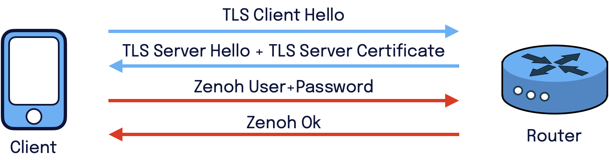
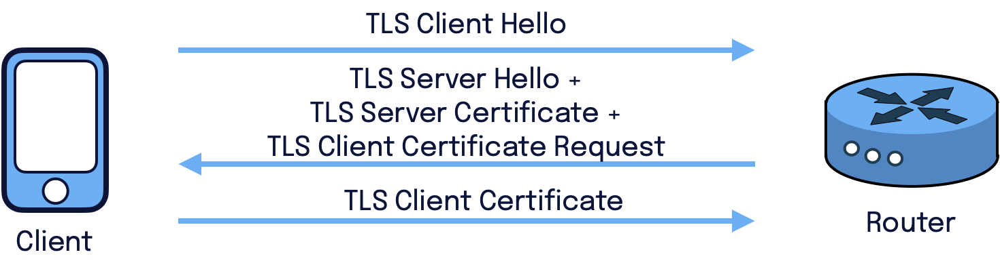
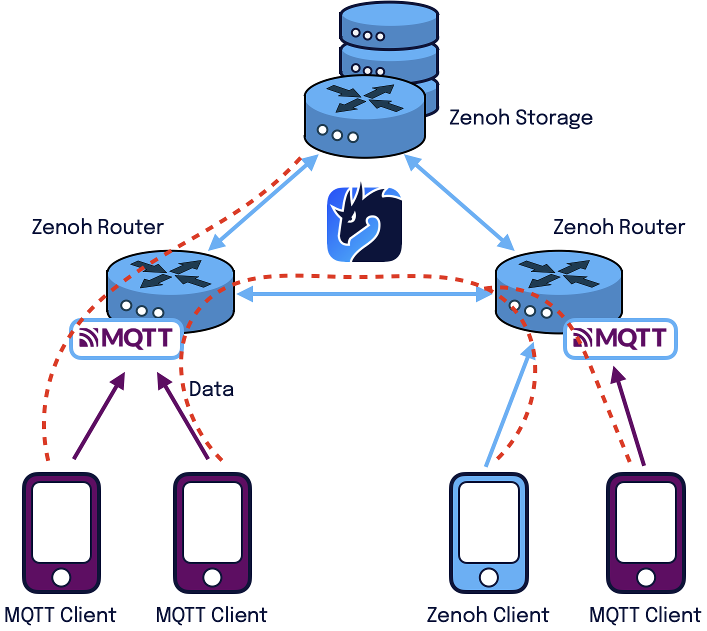
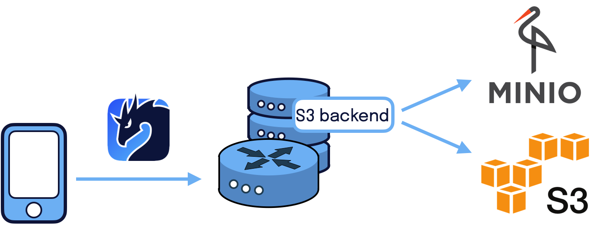
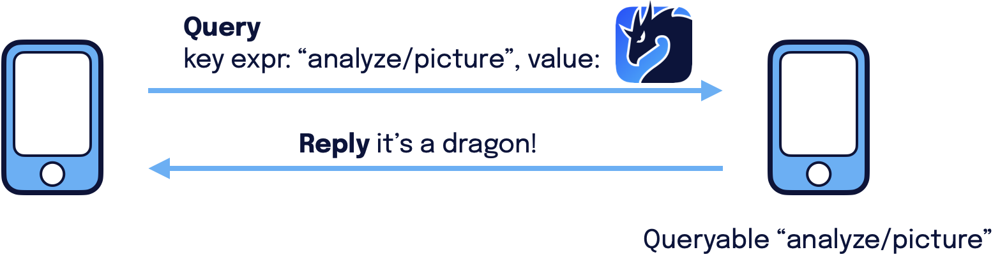
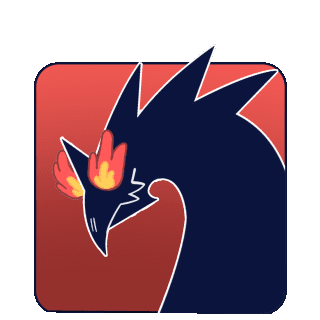

The new [Zenoh 0.7.0 release](https://github.com/eclipse-zenoh/zenoh/releases/tag/0.7.0-rc), codename Charmander, brings to the table many features requested by the community on the [Zenoh’s Discord server](https://discord.gg/2GJ958VuHs). 
Charmander introduces some long-awaited functionalities: 
- [Mutual TLS authentication](#mutual-tls-authentication);
- [MQTT plugin](#mqtt-plugin);
- [S3 storage backend](#s3-storage-backend);

some new freshly-landed functionalities:
- [Query payload](#query-payload);
- [C++ binding](#c-bindings);
- [Connectivity status and notifications](#connectivity-status-and-notifications);

and [MISRA-C compliance for Zenoh-Pico](#zenoh-pico-and-misra-c).

----
# Mutual TLS authentication
Until now, Zenoh was only supporting server-based authentication. 
That is the kind of authentication you experience when surfing the web using HTTPS: your browser verifies if the server it is connecting to is legit, but the server does not authenticate your browser. 
That’s why you need to use the user and password if you want to authenticate to the service itself. 
In Zenoh, it was the same until now as shown in the figure below. 
As a client or peer you could verify the authenticity of the router by using [TLS](https://zenoh.io/docs/manual/tls/), but then the router would use [user and password authentication](https://zenoh.io/docs/manual/user-password/) to validate the clients, peers as well as other routers.



Mutual TLS (mTLS) authentication allows the router to authenticate incoming TLS connections from clients, peers, or other routers as shown in the figure below. 
In this case, you will no longer need to use user and password authentication! 
You can [check here](https://zenoh.io/docs/manual/tls/#mutual-authentication-mtls) how to configure mTLS.



----
# MQTT plugin
A [new plugin](https://github.com/eclipse-zenoh/zenoh-plugin-mqtt) is coming into the dragon nest that enables integrating Zenoh with MQTT. 
This is a fresh addition to the already existing [DDS plugin](https://github.com/eclipse-zenoh/zenoh-plugin-dds), [REST plugin](https://github.com/eclipse-zenoh/zenoh/tree/master/plugins/zenoh-plugin-rest), and [web server plugin](https://github.com/eclipse-zenoh/zenoh-plugin-webserver). 
The [Zenoh MQTT plugin](https://github.com/eclipse-zenoh/zenoh-plugin-mqtt) converts a Zenoh router into a full-fledged MQTT broker supporting MQTT V3 and V5 clients. 
This allows to exploit all the Zenoh routing and storage capabilities from your MQTT client, but also to make Zenoh clients and peers talk with MQTT clients as shown in the figure below! 
To test it out just follow the [README](https://github.com/eclipse-zenoh/zenoh-plugin-mqtt).



----
# S3 storage backend
Speaking of Zenoh storage capabilities, [S3 storage backend](https://github.com/eclipse-zenoh/zenoh-backend-s3) has just landed.
It can be used with S3-like storage like [Amazon S3](https://aws.amazon.com/s3/) and [MinIO](https://min.io/). 
This allows you to plug S3 buckets into the Zenoh infrastructure and start storing and retrieving data from there. 
To test it out just follow the [README](https://github.com/eclipse-zenoh/zenoh-backend-s3).



----
# Query payload
Zenoh has gained the possibility to attach some user payload when issuing a query. 
This simplifies and makes it more efficient for an application to pass information, such as arguments or body, in the query that can be received and interpreted by the matching queryables. 
For example, you can now attach a picture to a query that is analyzed by a queryable running an object detection algorithm as shown in the figure below.



Here below is an example written in Python.

**Query**
```python
import zenoh

session = zenoh.open(zenoh.Config())

in_file = open("zenoh-logo.png", "rb")
picture = in_file.read()
in_file.close()

replies = session.get("analyze/picture", zenoh.Queue(), value=picture)
for reply in replies.receiver:
        print("{}".format(reply.ok.payload.decode("utf-8")))

session.close()
```

**Queryable**
```python
# Query
import zenoh
import time

key = "analyze/picture"

def callback(query):
    # analyze the picture in "query.value.payload"
    value = "It’s a dragon"
    query.reply(zenoh.Sample(key, value))

session = zenoh.open(zenoh.Config())

queryable = session.declare_queryable(key, callback)
while True:
    time.sleep(1)
```

Don’t forget to check out all the other examples for [Rust](https://github.com/eclipse-zenoh/zenoh/tree/master/examples), [Python](https://github.com/eclipse-zenoh/zenoh-python/tree/master/examples), and [C](https://github.com/eclipse-zenoh/zenoh-c/tree/master/examples).

----
# C++ bindings
Hey, did someone say [C++](https://github.com/eclipse-zenoh/zenoh-cpp)? Yes! 
This is the [new binding](https://github.com/eclipse-zenoh/zenoh-cpp) that has just arrived in the Zenoh world.
You can find it [here](https://github.com/eclipse-zenoh/zenoh-cpp) and start testing it out. 

C++ bindings are built on top of the C API and for this release they are fully based on [zenoh-c](https://github.com/eclipse-zenoh/zenoh-c). 
This allows you to start developing C++ Zenoh applications in your usual desktop/server environment. 
Here below you is a pub/sub example, while the full set of C++ examples is available [here](https://github.com/eclipse-zenoh/zenoh-cpp/tree/main/examples/cpp).

**Pub**
```cpp
#include <iostream>
#include "stdio.h"
#include "zenohcpp.h"

using namespace zenoh;

int main(int argc, char **argv) {
    const char *keyexpr = "demo/example/zenoh-cpp-pub";
    const char *value = "Pub from CPP!";

    Config config;

    auto session = std::get<Session>(open(std::move(config)));
    PutOptions options;
    options.set_encoding(Z_ENCODING_PREFIX_TEXT_PLAIN);

    if (!session.put(keyexpr, value, options)) {
        printf("Put failed...\n");
    }

    return 0;
}
```

**Sub**
```cpp
#include <stdio.h>
#include <unistd.h>
#include <iostream>
#include "zenohcpp.h"

using namespace zenoh;

const char *kind_to_str(z_sample_kind_t kind) {
    switch (kind) {
        case Z_SAMPLE_KIND_PUT:
            return "PUT";
        case Z_SAMPLE_KIND_DELETE:
            return "DELETE";
        default:
            return "UNKNOWN";
    }
}

void data_handler(const Sample *sample) {
    if (sample) {
        std::cout << ">> [Subscriber] Received " << kind_to_str(sample->get_kind()) << " ('"
                  << sample->get_keyexpr().as_string_view() << "' : '" << sample->get_payload().as_string_view()
                  << "')\n";
    }
}

int main(int argc, char **argv) {
    const char *keyexpr = "demo/example/**";

    Config config;
    auto session = std::get<Session>(open(std::move(config)));
    auto subscriber = std::get<Subscriber>(session.declare_subscriber(keyexpr, data_handler));

    while (true) {
        sleep(1);
    }

    return 0;
}
```

This is the very first release of the C++ bindings so the Zenoh team will highly appreciate any help in testing them on various platforms, system architecture, etc. and to [report any issue](https://github.com/eclipse-zenoh/zenoh-cpp/issues) you might encounter. 
This will help in greatly improving its maturity and robustness.

In the future, we are planning to bring C++ bindings also on [Zenoh-Pico](https://github.com/eclipse-zenoh/zenoh-pico) to natively integrate with C++ embedded systems like Arduino. 
At the moment you can use [Zenoh-Pico](https://github.com/eclipse-zenoh/zenoh-pico) with the C API on various embedded systems, see [some examples](https://github.com/eclipse-zenoh/zenoh-pico/tree/master/examples/arduino). 

----
# Zenoh-Pico and MISRA-C
A considerable [amount of work](https://github.com/eclipse-zenoh/zenoh-pico/pull/124) has been done in [Zenoh-Pico](https://github.com/eclipse-zenoh/zenoh-pico) to adhere to [MISRA-C guidelines](https://www.misra.org.uk/misra-c/). 
As a result, Zenoh-Pico becomes an even more attractive option for those environments where MISRA-C compliance is an important safety requirement.

----
# Connectivity status and notifications
Zenoh now has an experimental support that exposes connectivity status and notifications. 
The status and events can be queried or subscribed to in the following key space: `@/session/<local_zid>/**`.  
A more in-depth explanation and examples can be found in the dedicated [RFC](https://github.com/eclipse-zenoh/roadmap/blob/main/rfcs/ALL/Connectivity%20Status%20and%20Events.md).

----
# What’s next?
This release has been a pleasant ride together with the Zenoh community who significantly helped in improving the quality of Zenoh and to bring to the table many tantalizing ideas about its future. 
So, a big thanks goes to our Zenoh community! You made the difference!



If you enjoyed the ride so far, are you ready to continue the journey with Zenoh? These are the cool features you can expect for the months to come:
- More [DDS features](https://github.com/eclipse-zenoh/roadmap/issues/35) in the Zenoh plugin for DDS
- A ROS1 bridge
- Transparent data compression
- Key Formatters
- Zenoh over LoRA

And many other cool things...

And don’t forget to stay in touch with the Zenoh team on [Discord](https://discord.gg/vSDSpqnbkm) and to propose new features on the [roadmap](https://github.com/eclipse-zenoh/roadmap/discussions).

[**--The Zenoh Team**](https://github.com/orgs/eclipse-zenoh/people)
