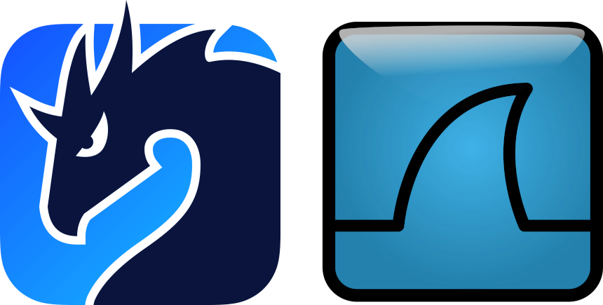
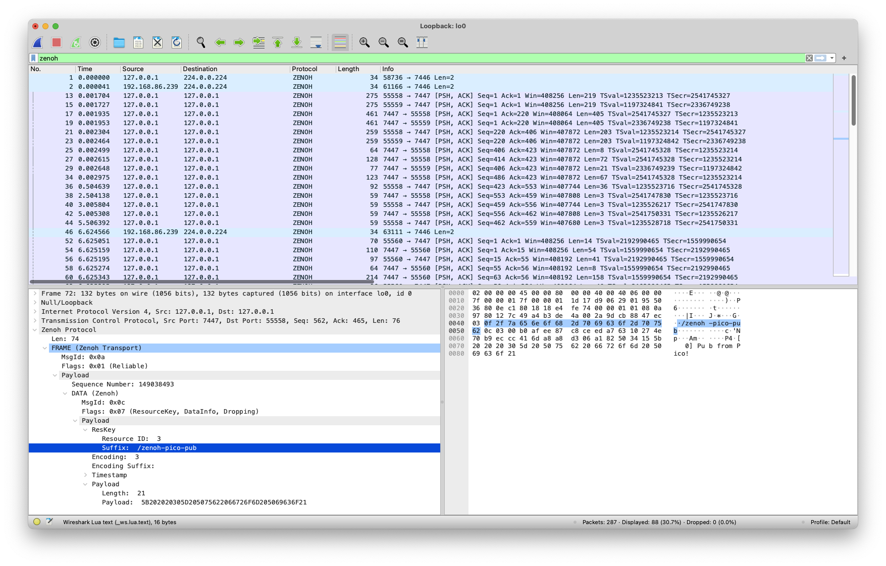
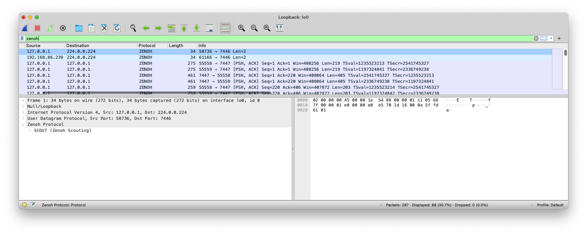
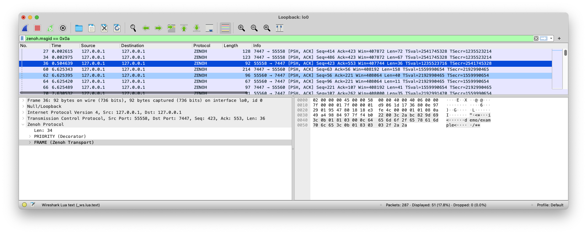
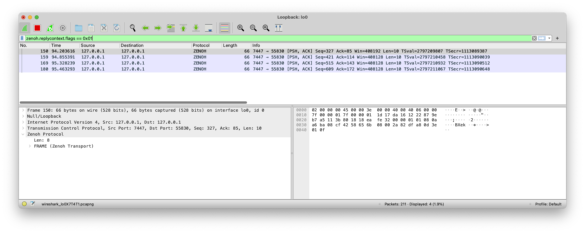

In this blog post, we will introduce Zenoh’s best friend, the **[Zenoh protocol dissector for Wireshark](https://github.com/ZettaScaleLabs/zenoh-dissector)**. It allows you to inspect and understand the Zenoh packets exchanged in your network. It is especially useful when you need to:
 - troubleshoot network problems,
 - examine security issues,
 - verify network applications,
 - debug protocol implementations,
 - and even learn about Zenoh’s protocol internals.



But let’s find out more!

# What is Wireshark?

[Wireshark](https://www.wireshark.org/) is a **widely-used network protocol analyzer**, mostly used to sniff which packets are crossing your network. In other words, it **captures packets and represents them in a human-understandable format**. This capability of understanding what packets are being exchanged in your network is helpful in a multitude of situations, including troubleshooting network problems, examining security issues, verifying network applications, debugging protocol implementations, and even learning about the network protocol internals.
Zenoh, as a pub/sub/query protocol, is the ideal stack for implementing distributed applications in the Cloud to Thing continuum. Thus, **understanding the network** and what happens at Zenoh-level communications will allow you to **better understand your applications behavior**.

Fear not, as now you have a **Zenoh protocol dissector that you can use with Wireshark**.

# How to Install the Zenoh Protocol Dissector?
Zenoh’s dissector is written in Lua to make it easy to install on any of the Wireshark supported platforms –  Wireshark has a built-in Lua interpreter. As such,  the installation process is as simple as copying the `zenoh.lua` file to the [Wireshark plugin folder](https://www.wireshark.org/docs/wsug_html_chunked/ChPluginFolders.html).

We recommend cloning the [Zenoh protocol dissector Github repository](https://github.com/ZettaScaleLabs/zenoh-dissector) and creating a symbolic link of `zenoh.lua` file to the Wireshark plugin folder. In this way, everytime you fetch the latest changes from the Github repository, it will immediately update the file already being loaded by Wireshark.

```bash
git clone https://github.com/ZettaScaleLabs/zenoh-dissector <WORKING_DIR>/zenoh-dissector
ln -s <WORKING_DIR>/zenoh-dissector/zenoh.lua ~/.config/wireshark/plugins/zenoh.lua
```

# How to Use the Zenoh Protocol Dissector?
By default, the Zenoh protocol dissector will automatically decode Zenoh packets on UDP/TCP port 7447 (Zenoh Protocol) and 7446 (Zenoh Scouting Protocol). Nevertheless, if you are running Zenoh on a different set of ports, you can configure Wireshark to decode selected packets as Zenoh protocol.

## Main Window View
Below is presented Wireshark live capturing packets while running some of the Zenoh examples.


You can see which packets are being issued and sent into the network, while being able to inspect some of their internal fields.

## Highlighting Field Bytes



Note that we utilize several Wireshark capabilities to ease how information is visualized. On one hand, the fields are represented in hierarchy trees that can collapse to hide or show more information; On the other hand, whenever a field is selected, the corresponding bytes in the *“packet details pane”* and *“packet diagram pane”* are also highlighted.

## Packet Filtering

As of today, the Zenoh protocol dissector allows different types of filters to be applied, so that you visualize only the desired packets. Below you can see some examples of filters.

### Filter all Zenoh protocol packets



### Filter only FRAME packets



### Filter packets which REPLY_CONTEXT decorator is flagged as final



# Conclusion

Zenoh is an innovative technology that liberates data in several dimensions. Zenoh is already making the difference in supporting  the design and development of end-to-end applications in the Robotics, Automotive Sector / Industry, Industrial and Distributed Analytics or across the entire Cloud-to-Microcontrollers continuum.

Along with this blog post, we are making available a Zenoh protocol dissector for Wireshark that allows users to understand what packets are being exchanged in your network. It is especially useful when you need to:
 - troubleshoot network problems,
 - examine security issues,
 - verify network applications,
 - debug protocol implementations,
 - and even learn about the network protocol internals.

The Zenoh protocol dissector will continue to evolve to make use of several other functionalities from Wireshark. In the short-term, we plan to extend the dissector to:
 - extend the list of filtering fields and make it more flexible,
 - support advanced analyzing capabilities (e.g., detect and highlight out of order packets, or isolate/follow packets that are related to a given Zenoh session),
 - provide detailed statistics (e.g., identify which `keyexpr`s are being published or queried).

[**--CG**](https://github.com/cguimaraes)
