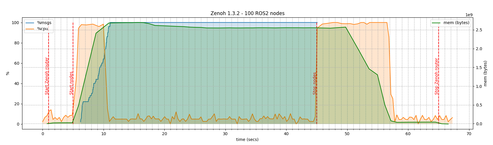

# Zenoh 1.3.3: Gozuryū

We are thrilled to announce the release of Zenoh 1.3.3 – **Gozuryū**!

Named after the legendary "Five-Headed Dragon", this release brings a powerful set of new capabilities across the entire Zenoh ecosystem, with improvements touching everything from core routing and shared memory to the language bindings and Zenoh-Pico for constrained devices.

Let’s dive into the highlights of this release.

**Namespace Prefix Support**: Isolate Zenoh sessions with namespace prefixes — ideal for multi-robot and multi-instance setups.

**Peer-to-Peer Unicast in Zenoh-Pico**: Zenoh-Pico now supports direct unicast communication, enabling router-less setups in constrained environments.

**Automatic Reconnect (Zenoh-Pico)**: Sessions can now automatically recover from disconnections, including declaration restoration.

**Shared Memory Performance Boost**: Up to **35% throughput improvements**, with new mutation examples and memory control options.

**Advanced Pub/Sub Enhancements**: Heartbeat support and zero-copy buffer management now available in Zenoh-C and Zenoh-Cpp.

**QoS Rewrite & Filtering Interceptors**: New routing interceptors allow message filtering and QoS adjustments at runtime.

**Resource Usage Optimizations**: Significant reductions in memory and CPU usage, especially on multi-interface systems.

These are just the highlights — Zenoh 1.3.3 comes packed with enhancements across the entire ecosystem, from core protocol upgrades to binding-specific improvements in C, C++, TypeScript, Java/Kotlin, and Zenoh-Pico. In the sections below, we’ll take a closer look at what’s new, what’s faster, and what’s now possible with **Gozuryū**.

# Zenoh

## Namespace prefix support

In the latest release we introduced the concept of session namespaces. A namespace can be viewed as a prefix that is automatically prepended to key expressions of all messages that are sent outside of the session. This includes publications, queries, replies, \ subscriber, queryable and liveliness token declarations.

If we declare a session to have a namespace `"my_namespace"` and call `session.put("my_keyexpr", my_data)` then for everyone *outside* the namespace,i.e., all subscribers declared on sessions without any namespace, this will look like a put on `"my_namespace/my_keyexpr"`, while subscribers declared for the sessions with same namespace will see it as a put on `"my_keyexpr"`.

Let us illustrate this with an example:

put.rs

```rust
#[tokio::main]
async fn main() {
    let mut config = Config::default();
    config.insert_json5("namespace", "\"my_namespace\"").unwrap();
    let session = zenoh::open(config).await.unwrap();
    session.put("my_keyexpr","my_data".to_string()).await.unwrap();
}
```

sub_in_namespace.rs

```rust
#[tokio::main]
async fn main() {
    let mut config = Config::default();
    config.insert_json5("namespace", "\"my_namespace\"").unwrap();
    let session = zenoh::open(config).await.unwrap();
    let subscriber = session.declare_subscriber("my_keyexpr").await.unwrap();
    while let Ok(sample) = subscriber.recv_async().await {
        println!(
            ">> [Subscriber] Received ('{}': '{}')",
            sample.key_expr().as_str(),
            sample.payload().try_to_string().unwrap(),
        );
    }
}
```

sub_outside_of_namespace.rs

```rust
#[tokio::main]
async fn main() {
    let mut config = Config::default();
    let session = zenoh::open(config).await.unwrap();
    let subscriber = session.declare_subscriber("my_namespace/my_keyexpr").await.unwrap();
    while let Ok(sample) = subscriber.recv_async().await {
        println!(
            ">> [Subscriber] Received ('{}': '{}')",
            sample.key_expr().as_str(),
            sample.payload().try_to_string().unwrap(),
        );
    }
}
```

Both `sub_in_namespace.rs` and `sub_outside_of_namespace.rs` will receive the message of `put.rs`. The former will output:

`>> [Subscriber] Received (‘my_keyexpr': ‘my_data’)`, while the latter will output:
`>> [Subscriber] Received (‘my_namespace/my_keyexpr’: ‘my_data’)`.

Namespaces can be useful when one needs to avoid name collisions when running the same code on different instances, in multi-robot scenarios for example. Additionally they can be used if isolation between different instances is required, since non-intersecting namespaces will never receive each other’s messages, since they will start with different prefixes. It is a feature that comes handy when integrating systems too.

Any string satisfying key expression constraints and not including wildcard chunks (i.e. `"*"`, `"**"`, or `"$*"`) can be used as a namespace.

## Multicast TTL Configuration

Multicast communication now supports a configurable TTL (Time-To-Live) parameter. Previously, multicast packets were restricted to a TTL of 1, preventing them from traversing routers. With this update, users can specify a TTL value when establishing a multicast connection, ensuring that traffic can reach beyond a local network. For example:

```
./z_pub -m peer -l 'udp/239.1.3.37:9001#iface=myinterface;ttl=32' -k 'testkey' -p 'Hello beyond the router'
```

## Configurable Interests Timeout

The interests protocol timeout, previously hardcoded to 10 seconds, is now configurable via `routing.interests.timeout`. This allows users to fine-tune interest tracking behavior based on network conditions and application requirements. The default remains 10 seconds, but adjusting this parameter can help optimize message delivery in dynamic environments.

## Improved Link Establishment Timeout

A default timeout for new link establishment has been introduced. While link acceptance already had a 10-second timeout, establishing a new link lacked a similar safeguard. This update ensures that connections do not fail prematurely due to incorrect timeout handling, improving connection stability and retry mechanisms. Default value can be changed via `transport.unicast.open_timeout` parameter.

## Advanced Pub/Sub Heartbeat

Advanced Pub/Sub was introduced in [Zenoh v1.1.0](https://zenoh.io/blog/2024-12-12-zenoh-firesong-1.1.0/#advanced-pubsub) to provide end-to-end reliability even in presence of router crashes and networks reconfiguration. In the initial implementation,  when using samples sequencing,   if the last sent sample was lost and no other samples were  published, the AdvancedSubscriber would not  detect the miss. One way to address this issue was to enable periodic queries,  but those are costly.

Zenoh version 1.3.3 introduces a `heartbeat` message that can optionally be sent by the AdvancedPublishers and indicates to the AdvancedSubscribers what are the available samples for recovery. This message can be sent periodically (version 1.3.0) or sporadically (only when new samples are available) with `CongestionControl::Block` to ensure its reception (version 1.3.2).

## Improved locator metadata syntax

Link locators support a priority range metadata value (i.e. `prio`) that instructs Zenoh to use the link in question to transmit messages whose priority falls within the given range. For single-value ranges, you can now write `tcp/localhost:0?prio=1` instead of `tcp/localhost:0?prio=1-1` — something that proved confusing and unnatural for users.

## New Interceptors and general interceptor framework improvements

In this release we introduce 2 new interceptor types:

- Low-pass filter (configurable through low_pass_filter field in the config) which limits the maximum size of incoming or outgoing messages.

- QoS Overwrite (configurable through qos/network field in the config) which allows the router (or peer) to overwrite QoS settings of the messages it propagates.

In addition existing interceptor framework received some substantial improvements:

- Whenever possible, interceptors now cache the data necessary to process the messages for the given key-expression, which significantly improves their performance.

- Downsampling interceptor now works with **query** and **reply** message types.

- All interceptor rules can now be restricted to specific link protocols (i.e. one can define rules which are only applied to TCP or TLS links for example).

## Shared Memory Just Got Better

The shared memory subsystem, first introduced in [Zenoh v1.0.0](https://zenoh.io/blog/2024-10-21-zenoh-firesong/), continues to evolve with new improvements and optimizations aimed at performance and flexibility.

### Mutation Examples in Rust, C, and C++

First up: we’ve added mutation examples for shared memory buffers in [Rust](https://github.com/eclipse-zenoh/zenoh/blob/94e917948914af093eae340ee52118b19fb1671f/examples/examples/z_sub_shm.rs#L91), [C](https://github.com/eclipse-zenoh/zenoh-c/blob/18eed6fecf2c52e8c822b3b8c77d92f620b6e120/examples/z_sub_shm.c#L50), and [C++](https://github.com/eclipse-zenoh/zenoh-cpp/blob/e3f9bfc977a72a03668537eca6f03e4bbbe130c7/examples/zenohc/z_sub_shm.cxx#L58).
These examples extend our common `z_sub_shm` demo, adding a mutation attempt to show whether the received buffer is actually mutable. This gives developers more insight into how to handle SHM buffer mutation functionality.

### Performance Boosts

We’ve also done a lot of under-the-hood optimization. By reducing computational complexity and memory footprint in the SHM internals, we’ve managed to boost message-per-second performance by a solid **35%**.

### New Configuration Option for Initialization Behavior

Previously, SHM internal resources were always initialized lazily—the first time your application touched shared memory (typically on the first buffer allocation or reception). This approach worked well for most use cases, keeping memory usage and startup time low. But it introduced a one-time latency spike that wasn’t ideal in latency-sensitive scenarios.

Now, we’ve introduced a [new configuration option](https://github.com/eclipse-zenoh/zenoh/blob/94e917948914af093eae340ee52118b19fb1671f/DEFAULT_CONFIG.json5#L681) to give you control over SHM initialization behavior. You can choose between lazy or eager initialization, depending on what best fits your application.

## Resources consumption improvements

Some major reduction of CPU and memory consumption have been introduced that allow for better scalability.

- Network interface scanning to compute locators is a very CPU expensive task that is now only performed once at startup.

- Various improvements have been made in the routing to decrease CPU and memory consumption.

- Changes have been made in the default size and allocation policies of the Zenoh internal queues that significantly decrease memory consumption.

Here is a graph of CPU and memory consumption running a Zenoh router and 100 ROS2 nodes (50 publishers and 50 subscribers) on a same host (4 cores 8GB RAM):



# Zenoh-Pico

## Add p2p unicast support

In the latest release, we have introduced peer-to-peer (P2P) unicast support in Zenoh-Pico, allowing applications to establish unicast links without the need for a central router – thus far, peer-to-peer was only available in combination with the use of UDP multicast.

This is particularly beneficial in scenarios where reliability, low-latency and high-throughput communication are crucial.

This addition aligns with Zenoh-Pico's goal of providing robust communication solutions for constrained devices, further expanding its use cases in IoT and embedded.

A blog post will go into more detail about the feature and its limitations but if you want to try it right now:

First, run a Zenoh-pico example on your machine as a tcp server:

`./build/examples/z_sub -m peer -l tcp/127.0.0.1:7447`

And run a few other examples as clients:

`./build/examples/z_pub -m peer -e tcp/127.0.0.1:7447`

## Connection restoring

When network disruptions occur, whether due to temporary connectivity issues or router restarts, Zenoh-Pico now automatically attempts to restore its connection. This new functionality, introduced under the `Z_FEATURE_AUTO_RECONNECT` flag (enabled by default), enhances reliability by detecting lost connections and seamlessly reestablishing them. Additionally, it caches declarations and restores them after reconnection, ensuring a smooth recovery without manual intervention. With this improvement, applications using Zenoh-Pico can handle transient failures more gracefully, reducing the risk of silent data loss and aligning Zenoh-Pico’s resilience more closely with Zenoh. For memory-constrained environments, the feature can be disabled to optimize resource usage.

## Querier

Zenoh-Pico now supports queriers, bringing query-side optimizations similar to those available for publishers. Just as publishers enable Zenoh to optimize continuous data dissemination, queriers allow for efficient, stateful querying with features like write-side filtering and matching status. This addition enhances Zenoh-Pico’s ability to interact with distributed systems while maintaining minimal resource usage.

### Declaring a Querier

A querier can be declared on a specific key expression, allowing queries to be issued dynamically:

```c
z_owned_querier_t querier;
if (z_declare_querier(z_loan(s), &querier, z_loan(keyexpr), NULL) < 0) {
    printf("Unable to declare Querier for key expression!\n");
    exit(-1);
}
```

### Sending a Query

Once declared, a querier can retrieve data from matching queryables in the system. Replies are handled asynchronously through a callback:

```c
void reply_handler(z_loaned_reply_t *reply, void *ctx) {
      if (z_reply_is_ok(reply)) {
          const z_loaned_sample_t *sample = z_reply_ok(reply);
          z_view_string_t keystr;
          z_keyexpr_as_view_string(z_sample_keyexpr(sample), &keystr);

          printf(">> Received '%.*s'\n",
                 z_string_len(z_loan(keystr)),
                 z_string_data(z_loan(keystr)));
      }
}

z_owned_closure_reply_t callback;
z_closure(&callback, reply_handler, NULL, NULL);

z_querier_get(z_loan(querier), params, z_move(closure), NULL);
```

### Cleaning Up

When no longer needed, the querier should be undeclared to release resources:

```c
z_drop(z_move(querier));
```

A full example as well as working with the channel can be found [there](https://github.com/eclipse-zenoh/zenoh-pico/blob/main/examples/unix/c11/z_querier.c).

## Matching listeners

Zenoh-Pico now supports matching listeners, allowing publishers and queriers to detect when there are active subscribers or queriable matching their key expression. This feature provides applications with greater awareness of their communication state, optimizing resource usage and enabling more responsive behavior. The same functionality is also available in Zenoh-Cpp, ensuring consistency across implementations.

A matching listener can be declared using `z_publisher_declare_background_matching_listener`, which registers a callback that is triggered when the first subscriber connects or when the last subscriber disconnects:

```c
void matching_status_handler(const z_matching_status_t *matching_status, void *arg) {
    (void)arg;
    if (matching_status->matching) {
        printf("Publisher has matching subscribers.\n");
    } else {
        printf("Publisher has NO MORE matching subscribers.\n");
    }
}

z_owned_closure_matching_status_t callback;
z_closure(&callback, matching_status_handler, NULL, NULL);
z_publisher_declare_background_matching_listener(z_loan(pub), z_move(callback));
```

Alternatively, for more control, `z_publisher_declare_matching_listener` can be used, which allows explicit management of the listener's lifecycle.

## "Take from loaned" operation for callbacks

See the same-named section for Zenoh-C, the Zenoh-Pico API was updated in the same way.

# Zenoh-C

## Advanced Pub Sub

We are happy to share that Zenoh-C now supports [Advanced Pub/Sub API]([https://zenoh.io/blog/2024-12-12-zenoh-firesong-1.1.0/#advanced-pubsub](https://zenoh.io/blog/2024-12-12-zenoh-firesong-1.1.0/#advanced-pubsub)) introduced in Zenoh 1.1.0.

z_advanced_pub.c

```c
z_owned_config_t config;
z_config_default(&config);
zc_config_insert_json5(
    z_loan_mut(config), Z_CONFIG_ADD_TIMESTAMP_KEY, "true");

z_owned_session_t s;
z_open(&s, z_move(config), NULL);

z_view_keyexpr_t ke;
z_view_keyexpr_from_str(&ke, "key/expression");

ze_advanced_publisher_options_t pub_opts;
ze_advanced_publisher_options_default(&pub_opts);
pub_opts.cache.is_enabled = true;
pub_opts.cache.max_samples = 10;
pub_opts.publisher_detection = true;
pub_opts.sample_miss_detection.is_enabled = true
pub_opts.sample_miss_detection.heartbeat_period_ms = 500;
pub_opts.sample_miss_detection.heartbeat_mode = ZE_ADVANCED_PUBLISHER_HEARTBEAT_MODE_PERIODIC;
// if not set, publisher will retransmit samples based on periodic queries from advanced subscriber

ze_owned_advanced_publisher_t pub;
ze_declare_advanced_publisher(z_loan(s), &pub, z_loan(ke), &pub_opts);

z_owned_bytes_t payload;
z_bytes_copy_from_str(&payload, "some_data");
ze_advanced_publisher_put(z_loan(pub), z_move(payload), NULL);
```

z_advanced_sub.c

```c
void data_handler(z_loaned_sample_t* sample, void* arg) {
    z_view_string_t key_string;
    z_keyexpr_as_view_string(z_sample_keyexpr(sample), &key_string);
    z_owned_string_t payload_string;
    z_bytes_to_string(z_sample_payload(sample), &payload_string);
    printf(">> [Subscriber] Received ('%.*s': '%.*s')\n",
        (int)z_string_len(z_loan(key_string)),
        z_string_data(z_loan(key_string)),
        (int)z_string_len(z_loan(payload_string)),
        z_string_data(z_loan(payload_string)));
    z_drop(z_move(payload_string));
}

void miss_handler(const ze_miss_t* miss, void* arg) {
    z_id_t id = z_entity_global_id_zid(&miss->source);
    z_owned_string_t id_string;
    z_id_to_string(&id, &id_string);
    printf(">> [Subscriber] Missed %d samples from '%.*s' !!!",
        miss->nb, (int)z_string_len(z_loan(id_string)),
        z_string_data(z_loan(id_string)));
    z_drop(z_move(id_string));
}

...

z_owned_config_t config;
z_config_default(&config);

z_owned_session_t session;
z_open(&session, z_move(config), NULL);

z_view_keyexpr_t ke;
z_view_keyexpr_from_str(&ke, "key/expression");

ze_advanced_subscriber_options_t sub_opts;
ze_advanced_subscriber_options_default(&sub_opts);
sub_opts.history.is_enabled = true;
sub_opts.history.detect_late_publishers = true;
sub_opts.recovery.is_enabled = true;
sub_opts.recovery.last_sample_miss_detection.is_enabled = true;
// use publisher heartbeats by default, otherwise enable periodic queries as follows:
// sub_opts.recovery.last_sample_miss_detection.periodic_queries_period_ms = 1000;
sub_opts.subscriber_detection = true;
z_owned_closure_sample_t callback;
z_closure(&callback, data_handler, NULL, NULL);
ze_owned_advanced_subscriber_t sub;
ze_declare_advanced_subscriber(
    z_loan(session), &sub, z_loan(ke),
    z_move(callback), &sub_opts);

ze_owned_closure_miss_t miss_callback;
z_closure(&miss_callback, miss_handler, NULL, NULL);
ze_advanced_subscriber_declare_background_sample_miss_listener(
    z_loan(sub), z_move(miss_callback));
```

Complete examples can be found at [z_advanced_pub.c](https://github.com/eclipse-zenoh/zenoh-c/blob/main/examples/z_advanced_pub.c) and [z_advanced_sub.c](https://github.com/eclipse-zenoh/zenoh-c/blob/main/examples/z_advanced_sub.c).

**ze_querying_subscriber** and **ze_publication_cache** APIs are now marked as deprecated.

## "Take from loaned" operation for callbacks

The Zenoh-C API makes a strong distinction between "moved" and "loaned" arguments of functions inspired by Rust and introduced to increase code safety. Assume that we define the structure

```c
z_owned_foo_t foo;
```

Below are the variants of how this structure is processed depending on function parameter type:

| Function declaration | How to call | Meaning |
|---|---|---|
| void new_foo(z_owned_foo_t* foo); | new_foo(&foo); | Construct a new "foo" object; assumes that the structure foo is undefined |
| bool read_foo(const z_loaned_foo_t* foo); | read_foo(z_loan(foo)); | Reads data from "foo", never changes it |
| void update_foo(z_loaned_foo_t* foo); | update_foo(z_loan_mut(foo)); | May modify "foo", but guarantees that "foo" is valid after the call |
| void take_foo(z_moved_foo_t* foo); | take_foo(z_move(foo)); | Takes ownership of data contained in foo. Guarantees that after calling this function the foo is left in the empty state and should not be accessed anymore (but z_drop on it is allowed, i.e., the API is double-drop safe) |

See the Zenoh-C "Concepts" section of documentation for more detailed explanations: [https://zenoh-c.readthedocs.io/en/1.3.2/concepts.html](https://zenoh-c.readthedocs.io/en/1.3.2/concepts.html).

It happened that this approach doesn’t work well with parameters of callback functions. Ideally the callback functions should have accepted the `z_moved_foo_t *` type. E.g., callback receives a sample and the user is allowed to take this sample and place it to some queue for further processing.

The problem is that `z_moved_foo_t *` type obliges function to take ownership of the parameter. But sometimes users just want to read and analyze data in place, they don’t want to care about the lifetime of the passed data.

So, it was decided that callback functions accepts parameter of `z_loaned_foo_t *` type and in this release the new operation `z_take_from_loaned` was introduced. Here is the example of its usage:

```c
void sub_callback(z_loaned_sample_t* sample, void* arg) {
  z_owned_sample_t s;
  z_take_from_loaned(&s, sample);
  // Now we can save `s` for further processing, e.g. send it to another thread
}
...
z_owned_closure_sample_t callback;
z_closure(&callback, sub_callback, NULL, NULL);
z_owned_subscriber_t sub;
if (z_declare_subscriber(z_loan(session), &sub, z_loan(keyexpr), z_move(callback), NULL) < 0) {
  printf("Unable to declare subscriber.\n");
  exit(-1);
}
```

It’s important to notice that the `z_take_from_loaned` function breaks the condition *"function, accepting z_loaned_foo_t* type guarantees that "foo" is valid after the call"* . That’s why this operation is reserved to be used only by developers and it’s strongly discouraged to use it outside of callbacks. The functions of Zenoh-C API itself never perform this operation.

## Other API improvements

We introduced the `z_bytes_get_contiguous_view` function  allowing to get a view (i.e. a pointer and length) of the payload bytes, for contiguous payloads. This function will return an error if payload is not contiguous (most likely due to fragmentation if payload size is too big) - in this case to access payload data without copy one can continue to use either **z_bytes_reader** API or **z_bytes_slice_iterator** API.

get_contiguous_view.c

```c
z_view_slice_t view;
if (z_bytes_get_contiguous_view(z_loan(payload), &view) == Z_OK) {
    const uint8_t* ptr = z_slice_data(z_loan(view));
    size_t len = z_slice_len(z_loan(view));
    // do something with ptr and len
}
```

# Zenoh-Cpp

## Advanced Pub Sub

[Advanced Pub/Sub API](https://zenoh.io/blog/2024-12-12-zenoh-firesong-1.1.0/#advanced-pubsub) introduced in Zenoh 1.1.0 is now also available in Zenoh-Cpp, but for the time being only with **Zenoh-C** backend:

z_advanced_pub.cpp

```cpp
auto config = Config::create_default();
config.insert_json5(Z_CONFIG_ADD_TIMESTAMP_KEY, "true");

auto session = Session::open(std::move(config));

ext::SessionExt::AdvancedPublisherOptions opts;
opts.cache.emplace().max_samples = 10;
opts.publisher_detection = true;
opts.sample_miss_detection.emplace().heartbeat =
ext::SessionExt::AdvancedPublisherOptions::SampleMissDetectionOptions::HeartbeatPeriodic{1000};
// alternatively sample miss detection can be done in response to subscriber's periodic queries

auto pub = session.ext().declare_advanced_publisher(
    "key/expression", std::move(opts));
pub.put("some_data");
```

z_advanced_sub.cpp

```cpp
auto config = Config::create_default();
auto session = Session::open(std::move(config));

ext::SessionExt::AdvancedSubscriberOptions opts;
opts.history.emplace().detect_late_publishers = true;
opts.history->detect_late_publishers = true;

// enable recovery based on received heartbeats from ext::AdvancedPublisher
opts.recovery.emplace().last_sample_miss_detection =
ext::SessionExt::AdvancedSubscriberOptions::RecoveryOptions::Heartbeat{};
// alternatively recovery can be triggered based on missed sample detection via periodic queries:
// opts.recovery.emplace().last_sample_miss_detection =
// ext::SessionExt::AdvancedSubscriberOptions::RecoveryOptions::PeriodicQueriesOptions{1000};
opts.subscriber_detection = true;

auto data_handler = [](const Sample &sample) {
   std::cout << ">> [Subscriber] Received ('"
             << sample.get_keyexpr().as_string_view() << "' : '"
             << sample.get_payload().as_string() << "')"
             << std::endl;
};

auto missed_sample_handler = [](const ext::Miss &miss) {
    std::cout << ">> [Subscriber] Missed " << miss.nb
              << " samples from '" << miss.source.id() << "' !!!"
              << std::endl;
};

auto advanced_subscriber =
session.ext().declare_advanced_subscriber(
    "key/expression", data_handler, closures::none, std::move(opts));

advanced_subscriber.declare_background_sample_miss_listener(
    missed_sample_handler, closures::none);
```

Complete examples can be found at [z_advanced_pub.cpp](https://github.com/eclipse-zenoh/zenoh-cpp/blob/main/examples/zenohc/z_advanced_pub.cxx) and [z_advanced_sub.cpp](https://github.com/eclipse-zenoh/zenoh-cpp/blob/main/examples/zenohc/z_advanced_sub.cxx).

**ext::QueryingSubscriber** and **ext::PublicationCache** APIs are now marked as deprecated.

## Custom deleter for external buffer

Sometimes it’s necessary to send a large amount of data, which can be inefficient to copy. However, the exact moment when Zenoh deletes the `Buffer` object is unknown: after being sent, the buffer is queued and only deleted once it has actually been transmitted.

It is possible to create a `Bytes` object by moving a `std::vector` into it, thereby avoiding a copy of the vector. However, this approach does not cover all use cases.

Now, it is possible to create a `Buffer` object that points to external data and uses a custom deleter for that data. When Zenoh finishes sending the buffer, it destroys the `Buffer` object, and its destructor invokes the custom deleter. See the example below:

```cpp
uint8_t* ptr = new uint8_t[10];
auto deleter = [&deleted](uint8_t* data) {
  delete[] data;
};

Bytes bytes(ptr, 10, deleter);
session.put("foo/bar", std::move(bytes));
```

## Other API improvements

We introduced `Bytes::get_contiguous_view()` method  allowing to get a view (i.e. a pointer and length) of the payload bytes, for contiguous payloads. This function will return an empty `std::optional` if payload is not contiguous (most likely due to fragmentation, if payload size is too big) - in this case to access payload data without copy one can continue to use either **Bytes::Reader** or **Bytes::SliceIterator**.

get_contiguous_view.cpp

```cpp
auto view = payload.get_contiguous_view();
if (view.has_value()) {
    const uint8_t* ptr = view.data;
    size_t len = view.len;
    // do something with ptr and len
}
```

# Zenoh-Python

## Query context manager

When using queryable with a channel handler, query objects need to be finalized in order to acknowledge the query response on the querier side. The proper way to do this in Python is by using a context manager, that’s why Query objects can now be used as context managers.

```python
with zenoh.open(conf) as session:
   print(f"Declaring Queryable on '{key}'...")
   queryable = session.declare_queryable(key, complete=complete)


   print("Press CTRL-C to quit...")
   while True:
       with queryable.recv() as query:  # use the context manager here
           # do something with query
```

# Zenoh-TS

## API Polish and alignments

In version 1.3.3 we have made some upgrades to the inner workings of the Typescript API, specifically we have added a **KeyExpr** API based on the Rust Zenoh-KeyExpr library, compiling a subset of the KeyExpr library to WASM. This is a first step on the path of integration and code reuse between main Zenoh and Zenoh typescript binding.

We have also exposed the ability to get session info in a poll-based fashion.
Note that due to the TS implementation being based on a remote API, every time a user requires the most up to date version of the session info, a new call to session info will have to be made, producing a new `SessionInfo` class instance.

```typescript
console.log!("Opening session...");
const session = await Session.open(new Config("ws/127.0.0.1:10000"));

console.log!("Get Info...");
const info: SessionInfo = await session.info();

console.log!("zid: {}", info.zid());

console.log!("routers zid: {:?}",info.routers_zid() );

console.log!("peers zid: {:?}",info.peers_zid() );
// New SessionInfo object will need to be created here for updated state
```

Multiple minor changes in the Typescript API have been made in order to cover main Zenoh functionality and to make Typescript API better matching with other language bindings as well as to make it internally consistent:

- The `callback` field was renamed to `handler` as it was supposed to contain a callback function or channel. This field now is always passed in corresponding "options" structure for API uniformity

- `options` structures with additional parameters like `encoding`, `attachment`, `priority`, etc were added to `reply()`, `reply_err()` and `reply_del()` operations of `Query`

- Channels' fields `size` were renamed to `capacity`

- Encoding’s `from_str` renamed to `from_string`,

- `with_schema()` method added to Encoding

Binary data serialization compatible with the zenoh-ext library was implemented. Now it’s possible to exchange data between Zenoh applications on typescript and other languages. The example of using serialization/deserialization API:

```typescript
let input = new Map<bigint, string>()
input.set(0n, "abc")
input.set(1n, "def")
let payload = zserialize(input, ZS.map(ZS.bigint(BigIntFormat.Uint64), ZS.string()))
let output = zdeserialize(ZD.map(ZD.bigint(BigIntFormat.Uint64), ZD.string()), payload)
```

## Example chat application

An example browser application demonstrating the key parts of Zenoh Typescript API functionality was added. This is a multiuser chat application which sends/receives chat messages using **pub/sub** API, allows to restore chat history for new connected users using **queryable/get** API and shows list of online users using **liveliness** API.

See ["Build and run examples"](https://github.com/eclipse-zenoh/zenoh-ts?tab=readme-ov-file#build-and-run-examples) section in the github readme for instructions how to run this example

# Zenoh-Java / Zenoh-Kotlin

## API Polish and alignments

For this release we have mostly worked on Zenoh-Java on aligning the API whose migration guide is now available on [https://zenoh.io/docs/migration_1.0/java/](https://zenoh.io/docs/migration_1.0/java/). We now provide the same features as on the other bindings.

Besides that, some changes on both projects include:

- Providing string overloads to functions requiring ZBytes instances, reducing the verbosity of the code when working with string messages.

- Implementing the Querier feature

- Fix missing QoS (quality of service) configuration options on session get operations.

Regarding architectures, we’ve now added support for the aarch64 architecture on Windows.

On both Zenoh-Kotlin and Zenoh-Java we have provided a further utility to run the examples, by allowing users to now build them as executable fat JARs.

## Maven Publications

A big improvement was achieved with regards to the packages publication of these libraries which is that we are now publishing to Maven Central! Checkout

- [https://central.sonatype.com/artifact/org.eclipse.zenoh/zenoh-kotlin/overview](https://central.sonatype.com/artifact/org.eclipse.zenoh/zenoh-kotlin/overview)

- [https://central.sonatype.com/artifact/org.eclipse.zenoh/zenoh-kotlin-android/overview](https://central.sonatype.com/artifact/org.eclipse.zenoh/zenoh-kotlin-android/overview)

- [https://central.sonatype.com/artifact/org.eclipse.zenoh/zenoh-java/overview](https://central.sonatype.com/artifact/org.eclipse.zenoh/zenoh-java/overview)

- [https://central.sonatype.com/artifact/org.eclipse.zenoh/zenoh-java-android/overview](https://central.sonatype.com/artifact/org.eclipse.zenoh/zenoh-java-android/overview)

Now it’s simpler to import the projects into your own projects by adding the MavenCentral repository and importing the appropriate library.

That’s a wrap for Zenoh 1.3.3 — **Gozuryū**! This release brings significant improvements in performance, flexibility, and feature completeness across the stack. Whether you're building on constrained devices, working in highly dynamic environments, or scaling across complex networks, Zenoh now gives you more tools to do it right and while having fun ;-).

As always, we’d love to hear your feedback, ideas, and contributions. Check out the [Zenoh repository](https://github.com/eclipse-zenoh/zenoh), join the conversation on [Zenoh’s Discord](https://discord.com/invite/vSDSpqnbkm), and let us know what you're building!

Until next time — stay fast, stay flexible, and keep streaming.

**– The Zenoh Team**
