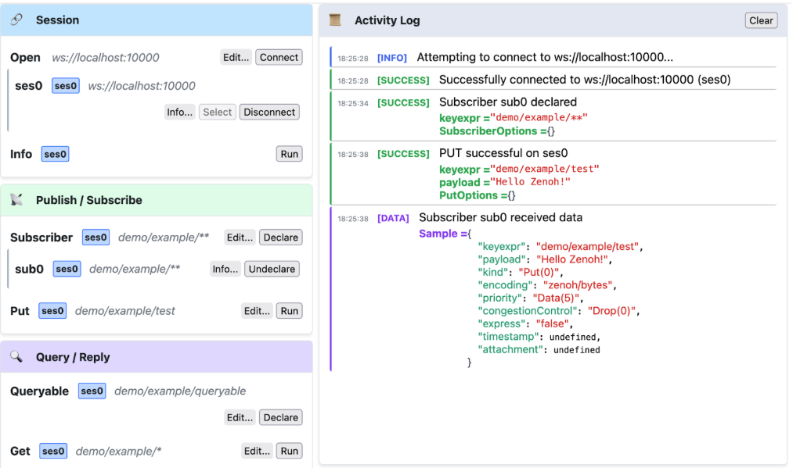

Named after the Red Dragon, a symbol of power, protection, and passion, this release delivers significant improvements across the entire Zenoh ecosystem. Hong brings substantial performance enhancements, we've broken the 10M msg/sec wall, and our shared memory implementation has 25% performance throughput gains along with a simplified API and improved safety mechanisms. Configuration management has been streamlined with better validation and the ability to provide full configurations via command line. The installation process has been modernized with signed Debian repositories for enhanced security.

This release also includes major updates to language bindings: Zenoh-TS now features binary serialization for improved performance and a camelCase API, Zenoh-Pico adds STM32 ThreadX support and peer-to-peer multicast improvements, and advanced pub/sub functionality has been expanded across multiple bindings.

Let's dive into the highlights of this release.

# Zenoh

## Throughput

This release of Zenoh has further improved its performance by breaking the 10M msg/sec barrier as measured on our MacBook laptops. We have almost doubled the throughput for small messages (8 bytes) since the release of 1.0.0.

If you want to check out the performance on your hardware, just do:

```bash
$ cargo run --release --example z_sub_thr -- --no-multicast-scouting -l tcp/127.0.0.1:7447 -s 30   
$ cargo run --release --example z_pub_thr -- --no-multicast-scouting -e tcp/127.0.0.1:7447 8

10648918.469217971 msg/s  
10751147.174281364 msg/s  
10658802.460094243 msg/s  
10605109.520556785 msg/s  
10769720.542983461 msg/s  
10690899.371909663 msg/s  
10758472.296933835 msg/s
```

## SHM: Performance, Safety and Simplicity

In this release, Zenoh's shared memory became more performant, safer, and easier to use—both for newcomers and power users alike. Here is a list of important changes:

**SHM API Simplification & Examples** 

* **Hidden ProtocolID**: The low-level `ProtocolID` is now internal to the SHM API, slimming down public types and reducing noise for most users.

* **Streamlined Builders**: `ShmProviderBuilder` APIs have been overhauled for consistency and ease of use—defaults are smarter and method chains shorter.

* **Improved Examples**: A brand-new minimal SHM example has been added, and existing examples were refactored to use the simplified API patterns.

  More details can be found in the [PR](https://github.com/eclipse-zenoh/zenoh/pull/1975).

**Watchdog Storage & Performance Tuning**

* **≈25% Throughput Gain**: Internal SHM watchdog confirmator storage was re-architected—metadata cells now grow on demand and Arc-based ownership was tightened—yielding an extra ~600 K msgs/sec (from 2.4 M to ~3 M msgs/sec).

* **Arena Utilization Fix**: The metadata segment now properly expands when cell exhaustion occurs, preventing stalls when the arena still has free memory but no metadata slots.

* **Lifetime Safety**: Shared memory buffers now own their underlying segment handle to guarantee correct cleanup.

  More details can be found in the [PR](https://github.com/eclipse-zenoh/zenoh/pull/1869)

**SHM Buffer Layout & Alignment**

* **Relayout & Resize Operations**: Buffers can now be resized in place, improving flexibility for dynamic data workloads.

* **Owned vs. Borrowed Buffers**: The relationship between owned and borrowed SHM buffers was clarified, fixing several edge-case bugs in buffer/session tests.

* **Alignment Constants**: Alignment parameters are exposed via new constants (default = 1)

  More details can be found in the [PR](https://github.com/eclipse-zenoh/zenoh/pull/1950)

**Consistent Re-exports & API Sync**

* **Pruned Client Storage**: ProtocolID usage has been fully removed from the Rust client-storage module to match the new hidden-ID approach.

* **Docs & Safety Notes**: The safety-critical portions of the SHM API documentation have been reformatted for clarity.
  
  More details can be found in the [PR](https://github.com/eclipse-zenoh/zenoh/pull/2003)

**SHM Polish & Ergonomic Tweaks**

* **Infallible POSIX Builder**: `with_size()` on the POSIX `ShmProviderBuilder` is now guaranteed to succeed, removing the need for error handling in most cases.

* **Unchecked Mutability Helpers**: New `as_mut_unchecked()` methods across all SHM buffer types simplify scenarios where unchecked raw access is safe. Please check the [ZSHM](https://github.com/kydos/zshm/tree/shm_typed_api) repo to see the examples of unchecked mutability power usage.

* **Alignment Builders**: Added `for_type()` and `for_val()` constructors for alignment helpers, plus a new default alignment setter on the SHM provider builder.

* **Cross-Platform Fixes**: Windows support has been hardened, and a round of `rustfmt`/`clippy` adjustments keep the codebase idiomatic.

  More details can be found in the [PR](https://github.com/eclipse-zenoh/zenoh/pull/2023)

Following the Zenoh SHM API changes, full support of the API and example updates have been implemented for both Zenoh-C and Zenoh-Cpp. You can find the relevant updates in the following pull requests: 

* For [Zenoh-C](https://github.com/eclipse-zenoh/zenoh-c/pull/1033)
* For [Zenoh-Cpp](https://github.com/eclipse-zenoh/zenoh-cpp/pull/537)

## Configuration improvements

### Improved configuration validation
The following parts of the configuration are now properly validated at load time:

- `access_control`
- `downsampling`
- `low_pass_filter`
- `qos/network`

### Providing a full configuration through --cfg command line argument

It is now possible to provide a full configuration through the command line with the `--cfg` argument.
Example:  
```bash
zenohd --cfg=':{id:"aa",listen:{timeout_ms:10}}'
```

### Optional id in the configuration
The `id` field of the configuration was a non optional field that was automatically set up at configuration creation or at configuration load if not explicitly provided. Because of this, it was impossible to clone and reuse a configuration as is because this would end up with two configurations with the same `id`.
This field has been made optional and the `id` is automatically generated at configuration application (and not at configuration creation/load) if not explicitly provided.

For example, the following code now works properly:
```python
import time
import zenoh

conf = zenoh.Config()
session1 = zenoh.open(conf)
session1.declare_subscriber("key/expression", lambda sample:
   print(f"Received {sample.payload.to_string()}"))

session2 = zenoh.open(conf)
session2.put("key/expression", "value")
```

### Support DSCP link config
Endpoints now supports DSCP configuration, which can be specified in the endpoint string as following: `"tcp/192.168.0.1:7447#dscp=0x08"`

This means that now you can control the type of service that your router and switches will apply to Zenoh traffic, thus making it possible to have them differentiate real-time traffic.

### Add support for link weights
We have added support for weighted routing graphs. In other terms you can now assign weights to any of the links in the communication graph to express routing cost. At any given point in time, the  routing algorithm will choose the path with minimal cost to route data from A to B.

Example:  
```bash
zenohd --cfg='routing:router:linkstate:transport_weights:[{"dst_zid": "zid1", "weight": 10}, {"dst_zid": "zid2", "weight": 42}]'
```

## Breaking change: Reply::replier_id

The unstable `replier_id` API, which used to return a `ZenohId`, is now aligned with other `SourceInfo` implementations, returning an `EntityGlobalId` which allows it to globally identify the queryable that generated the Reply in question. This is a breaking change, it has been propagated to all affected APIs: Rust, C, C++, Python, Kotlin and Java. The `replier_id` API remains marked as unstable for now.

Example in Rust:  
```rust
if let Some(replier_id) = reply.replier_id() {
    let replier_zid: ZenohId = replier_id.zid();
    let replier_eid: u32 = replier_id.eid();
}
```

## QUIC Datagram support

As of Zenoh 1.5.0, it is now possible to use unreliable datagrams in QUIC by setting `rel=0` in QUIC endpoints/locators. The initial MTU value and the MTU discovery interval are both configurable via endpoint configuration:

`quic/127.0.0.1:9000?rel=0#initial_mtu=2000;mtu_discovery_interval_secs=300`

By default, the initial MTU value is 1200 bytes with an MTU discovery interval of 600 seconds (note that MTU discovery is a binary search algorithm). Thus if network conditions allow for higher MTUs then manual configuration of `initial_mtu` is desirable.

Note that QUIC streamed and datagram modes are not currently compatible in Zenoh: both the listener and connect endpoints need to be using the same mode.

See [RFC 9221](https://datatracker.ietf.org/doc/rfc9221/) for more information on the QUIC protocol.

# Advanced Pub/Sub

You've been asking for it and we did it 🙂 The Advanced Pub/Sub API is now available in both Python and Kotlin! You can check out the implementations and examples at the following links:

* Zenoh-Python: [Advanced Pub/Sub](https://github.com/eclipse-zenoh/zenoh-python/pull/537)
* Zenoh-Kotlin: [Advanced Pub/Sub](https://github.com/eclipse-zenoh/zenoh-kotlin/pull/455)

# Zenoh-TS

The Zenoh Typescript API has witnessed a few major improvements:

* **Data Exchange Protocol**: Binary serialisation is now used between the typescript library and remote-API plugin. This update significantly reduced the bandwidth and improved the performance.
  Given highly optimized JSON serialization in javascript, the throughput improvement might be negligible for smaller payloads (around 10% more compared to older version for 8 byte messages), but becomes significant as message size increases (almost doubled for > 1KB payload).

* **From snake_case to camelCase**: This is a breaking change, but it was necessary to make the library conform to commonly accepted style and to avoid confusion between e.g. "toString" and "to_string".

* **Async**: API functions relying on websocket usage migrated to async.

In this release, we introduce the [“bridge”](https://github.com/eclipse-zenoh/zenoh-ts/tree/main/zenoh-bridge-remote-api) variant of remote-API plugin (the plugin which zenoh-ts library connects to through websocket). The bridge is a standalone application with statically linked plugin and with command-line options specific to the plugin. This makes configuration easier, allowing users to just run the application instead of error-prone dynamic plugin loading.

A [Nuxt](https://nuxt.com/) [example application](https://github.com/eclipse-zenoh/zenoh-ts/tree/main/zenoh-ts/examples/browser/nuxt) was added to demonstrate how to use zenoh in this popular framework. This example demonstrates how to work around some of the issues caused by Server Side Rendering (SSR)

Feel free to use this example to interactively explore basic zenoh functionality and API!



# Zenoh-Pico

### STM32 ThreadX Support

Thanks to g4sp3r from Ubiquity Robotics, we have added support for ThreadX on STM32 with serial transport, providing more options for real-time operating system integration.

### Peer-to-Peer Multicast Improvements

We have added the new `Z_FEATURE_MULTICAST_DECLARATIONS` compile-time option with the following features:

* Nodes can declare key-expressions as integers, which reduces wire overhead.
* Publishers will do write filtering; they will not publish on the network until at least a corresponding subscriber is active.

This option has a cost: every joining node will trigger the previous nodes to push all their declarations at once. As such, the option is off by default. Be sure to activate it if you think the pros outweigh the cons.

### Performance Optimization

Various performance optimizations were implemented in this release, resulting in lower latency overall and increased small packet throughput. We also reduced the amount of memory allocations required for standard operations. If you want to delve deeper into these changes, you can read our corresponding blog post: [Zenoh Blog](https://zenoh.io/blog/2025-07-11-zenoh-pico-peer-to-peer-unicast/).

### New Logging System

With this release, we changed how logging is handled at compile time. The previous `ZENOH_DEBUG=<value>` system still works, but now if you want to set the log level, you can use `ZENOH_LOG=debug`.

  More details can be found [here](https://github.com/eclipse-zenoh/zenoh-pico/pull/934).


# Installation Process Changes

Debian repository is now [signed](https://github.com/eclipse-zenoh/ci/issues/316) which requires changes in the sources.list of already installed systems and the download of the public key. The [instructions](https://zenoh.io/docs/getting-started/installation/#ubuntu-or-any-debian) to install a new system are now:

Add Eclipse Zenoh public key to apt keyring
```bash
$ curl -L https://download.eclipse.org/zenoh/debian-repo/zenoh-public-key | sudo gpg --dearmor --yes --output /etc/apt/keyrings/zenoh-public-key.gpg
```

Add Eclipse Zenoh private repository to the sources list:
```bash
$ echo "deb [signed-by=/etc/apt/keyrings/zenoh-public-key.gpg] https://download.eclipse.org/zenoh/debian-repo/ /" | sudo tee -a /etc/apt/sources.list > /dev/null
$ sudo apt update
```

For existing systems, replace `[trusted=yes]` for `[signed-by=/etc/apt/keyrings/zenoh-public-key.gpg]`

## Changelogs
The effort behind Zenoh 1.5.0 resulted in a large number of bug fixes and improvements. The full changelog for every Zenoh repository is available at the following links: [Rust](https://github.com/eclipse-zenoh/zenoh/releases) | [C](https://github.com/eclipse-zenoh/zenoh-c/releases) | [C++](https://github.com/eclipse-zenoh/zenoh-cpp/releases) | [Python](https://github.com/eclipse-zenoh/zenoh-python/releases) | [Java](https://github.com/eclipse-zenoh/zenoh-java/releases) | [Kotlin](https://github.com/eclipse-zenoh/zenoh-kotlin/releases) | [TypeScript](https://github.com/eclipse-zenoh/zenoh-ts/releases) | [Pico](https://github.com/eclipse-zenoh/zenoh-pico/releases) | [DDS plugin](https://github.com/eclipse-zenoh/zenoh-plugin-dds/releases) | [ROS2 plugin](https://github.com/eclipse-zenoh/zenoh-plugin-ros2dds/releases) | [MQTT plugin](https://github.com/eclipse-zenoh/zenoh-plugin-mqtt/releases) | [WebServer plugin](https://github.com/eclipse-zenoh/zenoh-plugin-webserver/releases/tag/1.0.4) | [Filesystem backend](https://github.com/eclipse-zenoh/zenoh-backend-filesystem/releases) | [RocksDB backend](https://github.com/eclipse-zenoh/zenoh-backend-rocksdb/releases) | [S3 backend](https://github.com/eclipse-zenoh/zenoh-backend-s3/releases) | [InfluxDB backend](https://github.com/eclipse-zenoh/zenoh-backend-influxdb/releases)

---

That's a wrap for Zenoh 1.5.0 — **Hong**! This release demonstrates our continued commitment to performance, safety, and developer experience across the entire Zenoh ecosystem. Whether you're building cloud-to-microcontroller systems, high-performance shared memory applications, deploying on constrained devices, or developing modern web applications, Hong provides the tools and improvements to power your next-generation data-centric systems.

We are eager to hear what you'll build with these new capabilities. As always, we welcome your feedback and contributions to help shape the future of Zenoh.
You can reach us on [Zenoh's Discord server](https://discord.com/invite/vSDSpqnbkm)!

May the power of Red Dragon fuel your innovations,

**– The Zenoh Team**

