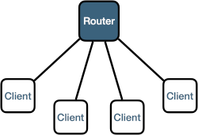

## Deployment units

zenoh provides 3 kinds of deployment units: **peers**, **clients** and **routers**.

### peer
A user application able to:


    

        
Communicate with other peers in a peer-to-peer topology

        

        

            </img>
        

    

    

        
Communicate with other peers in a mesh topology

        
<b style="color:red;">Available soon !!!</b>

        

            </img>
        

    

    

        
Communicate with a wide system through <b>routers</b>

        

        

            </img>
        

    

  


### client
A user application that connects to a single <b>router</b> (or a single <b>peer</b>) to communicate with the rest of the system.

    

        </img>
    



### router
An infrastructure component able to:


    

        
Route data between <b>clients</b> and <b>peers</b> groups

        

        

            </img>
        

    

    

        
Route data in a <i>clique</i> topology

        

        

            </img>
        

    

    

        
Route data in a <i>mesh</i> topology

        
<b style="color:red;">Available soon !!!</b>

        

            </img>
        

    

  


## User APIs

zenoh provides 2 levels of API:

### zenoh-net
A network oriented API providing the key primitives to allow pub/sub (push) communications as well as query/reply (pull) communications. The zenoh-net layer only cares about data transportation and doesn't care about data content nor storing data.

### zenoh
A higher level API providing the same abstractions as the zenoh-net API in a simpler and more data-centric oriented manner as well as providing all the building blocks to create a distributed storage. The zenoh level is aware of the data content and can apply content-based filtering and transcoding. 

  

### zenoh-net primitives
 - **write :** push live data to the matching subscribers.
 - **subscribe :** subscriber to live data. 
 - **query :** query data from the matching queryables.
 - **queryable :** an entity able to reply to queries.

### zenoh primitives
 - **put :** push live data to the matching subscribers and storages. (equivalent of zenoh-net write)
 - **subscribe :** subscriber to live data.  (equivalent of zenoh-net subscribe)
 - **get :** get data from the matching storages and evals.  (equivalent of zenoh-net query)
 - **storage :** the combination of a zenoh-net subscriber to listen for live data to store and a zenoh-net queryable to reply to matching get requests.
 - **eval :** an entity able to reply to get requests. Typically used to provide data on demand or build a RPC system.  (equivalent of zenoh-net queryable)